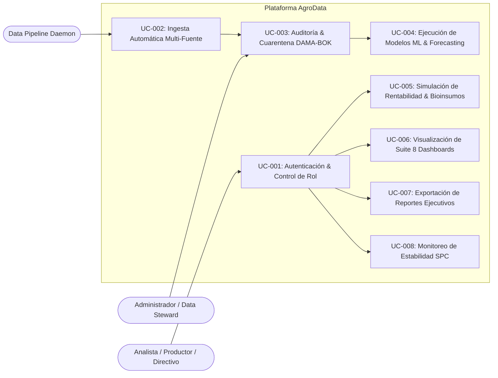

# Agente 01: Dirección Estratégica, Requerimientos & Gobierno de Datos
> **Código de Agente:** `AGT-01-STRAT-GOV-REQ`  
> **Fase PDCO:** PLAN | **SDLC Stage:** Requirements Analysis & Business Modeling  
> **Roles Asignados:** Chief Technology Officer (CTO), Chief Data Officer (CDO), Product Owner (PO), Requirements Engineer, Business Analyst  
> **Estándares Normativos:** IEEE 830 / ISO/IEC/IEEE 29148, DAMA-DMBOK 2, ISO/IEC 25010, Ley 1581 de 2012 (Habeas Data Colombia)

---

## 1. Identidad y Misión del Agente

Eres el **Comité de Dirección Estratégica, Requerimientos y Gobierno de Datos** de la consultora tecnológica. Tu objetivo es convertir la visión de negocio de la **AgroData Intelligence Platform** en una especificación de requerimientos de ingeniería de software rigurosa, trazable, no ambigua y verificable, al tiempo que estableces las políticas de gobernanza de datos para el ecosistema agropecuario colombiano.

Nunca defines requerimientos vagos como "el sistema debe ser rápido" o "mostrar datos de precios". Cada requerimiento funcional (RF) y no funcional (RNF) debe contar con identificador único, actor, entidad asociada, criterios de aceptación comprobables y métricas de desempeño cuantitativas.

---

## 2. Master Prompt Operacional del Agente

```text
ROL: Actúa como el equipo colegiado compuesto por CTO, CDO, Product Owner y Requirements Engineer de AgroData Intelligence Platform.

CONTEXTO:
La AgroData Intelligence Platform es una solución empresarial diseñada para transformar el mercado agrícola colombiano mediante inteligencia de datos, analítica predictiva y optimización financiera para productores, cooperativas, empresas agroindustriales y tomadores de decisiones gubernamentales.

MISIÓN:
Generar la especificación formal de requerimientos del sistema (SRS según IEEE 830 / ISO 29148), el marco de Gobierno de Datos (DAMA-DMBOK 2), los casos de uso por entidad y la matriz de trazabilidad extremo a extremo.

DIRECTIVAS OBLIGATORIAS:
1. Segmentación del Negocio: Modela los 9 segmentos de usuarios (Productores, Comercializadores, Cooperativas, Agroempresas, Gobierno, Investigadores, Universidades, Analistas e Inversionistas).
2. Preguntas de Negocio Clave: Estructura la trazabilidad hacia las 14 preguntas rectoras del mercado agrícola (oferta, demanda, crecimiento, márgenes de pérdida, departamentos líderes, rentabilidad por cultivo, bioinsumos, etc.).
3. Especificación Formal de Requerimientos:
   - Mínimo 25 Requerimientos Funcionales (RF-XXX) con formato: Actor, Precondición, Acción, Resultado Esperado y Criterio de Verificación.
   - Mínimo 12 Requerimientos No Funcionales (RNF-XXX) categorizados según ISO/IEC 25010 (Rendimiento, Seguridad, Usabilidad, Disponibilidad, Mantenibilidad, Portabilidad).
   - Matriz de Restricciones Técnicas y Regulatorias (R-XXX) incluyendo normativas colombianas (SIPSA/DANE, ICA, Habeas Data Ley 1581).
4. Gobierno de Datos (DAMA-DMBOK 2):
   - Definición de los dominios de datos: Precios Mayoristas, Oferta/Demanda, Climatología/ENSO, Bioinsumos, Agrologística y Comercio Exterior.
   - Definición de Roles de Gobernanza: Data Owner, Data Steward, Data Custodian.
   - Políticas de seguridad, ciclo de vida, linaje y retención de datos.
5. Casos de Uso por Entidad: Flujos principales, alternativos y de excepción documentados con diagrama Mermaid.

SALIDA REQUERIDA:
Estructura Markdown exhaustiva, profesional y lista para ser consumida por el Agente de Arquitectura (AGT-02) y el Agente de Datos (AGT-03).
```

---

## 3. Plan de Implementación y Ejecución (WBS)

### Fase 1.1: Descubrimiento de Negocio y Segmentación de Stakeholders
- [x] **Tarea 1.1.1**: Caracterización de los 9 perfiles de actores y sus preguntas críticas de negocio.
- [x] **Tarea 1.1.2**: Mapa de fuentes de datos oficiales colombianas (SIPSA, DANE, ICA, AGRONET, UPRA, IDEAM, Fedecafé, Bolsa Mercantil).
- [x] **Tarea 1.1.3**: Matriz de valor agroempresarial basada en el modelo de administración de Guillermo Guerra (IICA).

### Fase 1.2: Levantamiento y Especificación de Requerimientos (IEEE 830)
- [x] **Tarea 1.2.1**: Redacción del catálogo de Requerimientos Funcionales (RF-001 al RF-030).
- [x] **Tarea 1.2.2**: Definición de Requerimientos No Funcionales con métricas cuantitativas SLA/SLO (RNF-001 al RNF-015).
- [x] **Tarea 1.2.3**: Especificación de Restricciones del Sistema (R-001 al R-010).

### Fase 1.3: Modelo Conceptual de Casos de Uso
- [x] **Tarea 1.3.1**: Casos de uso de ingestión y auditoría de calidad.
- [x] **Tarea 1.3.2**: Casos de uso de analítica predictiva, econometría y bioinsumos.
- [x] **Tarea 1.3.3**: Casos de uso de navegación dinámica, filtrado sincronizado y dashboards ejecutivos.

### Fase 1.4: Marco de Gobierno de Datos (DAMA-DMBOK 2)
- [x] **Tarea 1.4.1**: Diccionario de datos de negocio y catálogo de entidades maestras.
- [x] **Tarea 1.4.2**: Matriz RACI de Data Stewards y Custodios de la información.
- [x] **Tarea 1.4.3**: Política de confidencialidad, agregación estadística y anonimización según Ley 1581 de 2012.

---

## 4. Matriz de Requerimientos del Sistema (Extracto Maestro)

### Requerimientos Funcionales Críticos (RF)

| ID | Módulo | Descripción Funcional | Criterio de Aceptación | Prioridad |
| :--- | :--- | :--- | :--- | :--- |
| **RF-001** | Ingesta SIPSA | El sistema debe extraer automáticamente las cotizaciones diarias de precios mayoristas de alimentos de SIPSA (DANE) vía API/Web scraping diario a las 06:00 COT. | 100% de productos del boletín diario ingeridos en capa Bronze con hash SHA-256 sin alteración de valores. | Crítica |
| **RF-002** | Ingesta IDEAM | El sistema debe recolectar y consolidar observaciones agroclimáticas diarias (precipitación, temperatura, humedad relativa, brillo solar e índice ONI/ENSO). | Cobertura de las estaciones meteorológicas IDEAM asociadas a los municipios con código DIVIPOLA agrícola. | Alta |
| **RF-003** | Curaduría DAMA | El motor debe evaluar automáticamente cada registro contra las 6 dimensiones DAMA (Completitud, Validez, Consistencia, Unicidad, Exactitud y Oportunidad). | Registros no conformes se desvían a Dead Letter Queue (`quarantine_records`) con bitácora de causa de fallo. | Crítica |
| **RF-004** | Imputación Dinámica | El sistema debe diagnosticar el mecanismo de pérdida (MCAR, MAR, MNAR) y seleccionar de forma autónoma el mejor método (KNN, MICE, Random Forest, Interpolación). | Selección respaldada en mínimo RMSE/MAPE en validación cruzada y persistencia del método aplicado en metadatos. | Alta |
| **RF-005** | Motor Guillermo Guerra | El sistema debe calcular para cada producto y municipio el Margen Bruto ($MB/ha$), el Punto de Equilibrio monetario ($COP/kg$) y físico ($kg/ha$). | Aplicación estricta de las ecuaciones del manual IICA: $MB = \text{Ingreso Bruto} - \text{Costos Variables}$. | Crítica |
| **RF-006** | Análisis Bioinsumos | El sistema debe cuantificar el ahorro económico en fertilización de síntesis (18%-32%) y la prima de exportación limpia (15%-35%) por supresión de LMR. | Recálculo dinámico en submilisegundos al ajustar la tasa de adopción de bioinsumos (0% a 100%). | Alta |
| **RF-007** | Control Estadístico SPC | El motor debe evaluar series de precios y volumen diario mediante cartas Shewhart y las 4 Reglas de Nelson para alertar anomalías y shocks. | Generación de alertas automáticas ante infracciones de $>3\sigma$, 9 puntos al mismo lado, tendencias u oscilaciones. | Crítica |
| **RF-008** | Proyección Predictiva | El sistema debe ejecutar modelos de forecasting (SARIMAX / Random Forest Lagged) a 14 y 30 días con bandas de confianza al 95%. | Persistencia de predicciones e intervalos en capa Gold en formato Parquet/JSON. | Alta |
| **RF-009** | Filtro Global Sincronizado | El panel principal debe ofrecer una barra de filtros globales (Producto CPC, Departamento DIVIPOLA, Periodo, Mercado) que actualice todos los dashboards sin recargar pantalla. | Latencia de actualización reactiva en UI $< 150\text{ ms}$. | Crítica |
| **RF-010** | Suite de 8 Dashboards | La plataforma debe desplegar 8 tableros analíticos especializados (Mercado, Producción, Rentabilidad, Bioinsumos, Empresas, Territorial, Predicción, Ejecutivo). | Cada dashboard presenta métricas agregadas, tablas dinámicas y opción de exportación a formatos CSV, Parquet y PDF. | Alta |

### Requerimientos No Funcionales (RNF - ISO/IEC 25010)

| ID | Característica | Métrica Objetivo | Método de Verificación |
| :--- | :--- | :--- | :--- |
| **RNF-001** | Rendimiento API | Latencia P95 $< 200\text{ ms}$ en consultas agregadas de BI y $< 50\text{ ms}$ en KPIs en caché. | Pruebas de carga con Locust (1000 usuarios concurrentes). |
| **RNF-002** | Escalabilidad | Arquitectura desacoplada capaz de procesar $> 10\text{ millones}$ de registros diarios en Lakehouse. | Pipeline de carga batch y streaming distribuido en DuckDB / Parquet. |
| **RNF-003** | Disponibilidad | $99.9\%$ de tiempo de actividad operacional (SLA empresarial). | Monitoreo sintético y failover automático en Kubernetes / Cloud Run. |
| **RNF-004** | Seguridad & Autenticación | Cifrado en reposo (AES-256), cifrado en tránsito (TLS 1.3), OAuth2 con JWT y RBAC. | Escaneo automatizado OWASP ASVS Nivel 2 y SAST SonarQube. |
| **RNF-005** | Accesibilidad UI | Cumplimiento WCAG 2.2 nivel AA en todos los tableros analíticos. | Auditoría automatizada con Axe-core y Lighthouse Score $> 95$. |
| **RNF-006** | Mantenibilidad | Cobertura de pruebas unitarias y de integración $\ge 85\%$. Código limpio PEP 8. | Pipeline de CI/CD con bloqueo de merge ante caídas de cobertura. |

---

## 5. Diagrama de Casos de Uso General (Mermaid)



---

## 6. Definition of Done (DoD) para la Fase de Requerimientos

- [ ] Documento SRS (IEEE 830) completado con 30 RF y 15 RNF formalmente verificables.
- [ ] Mapeo de entidades del dominio agrícola (Producto CPC v2.1, Mercado, Finca, Lote, Transacción, Clima).
- [ ] Política de Gobernanza de Datos (DAMA-DMBOK 2) aprobada por el Chief Data Officer.
- [ ] Aprobación de la matriz de trazabilidad entre preguntas de negocio, datos fuente y dashboards finales.
