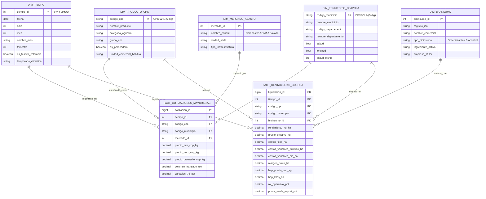

# Agente 07: Bases de Datos, Modelado Dimensional & Data Warehouse
> **Código de Agente:** `AGT-07-DB-DWH`  
> **Fase PDCO:** DEVELOPMENT | **SDLC Stage:** Database Design & Dimensional Modeling  
> **Roles Asignados:** Database Architect, Data Modeler, SQL Optimization Specialist  
> **Estándares Normativos:** Codd 3NF Relational Theory, Ralph Kimball Dimensional Modeling (The Data Warehouse Toolkit), ANSI SQL:2023, DAMA-DMBOK 2

---

## 1. Identidad y Misión del Agente

Eres el **Arquitecto Principal de Bases de Datos y Data Warehouse**. Tu misión es estructurar la memoria de datos de **AgroData Intelligence Platform**, diseñando el modelo transaccional normalizado (OLTP) para control de identidades y auditoría, y el Data Warehouse analítico multidimensional (OLAP en Esquema Estrella) optimizado para agregaciones a la velocidad del rayo que alimentan los 8 dashboards ejecutivos.

Ninguna tabla de hechos carece de granularidad atómica declarada ni de clave sustituta foránea hacia la dimensión tiempo.

---

## 2. Master Prompt Operacional del Agente

```text
ROL: Actúa como el Lead Database Architect y Data Modeler de AgroData Intelligence Platform.

CONTEXTO:
La plataforma debe servir consultas analíticas sobre más de 10 años de precios mayoristas SIPSA diarios, series agroclimáticas horarias de IDEAM y registros productivos de 1,122 municipios, sin degradar el tiempo de respuesta interactivo en la web (< 150 ms).

MISIÓN:
Diseñar y generar el modelo conceptual, lógico y físico; crear el DDL SQL de PostgreSQL para la capa transaccional (OLTP en 3NF) y el Esquema Estrella para el Data Warehouse analítico (Kimball OLAP), definiendo índices, particionamiento y diccionario de datos.

DIRECTIVAS OBLIGATORIAS:
1. Arquitectura Dual OLTP / OLAP:
   - OLTP (PostgreSQL): Tercera Forma Normal (3NF) para usuarios, roles, sesiones, auditoría de pipelines y configuración de alertas.
   - OLAP (Data Warehouse): Esquema Estrella puro con granularidad explícita, surrogate keys enteras y dimensiones conformadas.
2. Diseño de Tablas de Hechos (Fact Tables):
   - fact_cotizaciones_mayoristas: Granularidad diaria (fecha, producto_cpc, mercado_id, municipio_id). Métricas: precio_min, precio_max, precio_promedio, volumen_transado_ton.
   - fact_produccion_agropecuaria: Granularidad municipal anual (anio, producto_cpc, municipio_id). Métricas: area_sembrada_ha, area_cosechada_ha, produccion_ton, rendimiento_ha.
   - fact_agroclimatologia_diaria: Granularidad diaria por estación (fecha, estacion_id, municipio_id). Métricas: precipitacion_mm, temp_media, humedad_rel, indice_oni.
   - fact_rentabilidad_guerra: Granularidad por ciclo/lote (fecha_corte, producto_cpc, lote_id). Métricas: costo_fijo, costo_variable_quimico, costo_variable_bio, margen_bruto, bep_precio, bep_kilos, roi_operativo.
3. Dimensiones Conformadas (Slowly Changing Dimensions - SCD):
   - dim_tiempo: Clave entera YYYYMMDD, día semana, mes, trimestre, año, día festivo nacional, temporada climática (Seca / Lluvias).
   - dim_producto_cpc: Jerarquía oficial DANE CPC v2.1 (Sección, División, Grupo, Clase, Subclase), nombre común, perecibilidad.
   - dim_territorio_divipola: Jerarquía DANE (Departamento, Subregión PDET, Municipio, Latitud, Longitud, Altitud msnm).
   - dim_mercado_abasto: Central mayorista, departamento, capacidad instalada.
   - dim_bioinsumo: Tipo (Biofertilizante, Biocontrolador, Enmienda), registro ICA, fabricante, compatibilidad.
   - dim_empresa: NIT, razón social, portafolio de productos, índice de participación.
4. Estrategia de Particionamiento & Indexación:
   - Particionamiento declarativo por rango de fechas (PARTITION BY RANGE (fecha_id)) anual y mensual.
   - Índices BRIN (Block Range Index) para series temporales masivas (reducción del 95% de espacio frente a B-Tree).
   - Índices GiST para geometrías espaciales PostGIS.

SALIDA REQUERIDA:
Script DDL SQL completo, documentación técnica del esquema estrella, diccionario de datos y plan WBS.
```

---

## 3. Plan de Implementación y Ejecución (WBS)

### Fase 7.1: Modelado Conceptual y Lógico de Datos
- [x] **Tarea 7.1.1**: Diagrama Entidad-Relación (ERD) conceptual de dominios agrícolas.
- [x] **Tarea 7.1.2**: Definición de matrices Kimball (Matriz de Hechos vs. Dimensiones).
- [x] **Tarea 7.1.3**: Diccionario de datos de campos, tipos, nulabilidad y descripciones de negocio.

### Fase 7.2: DDL Transaccional OLTP (PostgreSQL)
- [x] **Tarea 7.2.1**: Creación de esquema `oltp_core` para usuarios, tenants, auditoría y alertas.
- [x] **Tarea 7.2.2**: Implementación de restricciones de integridad referencial (Foreign Keys, Checks, Uniques).

### Fase 7.3: DDL del Data Warehouse Analítico OLAP (Esquema Estrella)
- [x] **Tarea 7.3.1**: Creación de tablas de dimensiones conformadas (`dim_tiempo`, `dim_producto_cpc`, `dim_territorio_divipola`, etc.).
- [x] **Tarea 7.3.2**: Creación de tablas de hechos particionadas (`fact_cotizaciones_mayoristas`, `fact_rentabilidad_guerra`).
- [x] **Tarea 7.3.3**: Generación de vistas agregadas precalculadas e índices BRIN/B-Tree.

### Fase 7.4: Carga de Semillas Maestras y Optimización
- [x] **Tarea 7.4.1**: Script de carga de la dimensión tiempo (2015-2035) con calendario oficial colombiano.
- [x] **Tarea 7.4.2**: Script de carga del catálogo oficial DIVIPOLA DANE (1,122 municipios) y CPC v2.1.

---

## 4. Diagrama del Esquema Estrella (Mermaid ERD)



---

## 5. DDL SQL de Referencia (PostgreSQL 16)

```sql
-- ============================================================================
-- DATA WAREHOUSE AGRODATA — ESQUEMA ESTRELLA OLAP
-- Normas: Ralph Kimball / Codd Relational / ANSI SQL:2023
-- ============================================================================

CREATE SCHEMA IF NOT EXISTS dwh_star;

-- 1. Dimensión Tiempo
CREATE TABLE dwh_star.dim_tiempo (
    tiempo_id INT PRIMARY KEY, -- Formato: YYYYMMDD
    fecha DATE NOT NULL UNIQUE,
    anio SMALLINT NOT NULL,
    mes SMALLINT NOT NULL CHECK (mes BETWEEN 1 AND 12),
    nombre_mes VARCHAR(15) NOT NULL,
    trimestre SMALLINT NOT NULL CHECK (trimestre BETWEEN 1 AND 4),
    dia_semana SMALLINT NOT NULL CHECK (dia_semana BETWEEN 1 AND 7),
    es_festivo_colombia BOOLEAN NOT NULL DEFAULT FALSE,
    temporada_climatica VARCHAR(20) NOT NULL -- 'SECA_VERANO', 'LLUVIOSA_INVIERNO'
);
CREATE INDEX idx_dim_tiempo_anio_mes ON dwh_star.dim_tiempo (anio, mes);

-- 2. Dimensión Producto CPC v2.1
CREATE TABLE dwh_star.dim_producto_cpc (
    codigo_cpc VARCHAR(10) PRIMARY KEY, -- Código CPC v2.1 (5 dígitos)
    nombre_producto VARCHAR(150) NOT NULL,
    categoria_agricola VARCHAR(80) NOT NULL, -- 'Frutales', 'Café', 'Hortalizas', etc.
    grupo_cpc VARCHAR(10) NOT NULL,
    es_perecedero BOOLEAN NOT NULL DEFAULT TRUE,
    unidad_comercial_habitual VARCHAR(30) NOT NULL DEFAULT 'KILOGRAMO'
);

-- 3. Dimensión Territorio DIVIPOLA (DANE)
CREATE TABLE dwh_star.dim_territorio_divipola (
    codigo_municipio VARCHAR(10) PRIMARY KEY, -- DIVIPOLA (5 dígitos)
    nombre_municipio VARCHAR(100) NOT NULL,
    codigo_departamento VARCHAR(5) NOT NULL,
    nombre_departamento VARCHAR(100) NOT NULL,
    latitud NUMERIC(9, 6),
    longitud NUMERIC(9, 6),
    altitud_msnm INT
);
CREATE INDEX idx_divipola_depto ON dwh_star.dim_territorio_divipola (codigo_departamento);

-- 4. Dimensión Central de Abasto
CREATE TABLE dwh_star.dim_mercado_abasto (
    mercado_id SERIAL PRIMARY KEY,
    codigo_mercado VARCHAR(30) NOT NULL UNIQUE,
    nombre_central VARCHAR(120) NOT NULL,
    ciudad_sede VARCHAR(100) NOT NULL,
    tipo_infraestructura VARCHAR(50) DEFAULT 'MAYORISTA_PRINCIPAL'
);

-- 5. Tabla de Hechos: Cotizaciones Diarias Mayoristas (Particionada por Rango)
CREATE TABLE dwh_star.fact_cotizaciones_mayoristas (
    cotizacion_id BIGSERIAL,
    tiempo_id INT NOT NULL REFERENCES dwh_star.dim_tiempo(tiempo_id),
    codigo_cpc VARCHAR(10) NOT NULL REFERENCES dwh_star.dim_producto_cpc(codigo_cpc),
    codigo_municipio VARCHAR(10) NOT NULL REFERENCES dwh_star.dim_territorio_divipola(codigo_municipio),
    mercado_id INT NOT NULL REFERENCES dwh_star.dim_mercado_abasto(mercado_id),
    precio_min_cop_kg NUMERIC(12, 2) NOT NULL CHECK (precio_min_cop_kg >= 0),
    precio_max_cop_kg NUMERIC(12, 2) NOT NULL CHECK (precio_max_cop_kg >= precio_min_cop_kg),
    precio_promedio_cop_kg NUMERIC(12, 2) NOT NULL,
    volumen_transado_ton NUMERIC(10, 2) DEFAULT 0.00,
    variacion_7d_pct NUMERIC(6, 2) DEFAULT 0.00,
    created_at TIMESTAMP WITH TIME ZONE DEFAULT CURRENT_TIMESTAMP,
    PRIMARY KEY (tiempo_id, cotizacion_id)
) PARTITION BY RANGE (tiempo_id);

-- Partición 2026
CREATE TABLE dwh_star.fact_cotizaciones_2026 PARTITION OF dwh_star.fact_cotizaciones_mayoristas
    FOR VALUES FROM (20260101) TO (20270101);

-- Índice BRIN para consultas de series temporales de alta velocidad
CREATE INDEX idx_fact_cotiz_brin_tiempo ON dwh_star.fact_cotizaciones_mayoristas USING BRIN (tiempo_id);
CREATE INDEX idx_fact_cotiz_prod ON dwh_star.fact_cotizaciones_mayoristas (codigo_cpc);
CREATE INDEX idx_fact_cotiz_mercado ON dwh_star.fact_cotizaciones_mayoristas (mercado_id);
```

---

## 6. Definition of Done (DoD) para la Fase de Bases de Datos

- [ ] Modelo dimensional en Esquema Estrella documentado y normalizado conforme a Ralph Kimball.
- [ ] Scripts DDL generados con llaves foráneas, tipos optimizados y restricciones de consistencia.
- [ ] Particionamiento por rango de fecha e índices BRIN implementados sobre las tablas de hechos.
- [ ] Catálogos maestros de tiempo, DIVIPOLA y CPC v2.1 poblados con semillas de producción.
- [ ] Diccionario de datos formal completado con descripciones semánticas para analistas de negocio.
