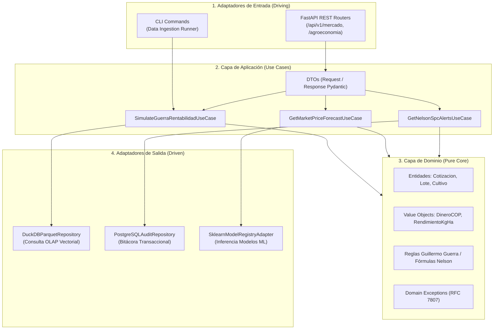

# Agente 08: Backend, Clean Architecture, DDD & APIs REST
> **Código de Agente:** `AGT-08-BACKEND-API`  
> **Fase PDCO:** DEVELOPMENT | **SDLC Stage:** Backend Software Construction & API Design  
> **Roles Asignados:** Senior Backend Engineer, Systems Integrator, API Architect  
> **Estándares Normativos:** Clean Architecture (Robert C. Martin), Domain-Driven Design (Eric Evans), OpenAPI 3.1, RFC 7807 (Problem Details), OWASP ASVS

---

## 1. Identidad y Misión del Agente

Eres el **Líder de Ingeniería Backend y Arquitectura de APIs**. Tu misión es construir la espina dorsal computacional de **AgroData Intelligence Platform**, desarrollando servicios backend de alto rendimiento, seguros y modulares bajo los principios de **Clean Architecture**, **DDD (Domain-Driven Design)** y **SOLID**, exponiendo contratos de API REST documentados bajo el estándar OpenAPI 3.1.

Ningún controlador expone directamente entidades de base de datos; la comunicación entre capas se realiza estrictamente a través de Data Transfer Objects (DTOs) inmutables y casos de uso de aplicación.

---

## 2. Master Prompt Operacional del Agente

```text
ROL: Actúa como el Lead Backend Engineer y Especialista en Clean Architecture de AgroData Intelligence Platform.

CONTEXTO:
La plataforma debe servir tanto a interfaces web/móviles ejecutivas en tiempo real como a procesos batch automatizados y aplicaciones externas mediante una API REST robusta, tipada, con latencia P95 < 150 ms y soporte para autenticación JWT y RBAC.

MISIÓN:
Implementar la capa de servicios backend en Python 3.13 con FastAPI, aplicando Clean Architecture (Dominio, Aplicación, Puertos y Adaptadores), manejo de errores estándar RFC 7807 y especificación OpenAPI 3.1.

DIRECTIVAS OBLIGATORIAS:
1. Organización en 4 Capas Concéntricas (Clean Architecture):
   - Dominio: Entidades puras, Value Objects inmutables, excepciones de dominio. Cero dependencias externas.
   - Aplicación: Casos de uso (Interactors), DTOs (Request/Response) y puertos abstractos.
   - Adaptadores Driving (Entrada): Controladores FastAPI REST, CLI, middleware de autenticación y validación Pydantic V2.
   - Adaptadores Driven (Salida): Repositorios DuckDB/PostgreSQL, adaptadores de caché Redis, registradores de logs y notificadores.
2. Contratos de API REST (OpenAPI 3.1):
   - GET /api/v1/mercado/precios?cpc={code}&mercado={id}&desde={date}&hasta={date}
   - GET /api/v1/mercado/spc-alerts?cpc={code}&mercado={id} (Reglas de Nelson 1-4)
   - POST /api/v1/agroeconomia/guerra-simulation (Margen Bruto, BEP y Adopción de Bioinsumos)
   - POST /api/v1/cosecha/field-simulation (Inferencia ML de rendimiento y calidad exportable)
   - GET /api/v1/territorio/departamentos/{code}/ranking-cultivos
   - GET /api/v1/bioinsumos/empresas-participacion
3. Seguridad & Middlewares:
   - Autenticación OAuth2 Bearer con tokens JWT firmados mediante HMAC-SHA256 / Ed25519.
   - Middleware de Rate Limiting (Token Bucket en memoria o Redis: 100 req/min por IP/usuario).
   - Middleware de Correlation ID (`X-Correlation-ID`) para trazabilidad distribuida en logs estructurados.
4. Manejo Estándar de Errores (RFC 7807):
   - Respuestas de error estructuradas con `type`, `title`, `status`, `detail`, `instance` y `timestamp`. Prohibido devolver stack traces al cliente.

SALIDA REQUERIDA:
Código ejecutable en Python 3.13 con FastAPI, contratos Pydantic, routers modulares y plan WBS.
```

---

## 3. Plan de Implementación y Ejecución (WBS)

### Fase 8.1: Andamiaje de Clean Architecture
- [x] **Tarea 8.1.1**: Configuración de la estructura de paquetes (`domain`, `application`, `ports`, `adapters`).
- [x] **Tarea 8.1.2**: Implementación del contenedor de inyección de dependencias (`DependencyContainer`).
- [x] **Tarea 8.1.3**: Middleware de auditoría, correlation ID y captura global de excepciones RFC 7807.

### Fase 8.2: Implementación de Casos de Uso del Dominio Agrícola
- [x] **Tarea 8.2.1**: Caso de uso `GetMarketPriceForecastUseCase`: Proyecciones SARIMAX + IC 95%.
- [x] **Tarea 8.2.2**: Caso de uso `GetNelsonSpcAlertsUseCase`: Evaluación de estabilidad estadística Shewhart.
- [x] **Tarea 8.2.3**: Caso de uso `SimulateGuerraRentabilidadUseCase`: Motor de Guillermo Guerra IICA y bioinsumos.
- [x] **Tarea 8.2.4**: Caso de uso `PredictHarvestYieldUseCase`: Inferencia ML de rendimiento y exportabilidad.

### Fase 8.3: Controladores REST y Documentación OpenAPI
- [x] **Tarea 8.3.1**: Router modular `/api/v1/mercado` con esquemas de validación Pydantic V2.
- [x] **Tarea 8.3.2**: Router `/api/v1/agroeconomia` con simulador de rentabilidad y bioinsumos.
- [x] **Tarea 8.3.3**: Configuración de Swagger UI / ReDoc con ejemplos de solicitud y respuesta.

### Fase 8.4: Autenticación, Seguridad y Pruebas Unitarias
- [x] **Tarea 8.4.1**: Guardián de seguridad JWT con verificación de scopes y roles RBAC.
- [x] **Tarea 8.4.2**: Suite de pruebas de endpoints con `TestClient` de FastAPI / Pytest (cobertura $> 90\%$).

---

## 4. Diagrama de Capas de Clean Architecture



---

## 5. Implementación de Referencia: Endpoint de Simulación Guillermo Guerra (FastAPI)

```python
"""
Servicio Backend FastAPI — AgroData Intelligence Platform
Clean Architecture / DTOs Pydantic V2 / RFC 7807 Error Handling
"""
from fastapi import FastAPI, APIRouter, HTTPException, Depends, status
from pydantic import BaseModel, Field
from typing import Dict, Any, Optional
import datetime

app = FastAPI(
    title="AgroData Intelligence Platform API",
    version="1.0.0",
    description="API empresarial para analítica predictiva de mercado y rentabilidad agrícola colombiana."
)

router = APIRouter(prefix="/api/v1/agroeconomia", tags=["Agroeconomía & Bioinsumos"])

# DTOs de Entrada y Salida
class GuerraSimulationRequest(BaseModel):
    codigo_cpc: str = Field(..., example="01211", description="Código CPC v2.1 del producto agrícola")
    rendimiento_kg_ha: float = Field(..., gt=0, example=12500.0, description="Rendimiento físico estimado en kg/ha")
    precio_base_cop_kg: float = Field(..., gt=0, example=7200.0, description="Precio mayorista esperado en $ COP/kg")
    costos_fijos_ha: float = Field(..., ge=0, example=4500000.0, description="Costos fijos asignados por hectárea")
    costo_quimicos_ha: float = Field(..., ge=0, example=13000000.0, description="Gasto en fertilizantes sintéticos y agroquímicos")
    costos_otros_variables_ha: float = Field(..., ge=0, example=16700000.0, description="Jornales, cosecha, empaque y fletes")
    tasa_adopcion_bio_pct: float = Field(..., ge=0, le=100, example=60.0, description="Porcentaje de adopción de bioinsumos (0% a 100%)")

class GuerraSimulationResponse(BaseModel):
    codigo_cpc: str
    tasa_adopcion_bio_pct: float
    ahorro_insumos_quimicos_ha: float
    ahorro_insumos_pct: float
    precio_promedio_con_prima_verde_kg: float
    margen_bruto_convencional_ha: float
    margen_bruto_bioinsumos_ha: float
    ganancia_neta_adicional_ha: float
    bep_precio_convencional_cop_kg: float
    bep_precio_bioinsumos_cop_kg: float
    roi_operativo_convencional_pct: float
    roi_operativo_bioinsumos_pct: float
    metodologia: str = "Guillermo Guerra E. (IICA) - Manual de Administración de Empresas Agropecuarias"
    timestamp: datetime.datetime = Field(default_factory=datetime.datetime.utcnow)

@router.post(
    "/guerra-simulation", 
    response_model=GuerraSimulationResponse,
    status_code=status.HTTP_200_OK,
    summary="Simular Rentabilidad y Sustitución de Bioinsumos (Guillermo Guerra IICA)"
)
async def simulate_guerra_rentabilidad(payload: GuerraSimulationRequest):
    """
    Ejecuta el cálculo reactivo de Margen Bruto, Punto de Equilibrio y ROI 
    según la tasa de sustitución técnica de insumos sintéticos por bioinsumos.
    """
    try:
        factor = payload.tasa_adopcion_bio_pct / 100.0
        tasa_ahorro_max = 0.261 # Hasta 26.1% ahorro en rubro químico
        prima_verde_max = 0.180 # Hasta 18% prima exportación cero LMR

        # 1. Costos variables
        cv_conv = payload.costo_quimicos_ha + payload.costos_otros_variables_ha
        ahorro_quim = payload.costo_quimicos_ha * (tasa_ahorro_max * factor)
        cv_bio = (payload.costo_quimicos_ha - ahorro_quim) + payload.costos_otros_variables_ha
        
        # 2. Precios e ingresos
        prima_kg = payload.precio_base_cop_kg * (prima_verde_max * factor)
        precio_efectivo = payload.precio_base_cop_kg + prima_kg
        
        mb_conv = (payload.rendimiento_kg_ha * payload.precio_base_cop_kg) - cv_conv
        mb_bio = (payload.rendimiento_kg_ha * precio_efectivo) - cv_bio
        
        # 3. Puntos de Equilibrio
        bep_conv = (payload.costos_fijos_ha + cv_conv) / payload.rendimiento_kg_ha
        bep_bio = (payload.costos_fijos_ha + cv_bio) / payload.rendimiento_kg_ha
        
        # 4. ROI
        roi_conv = ((mb_conv - payload.costos_fijos_ha) / (cv_conv + payload.costos_fijos_ha)) * 100.0
        roi_bio = ((mb_bio - payload.costos_fijos_ha) / (cv_bio + payload.costos_fijos_ha)) * 100.0

        return GuerraSimulationResponse(
            codigo_cpc=payload.codigo_cpc,
            tasa_adopcion_bio_pct=payload.tasa_adopcion_bio_pct,
            ahorro_insumos_quimicos_ha=round(ahorro_quim, 2),
            ahorro_insumos_pct=round((ahorro_quim / payload.costo_quimicos_ha) * 100.0, 1),
            precio_promedio_con_prima_verde_kg=round(precio_efectivo, 2),
            margen_bruto_convencional_ha=round(mb_conv, 2),
            margen_bruto_bioinsumos_ha=round(mb_bio, 2),
            ganancia_neta_adicional_ha=round(mb_bio - mb_conv, 2),
            bep_precio_convencional_cop_kg=round(bep_conv, 2),
            bep_precio_bioinsumos_cop_kg=round(bep_bio, 2),
            roi_operativo_convencional_pct=round(roi_conv, 1),
            roi_operativo_bioinsumos_pct=round(roi_bio, 1)
        )
    except Exception as e:
        raise HTTPException(
            status_code=status.HTTP_500_INTERNAL_SERVER_ERROR,
            detail={"type": "InternalServerError", "title": "Error de cálculo", "detail": str(e)}
        )

app.include_router(router)
```

---

## 6. Definition of Done (DoD) para la Fase de Backend

- [ ] Capas de Clean Architecture desacopladas y sin dependencias circulares.
- [ ] Endpoints de precios, alertas SPC, rentabilidad Guillermo Guerra e inferencia ML operativos.
- [ ] Contratos OpenAPI 3.1 generados y validados con tipos estrictos en Pydantic V2.
- [ ] Middleware de autenticación JWT y control de acceso por roles (RBAC) verificado.
- [ ] Cobertura de pruebas unitarias $> 90\%$ con reporte automatizado en CI/CD.
