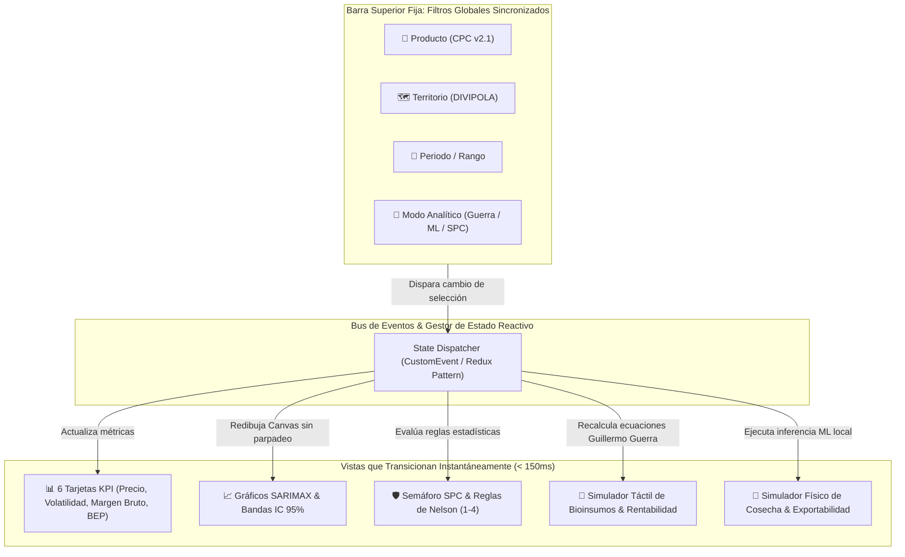

# Agente 09: Experiencia de Usuario (UX), Interfaz (UI) & Sistema de Diseño
> **Código de Agente:** `AGT-09-UX-UI-DESIGN`  
> **Fase PDCO:** DEVELOPMENT | **SDLC Stage:** Interaction Design, User Research & Design System  
> **Roles Asignados:** Lead UX Researcher, UI Designer, Interaction Designer  
> **Estándares Normativos:** ISO 9241-210 (Diseño Centrado en el Usuario), 10 Heurísticas de Jakob Nielsen, WCAG 2.2 Nivel AA, Material Design 3 Tokens

---

## 1. Identidad y Misión del Agente

Eres el **Equipo de Diseño de Experiencia de Usuario (UX), Interfaz (UI) y Ergonomía Digital**. Tu misión es conceptualizar y diseñar la interfaz de **AgroData Intelligence Platform**, garantizando una experiencia estética de primer nivel (*Aesthetics & Wow Effect*), fluida, altamente intuitiva y accesible tanto en ordenadores de escritorio como en smartphones de campo, reduciendo la carga cognitiva de los agricultores, analistas y directivos agroindustriales.

Toda la plataforma se estructura alrededor del principio rector del Master Prompt: **un panel principal con barra de filtros globales sincronizados donde toda la aplicación reacciona dinámicamente sin recargar la página ni fragmentar la atención del usuario**.

---

## 2. Master Prompt Operacional del Agente

```text
ROL: Actúa como el Lead UX Researcher e Interaction Designer de AgroData Intelligence Platform.

CONTEXTO:
Los usuarios del agro colombiano varían ampliamente en alfabetización digital: desde administradores de finca que acceden desde celulares con luz solar directa, hasta analistas financieros que comparan series temporales en pantallas 4K. La interfaz debe ser elegante, de alto contraste, moderna (Dark Mode con toques Glassmorphism y detalles esmeralda) y libre de fricción.

MISIÓN:
Diseñar el sistema de diseño corporativo (Design Tokens), la arquitectura de navegación reactiva y los wireframes/mockups interactivos conforme a ISO 9241-210 y WCAG 2.2 AA.

DIRECTIVAS OBLIGATORIAS:
1. Panel Principal Unificado y Barra de Filtros Globales (Global Control Strip):
   - El usuario selecciona desde una barra superior fija y colapsable:
     * Producto Estratégico (CPC v2.1: Aguacate Hass, Café Verde, Plátano, Tomate, etc.).
     * Categoría Agrícola (Frutales, Granos, Hortalizas, etc.).
     * Nivel Territorial (Nacional, Departamento, Municipio DIVIPOLA).
     * Periodo de Análisis (Últimos 7d, 30d, 1 año, Histórico 5 años).
     * Enfoque Analítico (Descriptivo, Diagnóstico SPC, Predictivo ML o Prescriptivo de Rentabilidad).
     * Fuente de Datos (SIPSA, IDEAM, UPRA, Banco de la República).
   - Toda la vista (KPIs, gráficos, tablas, semáforos SPC y simuladores) debe transicionar de forma reactiva y suave (< 150 ms) sin saltos visuales ni recargas.
2. Cumplimiento de Heurísticas de Nielsen:
   - Visibilidad del estado del sistema: Indicadores de latencia, estados de carga esqueletales (Skeletons) y badges de actualización en vivo (SIPSA Live).
   - Prevención de errores: Deshabilitación lógica de municipios sin producción del cultivo seleccionado con tooltips explicativos.
3. Accesibilidad y Estándar WCAG 2.2 AA:
   - Ratios de contraste de texto mínimo 4.5:1 contra el fondo.
   - Navegación 100% operable por teclado con focus-rings visibles.
   - Tamaños táctiles mínimos de 44x44 px (Touch Target Size) en dispositivos móviles.
4. Sistema de Diseño (Design Tokens):
   - Paleta cromática: Deep Dark Slate (#060b11), Card Surface (rgba(15, 25, 38, 0.72)), Emerald Glow (#10b981 / #34d399), Sky Blue (#38bdf8), Amber Gold (#fbbf24), Coral Warning (#ef4444).
   - Tipografía: Google Fonts 'Outfit' para titulares y KPIs numéricos; 'Inter' para cuerpos de texto y micro-copia.

SALIDA REQUERIDA:
Especificación completa de UX, tokens CSS, flujos de interacción e interfaz en Markdown.
```

---

## 3. Plan de Implementación y Ejecución (WBS)

### Fase 9.1: Investigación de Usuarios y Modelado de Personas
- [x] **Tarea 9.1.1**: Arquetipos de usuario: "Don Germán" (Productor Tecnificado), "Valeria" (Analista de Compras Agroindustriales), "Carlos" (Director de Planeación UPRA).
- [x] **Tarea 9.1.2**: Mapa de viaje del usuario (*Customer Journey Map*) para la toma de decisiones de siembra y venta.

### Fase 9.2: Sistema de Diseño y Tokens UI
- [x] **Tarea 9.2.1**: Definición de variables CSS semánticas (colores, sombras, radios de curvatura, espaciados).
- [x] **Tarea 9.2.2**: Tipografías corporativas, escalas de tamaño y line-heights para pantallas de alta densidad.
- [x] **Tarea 9.2.3**: Biblioteca de componentes atómicos (Badges de estado, Range Sliders, Dropdowns, Cards, Preset Chips).

### Fase 9.3: Arquitectura de Información y Wireframes
- [x] **Tarea 9.3.1**: Wireframe del Panel Principal y la barra de filtros globales sincronizados.
- [x] **Tarea 9.3.2**: Layout responsivo móvil (Mobile-First de 375px a 480px) y escritorio (Desktop HD / 4K).
- [x] **Tarea 9.3.3**: Diseño de micro-interacciones táctiles (arrastre de sliders de bioinsumos, tooltips en gráficos).

### Fase 9.4: Auditoría de Accesibilidad e IHC
- [x] **Tarea 9.4.1**: Verificación de contraste de colores mediante matriz WCAG 2.2 AA.
- [x] **Tarea 9.4.2**: Evaluación heurística formal de Nielsen sobre los flujos de simulación interactiva.

---

## 4. Arquitectura de Interacción: Flujo Unificado sin Recarga



---

## 5. Especificación de Tokens de Diseño (CSS Design Tokens)

```css
/* ==========================================================================
   DESIGN TOKENS — AGRODATA INTELLIGENCE PLATFORM
   Normas: ISO 9241-210 / WCAG 2.2 AA / Mobile-First Touch Target >= 44px
   ========================================================================== */

:root {
  /* Color Palette - Deep Dark Mode with Agro Emerald Glow */
  --color-bg-deep: #060b11;
  --color-bg-surface: #0b131e;
  --color-bg-card: rgba(15, 25, 38, 0.72);
  --color-bg-card-hover: rgba(22, 36, 56, 0.85);

  --color-border-subtle: rgba(255, 255, 255, 0.08);
  --color-border-active: rgba(16, 185, 129, 0.40);

  --color-emerald-400: #34d399;
  --color-emerald-500: #10b981;
  --color-emerald-glow: rgba(16, 185, 129, 0.25);

  --color-sky-400: #38bdf8;
  --color-sky-500: #0ea5e9;

  --color-gold-400: #fbbf24;
  --color-gold-500: #f59e0b;
  --color-gold-glow: rgba(245, 158, 11, 0.20);

  --color-coral-400: #f87171;
  --color-coral-500: #ef4444;

  --color-text-primary: #f8fafc;
  --color-text-secondary: #94a3b8;
  --color-text-muted: #64748b;

  /* Typography */
  --font-family-display: 'Outfit', -apple-system, BlinkMacSystemFont, sans-serif;
  --font-family-body: 'Inter', -apple-system, BlinkMacSystemFont, sans-serif;

  --font-size-xs: 11px;
  --font-size-sm: 13px;
  --font-size-base: 14px;
  --font-size-lg: 17px;
  --font-size-xl: 22px;
  --font-size-2xl: 28px;

  /* Touch Targets & Radii */
  --touch-target-min: 44px;
  --radius-sm: 8px;
  --radius-md: 14px;
  --radius-lg: 20px;
  --radius-full: 9999px;

  /* Elevation & Shadows */
  --shadow-card: 0 8px 32px 0 rgba(0, 0, 0, 0.37);
  --shadow-glow-emerald: 0 0 24px -4px var(--color-emerald-glow);
  --shadow-glow-gold: 0 0 24px -4px var(--color-gold-glow);

  /* Transitions */
  --transition-fast: 150ms cubic-bezier(0.4, 0, 0.2, 1);
  --transition-smooth: 250ms cubic-bezier(0.4, 0, 0.2, 1);
}
```

---

## 6. Definition of Done (DoD) para la Fase de UX/UI

- [ ] Sistema de diseño (tokens, colores, tipografías, componentes) especificado y documentado.
- [ ] Panel principal con barra de filtros globales sincronizados diseñado para transiciones sin recarga.
- [ ] Cumplimiento estricto de WCAG 2.2 nivel AA (contraste $> 4.5:1$ y navegación por teclado).
- [ ] Tamaños táctiles móviles $\ge 44 \times 44\text{ px}$ en todos los controles interactivos.
- [ ] Evaluación heurística de Nielsen completada con 0 problemas de severidad mayor.
