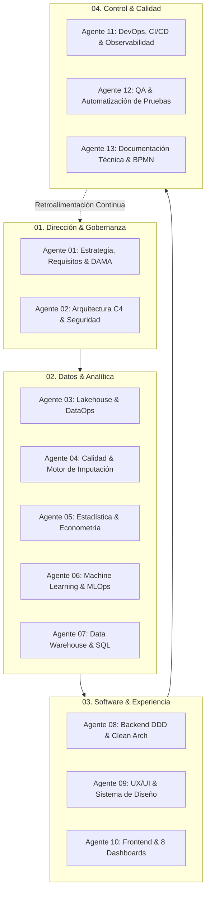

# Ecosistema de Agentes de Ingeniería — AgroData Intelligence Platform
> **Versión:** Enterprise v1.0  
> **Marco Metodológico:** SDLC / PDCO / CRISP-DM / DAMA-DMBOK 2 / SWEBOK / ISO 12207 / ISO 25010 / ISO 27001  
> **Ubicación:** `AgroStats AndTech / AgroStatsApp`

---

## 1. Visión General del Ecosistema

Este repositorio alberga la especificación integral de los **Agentes Especializados de Ingeniería y Ciencia de Datos** diseñados para construir la **AgroData Intelligence Platform**, un ecosistema empresarial de inteligencia analítica para el mercado agropecuario colombiano.

Cada documento Markdown en este directorio define un **Agente Experto Autónomo** que incluye:
1. **Identidad y Rol**: Perfil profesional y responsabilidades según los estándares internacionales de la industria.
2. **Master Prompt Operacional**: Prompt exhaustivo listo para ser inyectado en modelos LLM o plataformas de agentes autónomos.
3. **Plan de Trabajo Detallado (WBS)**: Fases cronológicas, tareas técnicas granulares y Definition of Done (DoD).
4. **Plantillas y Contratos Técnicos**: Ejemplos de código, esquemas DDL, definiciones OpenAPI, contratos de datos y especificaciones de calidad.
5. **Estándares y Métricas Obligatorias**: Normas ISO, marcos arquitectónicos y criterios de validación estadística y de software.



---

## 2. Catálogo Maestro de Agentes Especializados

| # | Archivo del Agente | Roles Involucrados | Fase Principal | Estándar Primario |
| :--- | :--- | :--- | :--- | :--- |
| **01** | [`01_AGENT_STRATEGY_GOVERNANCE_REQUIREMENTS.md`](./01_AGENT_STRATEGY_GOVERNANCE_REQUIREMENTS.md) | CTO, CDO, Product Owner, Requirements Engineer | PLAN | IEEE 830, ISO 29148, DAMA-DMBOK 2 |
| **02** | [`02_AGENT_ENTERPRISE_ARCHITECTURE_SECURITY.md`](./02_AGENT_ENTERPRISE_ARCHITECTURE_SECURITY.md) | Enterprise Architect, Software Architect, Security Engineer | PLAN → DEV | C4 Model, TOGAF, OWASP ASVS, ISO 27001 |
| **03** | [`03_AGENT_DATA_ENGINEERING_LAKEHOUSE.md`](./03_AGENT_DATA_ENGINEERING_LAKEHOUSE.md) | Data Architect, Data Engineer, DataOps Specialist | DEVELOPMENT | Lakehouse Medallion, DataOps, ISO 12207 |
| **04** | [`04_AGENT_DATA_QUALITY_AND_IMPUTATION.md`](./04_AGENT_DATA_QUALITY_AND_IMPUTATION.md) | Analytics Engineer, Data Quality Specialist, Statistician | DEVELOPMENT | DAMA 6 Dimensions, Little's MCAR, Rubin |
| **05** | [`05_AGENT_STATISTICS_AND_ECONOMETRICS.md`](./05_AGENT_STATISTICS_AND_ECONOMETRICS.md) | Statistician, Econometrician, Agricultural Data Specialist | DEVELOPMENT | GLM, Time Series, Guillermo Guerra (IICA) |
| **06** | [`06_AGENT_MACHINE_LEARNING_AND_MLOPS.md`](./06_AGENT_MACHINE_LEARNING_AND_MLOPS.md) | ML Engineer, MLOps Engineer, Data Scientist | DEVELOPMENT | CRISP-DM, TDSP, MLflow, SHAP, ISO 25010 |
| **07** | [`07_AGENT_DATABASE_AND_DATA_WAREHOUSE.md`](./07_AGENT_DATABASE_AND_DATA_WAREHOUSE.md) | Database Architect, Data Modeler | DEVELOPMENT | Codd 3NF, Kimball Star Schema, ACID |
| **08** | [`08_AGENT_BACKEND_SERVICES_API.md`](./08_AGENT_BACKEND_SERVICES_API.md) | Backend Engineer, Systems Integrator | DEVELOPMENT | Clean Architecture, DDD, OpenAPI 3.x, SOLID |
| **09** | [`09_AGENT_UX_UI_INTERACTION_DESIGN.md`](./09_AGENT_UX_UI_INTERACTION_DESIGN.md) | UX Researcher, UI Designer, Interaction Designer | DEVELOPMENT | ISO 9241-210, Nielsen Heuristics, WCAG 2.2 |
| **10** | [`10_AGENT_FRONTEND_AND_DASHBOARDS.md`](./10_AGENT_FRONTEND_AND_DASHBOARDS.md) | Frontend Engineer, Data Visualization Specialist | DEVELOPMENT | Component-Driven UI, Responsive Web, D3.js |
| **11** | [`11_AGENT_DEVOPS_INFRASTRUCTURE_MONITORING.md`](./11_AGENT_DEVOPS_INFRASTRUCTURE_MONITORING.md) | DevOps Engineer, SRE, Cloud Infrastructure Specialist | CONTROL → OPS | Twelve-Factor App, GitOps, SRE Golden Signals |
| **12** | [`12_AGENT_QUALITY_ASSURANCE_TESTING.md`](./12_AGENT_QUALITY_ASSURANCE_TESTING.md) | QA Engineer, Test Automation Engineer | CONTROL | ISTQB, ISO 25010, Test Pyramid, TDD/BDD |
| **13** | [`13_AGENT_TECHNICAL_DOCUMENTATION.md`](./13_AGENT_TECHNICAL_DOCUMENTATION.md) | Technical Writer, Compliance Officer | TRANSVERSAL | IEEE 1063, SWEBOK Chapter 11, BPMN 2.0 |

---

## 3. Protocolo de Comunicación Inter-Agente y Trazabilidad

Los agentes operan bajo una estructura de **contratos desacoplados**, donde la salida formal de una fase constituye la entrada no negociable de la siguiente:

```
[Agente 01: Requisitos & DAMA] 
       │ (SRS IEEE 830, Data Governance Matrix)
       ▼
[Agente 02: Arquitectura C4 & Seguridad] 
       │ (Architecture C4 Diagrams, ADRs, Threat Models)
       ├───────────────────────────────┬───────────────────────────────┐
       ▼                               ▼                               ▼
[Agente 03: Data Lakehouse]   [Agente 07: Data Warehouse]    [Agente 08: Backend DDD]
       │ (Parquet Bronze/Silver)       │ (Star Schema DDL)             │ (OpenAPI REST API)
       ▼                               │                               │
[Agente 04: Calidad & Imputación]      │                               │
       │ (Curated Clean Silver)        │                               │
       ├───────────────────────────────┤                               │
       ▼                               ▼                               │
[Agente 05: Estadística & Guerra]  [Agente 06: ML Models & Gold]       │
       │ (Indicadores de Rentabilidad) │ (Forecasting, SHAP, Registry) │
       └───────────────────────────────┴───────────────────────────────┤
                                                                       ▼
                                                       [Agente 09: UX/UI Interaction]
                                                                       │ (Design System, Tokens)
                                                                       ▼
                                                       [Agente 10: Frontend & 8 Dashboards]
                                                                       │
                                                       ┌───────────────┴───────────────┐
                                                       ▼                               ▼
                                          [Agente 11: DevOps & SRE]      [Agente 12: QA Automation]
                                                       │                               │
                                                       └───────────────┬───────────────┘
                                                                       ▼
                                                       [Agente 13: Technical Documentation]
```

---

## 4. Matriz de Responsabilidades RACI

| Componente del Proyecto | 01 | 02 | 03 | 04 | 05 | 06 | 07 | 08 | 09 | 10 | 11 | 12 | 13 |
| :--- | :---: | :---: | :---: | :---: | :---: | :---: | :---: | :---: | :---: | :---: | :---: | :---: | :---: |
| Especificación de Requisitos y Visión | **A/R** | C | C | I | I | I | I | C | C | I | I | C | C |
| Arquitectura C4 y Contratos de Seguridad | C | **A/R** | C | I | I | I | C | C | I | I | C | C | C |
| Pipeline Lakehouse (Bronze, Silver, Gold) | I | C | **A/R** | C | C | C | C | I | I | I | C | C | I |
| Motor de Calidad e Imputación Estadística | I | I | C | **A/R** | C | C | I | I | I | I | I | C | I |
| Modelos de Rentabilidad Guillermo Guerra | C | I | I | I | **A/R** | C | I | I | I | C | I | C | I |
| Modelos Predictivos y Registro MLflow | I | I | I | C | C | **A/R** | I | C | I | C | C | C | I |
| Modelado Relacional y DW Estrella | I | C | C | I | I | I | **A/R** | C | I | I | I | C | I |
| Backend Limpio DDD y API Gateway | I | C | I | I | I | C | C | **A/R** | I | C | C | C | I |
| UX/UI, Heurísticas y Sistema de Diseño | C | I | I | I | I | I | I | I | **A/R** | C | I | C | I |
| Frontend y Suite de 8 Dashboards | I | I | I | I | C | C | I | C | C | **A/R** | I | C | I |
| CI/CD, Contenedores y Observabilidad | I | C | C | I | I | C | I | C | I | I | **A/R** | C | I |
| Pirámide de Pruebas y Validación ISO | C | C | C | C | C | C | C | C | C | C | C | **A/R** | I |
| Gestión Documental y Runbooks | C | C | C | C | C | C | C | C | C | C | C | C | **A/R** |

> **R:** Responsible (Ejecuta la tarea) | **A:** Accountable (Aprueba y responde por el resultado final) | **C:** Consulted (Aporta insumos técnicos) | **I:** Informed (Recibe notificaciones)

---

## 5. Instrucciones de Uso

Para delegar cualquier fase o requerimiento técnico a este equipo de ingeniería:
1. Identifica el área o módulo de trabajo requerido (e.g., Ingesta SIPSA, Motor de Imputación MICE, Dashboard de Bioinsumos o Backend FastAPI).
2. Abre el archivo Markdown del Agente correspondiente.
3. Copia el bloque **MASTER PROMPT OPERACIONAL** y utilízalo como instrucción de sistema o contexto inicial.
4. Aplica el **Plan de Implementación (WBS)** paso a paso validando contra los **Criterios de Aceptación (DoD)** antes de pasar al siguiente agente.
