# Mapa de Entidades y Modelo Relacional Dimensional (ER)
**Plataforma**: Agrostat Data Intelligence Platform  
**Fase PDCO**: **PLAN** | **Active Skill**: `01-requirements`  
**Estándar**: DAMA-BOK / Esquema Dimensional Kimball  

---

## 1. Diagrama Entidad-Relación Dimensional (Mermaid ER)

```mermaid
erDiagram
    DIM_TIEMPO ||--o{ FACT_PRECIOS_SIPSA : "periodo_id"
    DIM_TIEMPO ||--o{ FACT_ABASTECIMIENTO_SIPSA : "periodo_id"
    DIM_TIEMPO ||--o{ FACT_PRODUCCION_AGRONET : "periodo_id"
    DIM_TIEMPO ||--o{ FACT_CLIMA_DIARIO : "periodo_id"

    DIM_PRODUCTO ||--o{ FACT_PRECIOS_SIPSA : "producto_id"
    DIM_PRODUCTO ||--o{ FACT_ABASTECIMIENTO_SIPSA : "producto_id"
    DIM_PRODUCTO ||--o{ FACT_PRODUCCION_AGRONET : "producto_id"

    DIM_MERCADO_ABASTO ||--o{ FACT_PRECIOS_SIPSA : "mercado_id"
    DIM_MERCADO_ABASTO ||--o{ FACT_ABASTECIMIENTO_SIPSA : "mercado_destino_id"

    DIM_GEOGRAFIA ||--o{ DIM_MERCADO_ABASTO : "municipio_id"
    DIM_GEOGRAFIA ||--o{ FACT_ABASTECIMIENTO_SIPSA : "municipio_origen_id"
    DIM_GEOGRAFIA ||--o{ FACT_PRODUCCION_AGRONET : "municipio_id"
    DIM_GEOGRAFIA ||--o{ DIM_ESTACION_CLIMA : "municipio_id"

    DIM_ESTACION_CLIMA ||--o{ FACT_CLIMA_DIARIO : "estacion_id"

    DIM_ACTOR_CADENA ||--o{ FACT_TRANSACCIONES_BMC : "actor_id"
    DIM_PRODUCTO ||--o{ FACT_TRANSACCIONES_BMC : "producto_id"
    DIM_TIEMPO ||--o{ FACT_TRANSACCIONES_BMC : "periodo_id"

    DIM_TIEMPO {
        int fecha_key PK "Formato YYYYMMDD"
        date fecha_completa
        int anio
        int mes
        string nombre_mes
        int semana_anio
        int trimestre
        int dia_semana
        boolean es_fin_semana
    }

    DIM_GEOGRAFIA {
        string divipola_codigo PK "Código DANE 5 dígitos"
        string departamento_nombre
        string departamento_codigo "2 dígitos"
        string municipio_nombre
        string region_natural "Andina, Caribe, Pacífica, etc."
        float latitud
        float longitud
    }

    DIM_PRODUCTO {
        string producto_cpc_codigo PK "Código CPC 2.1 A.C."
        string nombre_comun
        string grupo_agricola "Frutas, Hortalizas, Tubérculos, etc."
        string subgrupo_agricola
        string unidad_comercial "Kilogramo, Tonelada, Bulto"
        string variedad_estandar
    }

    DIM_MERCADO_ABASTO {
        string mercado_id PK "CORABASTOS, CAVASA, CENABASTOS, etc."
        string nombre_central
        string divipola_codigo FK
        string tipo_mercado "Mayorista Principal, Satélite"
    }

    DIM_ESTACION_CLIMA {
        string estacion_codigo PK "Código IDEAM"
        string nombre_estacion
        string divipola_codigo FK
        string tipo_estacion "Pluviométrica, Climatológica Principal"
        float altitud_msnm
    }

    DIM_ACTOR_CADENA {
        string actor_id PK "NIT o Código Gremial"
        string razon_social
        string rol_cadena "Productor, Comercializador, Gremio, Exportador"
        string gremio_asociado "Fedearroz, FENALCE, Fedegan, etc."
    }

    FACT_PRECIOS_SIPSA {
        bigint precio_id PK
        int fecha_key FK
        string producto_cpc_codigo FK
        string mercado_id FK
        float precio_minimo_kg
        float precio_medio_kg
        float precio_maximo_kg
        float desviacion_estandar_precio
        string fuente_boletin
        timestamp ingest_timestamp
    }

    FACT_ABASTECIMIENTO_SIPSA {
        bigint abastecimiento_id PK
        int fecha_key FK
        string producto_cpc_codigo FK
        string mercado_destino_id FK
        string municipio_origen_divipola FK
        float volumen_toneladas
        float participacion_pct
        timestamp ingest_timestamp
    }

    FACT_PRODUCCION_AGRONET {
        bigint produccion_id PK
        int anio
        int ciclo_semestre "1 o 2"
        string producto_cpc_codigo FK
        string divipola_municipio FK
        float area_sembrada_ha
        float area_cosechada_ha
        float produccion_toneladas
        float rendimiento_t_ha
    }

    FACT_CLIMA_DIARIO {
        bigint clima_id PK
        int fecha_key FK
        string estacion_codigo FK
        float precipitacion_mm
        float temperatura_max_celsius
        float temperatura_min_celsius
        float temperatura_media_celsius
        float humedad_relativa_pct
        float radiacion_solar_mj_m2
    }

    FACT_TRANSACCIONES_BMC {
        bigint transaccion_id PK
        int fecha_key FK
        string producto_cpc_codigo FK
        string actor_id FK
        float volumen_kg
        float precio_pactado_kg
        string tipo_operacion "Registro Factura, Rueda Abierta"
    }
```

---

## 2. Descripción de Dimensiones Canónicas

1. **`DIM_TIEMPO`**: Dimensión conformada que garantiza la coherencia temporal entre precios diarios del SIPSA, datos meteorológicos del IDEAM y estadísticas anuales de Agronet.
2. **`DIM_GEOGRAFIA`**: Normalizada bajo el estándar **DIVIPOLA DANE**, permitiendo la agregación desde nivel municipal hasta regional y departamental.
3. **`DIM_PRODUCTO`**: Jerarquía de productos basada en la **CPC Ver. 2.1 A.C.** (Clasificación Central de Productos Adaptada para Colombia), permitiendo comparar productos a nivel de especie, grupo agronómico y variedad.
4. **`DIM_MERCADO_ABASTO`**: Representa las centrales mayoristas del país (Corabastos en Bogotá, Cavasa en Cali, Central Mayorista de Antioquia, Granabastos en Barranquilla, Cenabastos en Cúcuta, etc.).
5. **`DIM_ESTACION_CLIMA`**: Red de estaciones meteorológicas del IDEAM con georreferenciación y altitud para modelado microclimático.
6. **`DIM_ACTOR_CADENA`**: Registro de agremiaciones, empresas agropecuarias y comercializadores para mapear la estructura competitiva del sector.

---

## 3. Tablas de Hechos (Facts)

1. **`FACT_PRECIOS_SIPSA`**: Registro diario de precios mayoristas por kilogramo, con estadísticas de dispersión (mínimo, medio, máximo).
2. **`FACT_ABASTECIMIENTO_SIPSA`**: Volúmenes de entrada de alimentos por mercado y municipio de origen. Permite trazar los corredores logísticos y la demanda de las grandes ciudades.
3. **`FACT_PRODUCCION_AGRONET`**: Balances consolidados de área sembrada, cosechada y rendimiento agrícola por municipio (Evaluaciones Agropecuarias Municipales - EVA).
4. **`FACT_CLIMA_DIARIO`**: Historial meteorológico de precipitación, temperatura y radiación para alimentar los modelos de regresión y series de tiempo.
5. **`FACT_TRANSACCIONES_BMC`**: Registro mercantil de contratos y facturas agropecuarias en la Bolsa Mercantil de Colombia.
