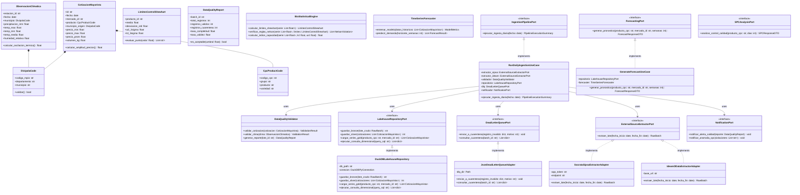

# Diagrama Estructural de Clases UML (Mermaid)
**Plataforma**: Agrostat Data Intelligence Platform  
**Fase PDCO**: PLAN → DEVELOPMENT  
**Active Skill**: `02-architecture`  

---

```mermaid
classDiagram
    %% ==========================================
    %% CAPA DE DOMINIO PURO (Entities & VOs)
    %% ==========================================
    class DivipolaCode {
        +codigo_mpio: str
        +departamento: str
        +municipio: str
        +validar() bool
    }

    class CpcProductCode {
        +codigo_cpc: str
        +grupo: str
        +producto: str
        +variedad: str
    }

    class CotizacionMayorista {
        +id: str
        +fecha: date
        +mercado_id: str
        +producto: CpcProductCode
        +municipio_origen: DivipolaCode
        +precio_min: float
        +precio_max: float
        +precio_prom: float
        +volumen_kg: float
        +calcular_amplitud_precios() float
    }

    class ObservacionClimatica {
        +estacion_id: str
        +fecha: date
        +municipio: DivipolaCode
        +precipitacion_mm: float
        +temp_max: float
        +temp_min: float
        +temp_media: float
        +humedad_relativa: float
        +calcular_oscilacion_termica() float
    }

    class LimitesControlShewhart {
        +producto_id: str
        +media: float
        +desviacion_std: float
        +ucl_3sigma: float
        +lcl_3sigma: float
        +evaluar_punto(valor: float) List~str~
    }

    class DataQualityReport {
        +batch_id: str
        +total_registros: int
        +registros_validos: int
        +registros_cuarentena: int
        +tasa_completitud: float
        +tasa_validez: float
        +es_aceptable(umbral: float) bool
    }

    %% ==========================================
    %% SERVICIOS DE DOMINIO
    %% ==========================================
    class DataQualityValidator {
        +validar_cotizacion(cotizacion: CotizacionMayorista) ValidationResult
        +validar_clima(clima: ObservacionClimatica) ValidationResult
        +generar_reporte(lote_id: str) DataQualityReport
    }

    class BioStatisticalEngine {
        +calcular_limites_shewhart(serie: List~float~) LimitesControlShewhart
        +verificar_reglas_nelson(serie: List~float~, limites: LimitesControlShewhart) List~NelsonViolation~
        +calcular_indice_capacidad(serie: List~float~, lsl: float, usl: float) float
    }

    class TimeSeriesForecaster {
        +entrenar_modelo(datos_historicos: List~CotizacionMayorista~) ModelMetrics
        +predecir_demanda(horizonte_semanas: int) List~ForecastResult~
    }

    %% ==========================================
    %% PUERTOS DE ENTRADA (Driving Ports)
    %% ==========================================
    class IngestionPipelinePort {
        <<interface>>
        +ejecutar_ingesta_diaria(fecha: date) PipelineExecutionSummary
    }

    class ForecastingPort {
        <<interface>>
        +generar_pronostico(producto_cpc: str, mercado_id: str, semanas: int) ForecastResponseDTO
    }

    class SPCAnalysisPort {
        <<interface>>
        +analizar_control_calidad(producto_cpc: str, dias: int) SPCResponseDTO
    }

    %% ==========================================
    %% PUERTOS DE SALIDA (Driven Ports)
    %% ==========================================
    class LakehouseRepositoryPort {
        <<interface>>
        +guardar_bronze(lote_crudo: RawBatch) str
        +guardar_silver(cotizaciones: List~CotizacionMayorista~) int
        +cargar_series_gold(producto_cpc: str, mercado_id: str) List~CotizacionMayorista~
        +ejecutar_consulta_dimensional(query_sql: str) List~dict~
    }

    class DeadLetterQueuePort {
        <<interface>>
        +enviar_a_cuarentena(registro_invalido: dict, motivo: str) void
        +consultar_cuarentena(batch_id: str) List~dict~
    }

    class ExternalSourceExtractorPort {
        <<interface>>
        +extraer_lote(fecha_inicio: date, fecha_fin: date) RawBatch
    }

    class NotificationPort {
        <<interface>>
        +notificar_alerta_calidad(reporte: DataQualityReport) void
        +notificar_anomalia_spc(violaciones: List~str~) void
    }

    %% ==========================================
    %% CASOS DE USO (Application Layer)
    %% ==========================================
    class RunDailyIngestionUseCase {
        -extractor_sipsa: ExternalSourceExtractorPort
        -extractor_ideam: ExternalSourceExtractorPort
        -validador: DataQualityValidator
        -repositorio: LakehouseRepositoryPort
        -dlq: DeadLetterQueuePort
        -notificador: NotificationPort
        +ejecutar_ingesta_diaria(fecha: date) PipelineExecutionSummary
    }

    class GenerateForecastUseCase {
        -repositorio: LakehouseRepositoryPort
        -forecaster: TimeSeriesForecaster
        +generar_pronostico(producto_cpc: str, mercado_id: str, semanas: int) ForecastResponseDTO
    }

    %% ==========================================
    %% ADAPTADORES CONCRETOS (Infraestructura)
    %% ==========================================
    class DuckDBLakehouseRepository {
        -db_path: str
        -conexion: DuckDBPyConnection
        +guardar_bronze(lote_crudo: RawBatch) str
        +guardar_silver(cotizaciones: List~CotizacionMayorista~) int
        +cargar_series_gold(producto_cpc: str, mercado_id: str) List~CotizacionMayorista~
        +ejecutar_consulta_dimensional(query_sql: str) List~dict~
    }

    class JsonDeadLetterQueueAdapter {
        -dlq_dir: Path
        +enviar_a_cuarentena(registro_invalido: dict, motivo: str) void
        +consultar_cuarentena(batch_id: str) List~dict~
    }

    class SocrataSipsaExtractorAdapter {
        -app_token: str
        -endpoint: str
        +extraer_lote(fecha_inicio: date, fecha_fin: date) RawBatch
    }

    class IdeamODataExtractorAdapter {
        -base_url: str
        +extraer_lote(fecha_inicio: date, fecha_fin: date) RawBatch
    }

    %% ==========================================
    %% RELACIONES
    %% ==========================================
    CotizacionMayorista *-- DivipolaCode
    CotizacionMayorista *-- CpcProductCode
    ObservacionClimatica *-- DivipolaCode

    IngestionPipelinePort <|.. RunDailyIngestionUseCase : implements
    ForecastingPort <|.. GenerateForecastUseCase : implements

    RunDailyIngestionUseCase --> DataQualityValidator : uses
    RunDailyIngestionUseCase --> LakehouseRepositoryPort : uses
    RunDailyIngestionUseCase --> DeadLetterQueuePort : uses
    RunDailyIngestionUseCase --> ExternalSourceExtractorPort : uses
    RunDailyIngestionUseCase --> NotificationPort : uses

    LakehouseRepositoryPort <|.. DuckDBLakehouseRepository : implements
    DeadLetterQueuePort <|.. JsonDeadLetterQueueAdapter : implements
    ExternalSourceExtractorPort <|.. SocrataSipsaExtractorAdapter : implements
    ExternalSourceExtractorPort <|.. IdeamODataExtractorAdapter : implements
```
