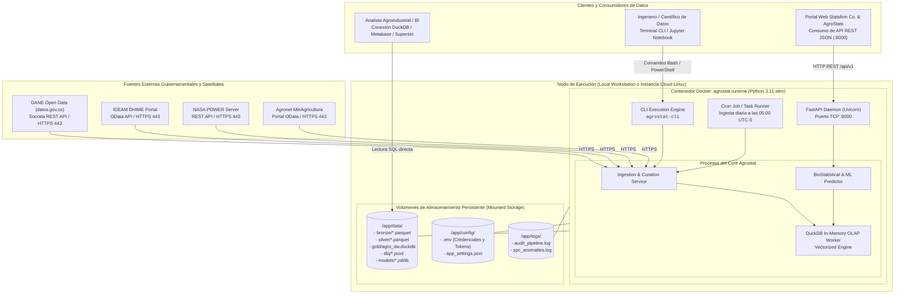

# Diagrama de Despliegue UML (Mermaid)
**Plataforma**: Agrostat Data Intelligence Platform  
**Fase PDCO**: PLAN → DEVELOPMENT  
**Active Skill**: `02-architecture`  

---

```mermaid
graph TB
    %% ==========================================
    %% FUENTES EXTERNAS EN INTERNET
    %% ==========================================
    subgraph InternetSources["Fuentes Externas Gubernamentales y Satelitales"]
        SRC_DANE["DANE Open Data (datos.gov.co)<br/>Socrata REST API / HTTPS 443"]
        SRC_IDEAM["IDEAM DHIME Portal<br/>OData API / HTTPS 443"]
        SRC_NASA["NASA POWER Server<br/>REST API / HTTPS 443"]
        SRC_AGRONET["Agronet MinAgricultura<br/>Portal OData / HTTPS 443"]
    end

    %% ==========================================
    %% HOST DE EJECUCIÓN (LOCAL / CONTENEDOR DOCKER)
    %% ==========================================
    subgraph HostSystem["Nodo de Ejecución (Local Workstation o Instancia Cloud Linux)"]
        subgraph DockerContainer["Contenedor Docker: agrostat-runtime (Python 3.11-slim)"]
            PROC_CLI["CLI Execution Engine<br/><code>agrostat-cli</code>"]
            PROC_API["FastAPI Daemon (Uvicorn)<br/>Puerto TCP :8000"]
            PROC_SCHED["Cron Job / Task Runner<br/>Ingesta diaria a las 05:00 UTC-5"]

            subgraph CoreEngine["Procesos del Core Agrostat"]
                MOD_INGEST["Ingestion & Curation Service"]
                MOD_DUCKDB["DuckDB In-Memory OLAP Worker<br/>Vectorized Engine"]
                MOD_BIO["BioStatistical & ML Predictor"]
            end
        end

        subgraph PersistentVolumes["Volúmenes de Almacenamiento Persistente (Mounted Storage)"]
            VOL_DATA[("/app/data/<br/>- bronze/*.parquet<br/>- silver/*.parquet<br/>- gold/agro_dw.duckdb<br/>- dlq/*.jsonl<br/>- models/*.joblib")]
            VOL_CONFIG[("/app/config/<br/>- .env (Credenciales y Tokens)<br/>- app_settings.json")]
            VOL_LOGS[("/app/logs/<br/>- audit_pipeline.log<br/>- spc_anomalies.log")]
        end
    end

    %% ==========================================
    %% CLIENTES CONSUMIDORES
    %% ==========================================
    subgraph Clients["Clientes y Consumidores de Datos"]
        USER_DATA["Ingeniero / Científico de Datos<br/>Terminal CLI / Jupyter Notebook"]
        USER_BI["Analista Agroindustrial / BI<br/>Conexión DuckDB / Metabase / Superset"]
        WEB_APP["Portal Web Statsfirm Co. & AgroStats<br/>Consumo de API REST JSON (:8000)"]
    end

    %% Flujos de Red
    SRC_DANE -->|HTTPS| MOD_INGEST
    SRC_IDEAM -->|HTTPS| MOD_INGEST
    SRC_NASA -->|HTTPS| MOD_INGEST
    SRC_AGRONET -->|HTTPS| MOD_INGEST

    PROC_CLI --> MOD_INGEST
    PROC_API --> MOD_BIO
    PROC_SCHED --> MOD_INGEST

    MOD_INGEST --> MOD_DUCKDB
    MOD_BIO --> MOD_DUCKDB

    DockerContainer --- VOL_DATA
    DockerContainer --- VOL_CONFIG
    DockerContainer --- VOL_LOGS

    USER_DATA -->|Comandos Bash / PowerShell| PROC_CLI
    USER_BI -->|Lectura SQL directa| VOL_DATA
    WEB_APP -->|HTTP REST /api/v1| PROC_API
```
