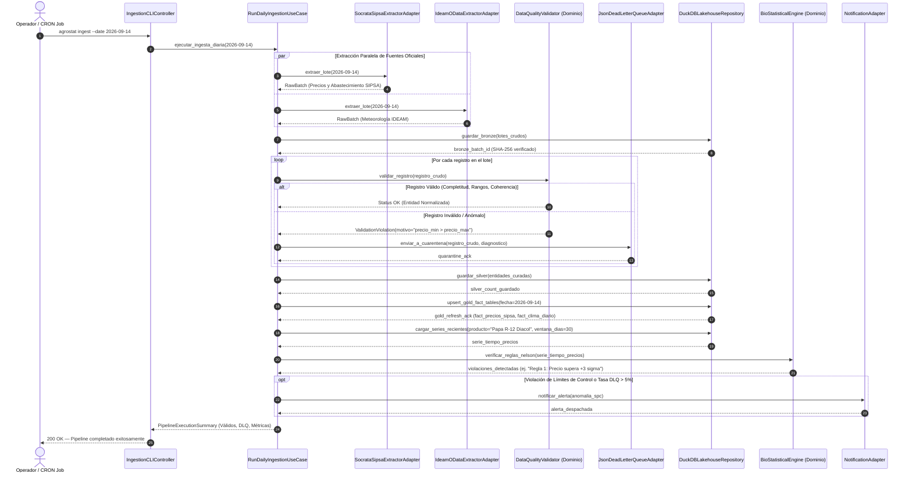

# Diagrama de Secuencia UML (Mermaid)
**Plataforma**: Agrostat Data Intelligence Platform  
**Proceso**: Ingesta Diaria, Curaduría DAMA-BOK, Carga Dimensional DuckDB y Detección de Anomalías  
**Fase PDCO**: PLAN → DEVELOPMENT  
**Active Skill**: `02-architecture`  

---

