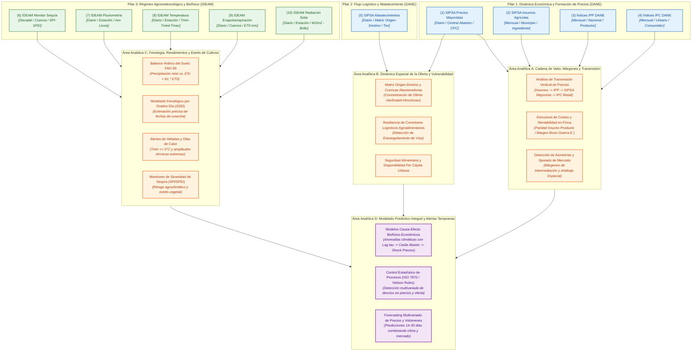

# Catálogo Maestro y Caracterización de Fuentes de Datos del Sector Agropecuario
**Plataforma**: Agrostat Data Intelligence Platform  
**Fase PDCO**: **PLAN** | **Active Skill**: `01-requirements` (Modelado y Gobierno de Datos)  
**Estándares**: DAMA-BOK (Gestión de Metadatos y Arquitectura de Datos) | SWEBOK Cap. 1 & 2 | IEEE 830 / ISO 29148 | FAO-56 Irrigation & Drainage | Clasificación CPC Ver. 2.1 A.C. | DANE DIVIPOLA  

---

## 1. Visión General del Ecosistema de Datos

El sector agropecuario colombiano opera bajo una dinámica de acoplamiento complejo entre **factores biofísicos/climáticos** (que determinan la oferta primaria y los rendimientos en finca), **factores logísticos/abastecimiento** (que gobiernan el transporte y la disponibilidad regional) y **factores económicos de mercado** (que dictan la formación de precios, la inflación de insumos y el ingreso de los productores).

El presente documento formaliza la caracterización multidimensional de las **10 fuentes oficiales estratégicas** (DANE e IDEAM) identificadas para la plataforma, estableciendo su taxonomía, granularidad temporal y espacial, desagregación temática y las capacidades analíticas resultantes de su articulación.

---

## 2. Matriz Comparativa de Caracterización de Fuentes (DAMA-BOK)

| # | Fuente Oficial | Custodio / Acceso | Naturaleza del Dato | Granularidad Temporal Mínima | Granularidad Espacial Mínima | Desagregación Temática / Taxonómica | Frecuencia / Latencia Típica | Indicadores & Casos de Uso Agropecuarios |
|---|---|---|---|---|---|---|---|---|
| **1** | **SIPSA Abastecimientos** | DANE (API Socrata / Microdatos) | Logístico / Flujos de Alimentos | Diaria (días de mercado) | Centro de acopio / Municipio origen (DIVIPOLA) $\rightarrow$ Central mayorista destino | Grupo agronómico, producto, variedad, unidad de transporte | Diaria / Retardo de 24 a 48 horas | Volúmenes de entrada (Ton), cuencas abastecedoras, cuellos de botella logísticos, seguridad alimentaria urbana. |
| **2** | **SIPSA Precios Mayoristas** | DANE (API Socrata / Boletines) | Económico / Precios Mayoristas | Diaria (días hábiles) | Mercado mayorista / Central de abastos (nodo urbano) | Código CPC, producto, variedad, calidad (primera, estándar) | Diaria / Retardo de 24 horas | Precios mínimos, medios, máximos ($/kg); volatilidad (GARCH), control estadístico de procesos (Nelson Rules), arbitraje espacial. |
| **3** | **SIPSA Insumos Agrícolas** | DANE (Reportes mensuales / Socrata) | Económico / Costos de Producción | Mensual | Municipio comercializador / Almacén agropecuario | Fertilizantes, plaguicidas, fármacos veterinarios, semillas (ingrediente activo) | Mensual / Retardo de 15 a 30 días | Precios de insumos comerciales ($/bulto, $/litro); análisis de costos directos (Guerra E.), paridad insumo-producto. |
| **4** | **Índice Precios Productor (IPP)** | DANE (Series estadísticas / API) | Macroeconómico / Inflación al Productor | Mensual | Nacional (agregado país) | CIIU Rev. 4 / CPC: Agricultura, ganadería, caza, silvicultura, pesca | Mensual (primeros 5 días hábiles del mes siguiente) | Inflación en boca de finca, deflactor de producción bruta, transmisión vertical de precios hacia el canal mayorista. |
| **5** | **Índice Precios Consumidor (IPC)** | DANE (Series estadísticas / API) | Macroeconómico / Inflación Minorista | Mensual | Ciudad capital (23 ciudades y áreas metropolitanas) | COICOP: División 01 (Alimentos y bebidas no alcohólicas), subclases de frutas, hortalizas, tubérculos | Mensual (primer fin de semana de mes cerrado) | Inflación alimentaria minorista, elasticidad precio de la demanda, spreads mayorista-minorista, pérdida de poder de compra. |
| **6** | **IDEAM Monitor de Sequía** | IDEAM (Servicios OData / Geoportales) | Hidroclimático / Riesgo de Estrés | Decadal (cada 10 días) / Mensual | Grilla ráster nacional (pixel ~5-10 km) / Cuenca hidrográfica / Municipio | Índices SPI (1, 3, 6 meses), SPEI, anomalía de humedad del suelo, categorías D0-D4 | Decadal / Retardo de 3 a 5 días | Detección temprana de déficit hídrico, predicción de pérdida de rendimientos, gestión de seguros agropecuarios y alertas ENSO. |
| **7** | **IDEAM Pluviometría** | IDEAM (Catálogo DHIME / OData) | Meteorológico / Precipitación | Horaria (automáticas) / Diaria (convencionales) | Estación puntual (Lat, Long, Altitud) $\rightarrow$ Buffer municipal | Precipitación total (mm), días con lluvia, anomalías vs. normal histórica (1991-2020) | Diaria (retraso variable según transmisión de red) | Acumulados hídricos por ciclo fenológico, riesgo de anoxia radicular/inundación, desfase lluvia-cosecha hacia centrales. |
| **8** | **IDEAM Temperatura** | IDEAM (Catálogo DHIME / OData) | Meteorológico / Régimen Térmico | Horaria (automáticas) / Diaria (convencionales) | Estación puntual (Lat, Long, Altitud) $\rightarrow$ Isoclinas térmicas | $T_{min}$, $T_{med}$, $T_{max}$ (°C), amplitud térmica diaria | Diaria / Retardo de 24-72 horas | Grados Día de Desarrollo (GDD), riesgo de heladas agrometeorológicas ($T < 0^\circ\text{C}$), golpes de calor y aborto floral. |
| **9** | **IDEAM Evapotranspiración** | IDEAM (DHIME / Modelos de Radiación) | Agrometeorológico / Demanda Atmosférica | Diaria / Decadal / Mensual | Estación agrometeorológica / Cuenca hidrográfica | Evaporación de tanque (mm), $ET_0$ de referencia (Penman-Monteith / Hargreaves) | Mensual o decadal calculada | Balance hídrico de suelo ($BH = P - ET_c$), requerimientos netos de riego por cultivo ($K_c$), estrés hídrico acumulado. |
| **10** | **IDEAM Radiación Solar** | IDEAM (Red Solarimétrica / Reanálisis) | Biofísico / Energético | Horaria / Diaria | Estación climatológica principal puntual / Grilla satelital | Radiación global incidente ($MJ/m^2/d\acute{\imath}a$), horas de sol efectivas (brillo solar) | Diaria / Mensual | Potencial fotosintético y acumulación de biomasa (Monteith), parametrización precisa de modelos Penman-Monteith de $ET_0$. |

---

## 3. Fichas de Caracterización Detallada por Fuente

### 3.1. SIPSA — Componente de Abastecimiento de Alimentos (DANE)
- **Naturaleza**: Registro censal de ingresos de carga de alimentos a mercados mayoristas.
- **Granularidad y Desagregación**:
  - **Temporal**: Registros diarios por cada vehículo de carga que ingresa a la central mayorista en los días hábiles de acopio.
  - **Espacial**: Bidireccional (Matriz Origen-Destino). Origen a nivel de municipio (código DIVIPOLA 5 dígitos) y destino a nivel de central mayorista (ej. Corabastos en Bogotá, Cavasa en Candelaria/Cali, Central Mayorista de Antioquia en Itagüí).
  - **Temática**: Clasificación por grupo de alimentos (tubérculos, hortalizas, verduras, frutas, granos/cereales, carnes, lácteos), producto genérico, variedad agronómica y volumen estandarizado en toneladas métricas.
- **Potencial Analítico Agropecuario**:
  - Mapeo de cuencas de suministro crítico hacia grandes concentraciones urbanas.
  - Modelado de flujos logísticos y vulnerabilidad de corredores viales ante eventos climáticos extremos o bloqueos viales.
  - Detección de picos de estacionalidad de cosecha por municipio remitente.
  - Alerta temprana de shock de oferta física antes de que impacte el precio mayorista.

### 3.2. SIPSA — Componente de Precios Mayoristas (DANE)
- **Naturaleza**: Muestreo representativo diario de transacciones comerciales en el canal mayorista.
- **Granularidad y Desagregación**:
  - **Temporal**: Diaria (lunes a viernes / fines de semana según dinámica de cada mercado).
  - **Espacial**: Nodo central de abastos / municipio receptor.
  - **Temática**: Código CPC adaptado a Colombia, producto, variedad agronómica, calidad de clasificación comercial (primera, estándar, extra) y presentación física (bulto 50kg, caja de madera, canastilla plástica, racimo, kilogramo).
- **Potencial Analítico Agropecuario**:
  - Análisis de series temporales de alta frecuencia: descomposición de tendencia, ciclo y estacionalidad.
  - Control Estadístico de Procesos (SPC - ISO 7870): reglas de Nelson para detección precoz de volatilidades anormales en precios mayoristas.
  - Detección de asimetrías de transmisión de precios y arbitraje geográfico entre centrales mayoristas regionales.

### 3.3. SIPSA — Precios de Insumos Agropecuarios y Factores de Producción (DANE)
- **Naturaleza**: Monitoreo de precios de comercialización al agricultor en almacenes y distribuidores autorizados.
- **Granularidad y Desagregación**:
  - **Temporal**: Mensual.
  - **Espacial**: Municipio / cabecera con presencia comercial de distribución de insumos.
  - **Temática**: Segmentación por familias agronómicas: Fertilizantes simples (Urea, KCl, DAP), fertilizantes compuestos (NPK 15-15-15, etc.), enmiendas agrícolas, plaguicidas (fungicidas, herbicidas, insecticidas clasificados por ingrediente activo y concentración), medicamentos veterinarios, alimentos balanceados y semillas certificadas.
- **Potencial Analítico Agropecuario**:
  - Estructura de costos operativos directos según la metodología de Administración Rural (Guillermo Guerra E. - IICA).
  - Análisis de paridad o términos de intercambio: ¿cuántos bultos de papa o arrobas de café se requieren para comprar un bulto de fertilizante?
  - Detección de inflación de costos importados y transmisión hacia los márgenes brutos de las fincas agrícolas.

### 3.4. Índices de Precios al Productor — IPP (DANE)
- **Naturaleza**: Número índice que mide la variación pura de precios de venta en la primera etapa de comercialización (puerta de finca).
- **Granularidad y Desagregación**:
  - **Temporal**: Mensual.
  - **Espacial**: Nacional (con representatividad de la producción local).
  - **Temática**: Clasificación CIIU Rev. 4 A.C. y CPC, desglosando el sector agropecuario en: Cultivos agrícolas transitorios, cultivos agrícolas permanentes, cría y explotación de animales, silvicultura y pesca.
- **Potencial Analítico Agropecuario**:
  - Evaluación de la rentabilidad primaria del productor antes del margen de intermediación comercial.
  - Identificación del "efecto látigo" (bullwhip effect) en cadenas de suministro agroalimentarias.
  - Deflactor estadístico para valorar la producción agropecuaria en términos reales.

### 3.5. Índices de Precios al Consumidor — IPC (DANE)
- **Naturaleza**: Indicador canónico del nivel general de precios pagados por los hogares urbanos.
- **Granularidad y Desagregación**:
  - **Temporal**: Mensual.
  - **Espacial**: Por dominios geográficos (23 ciudades capitales y áreas metropolitanas) y agregado nacional.
  - **Temática**: Clasificación COICOP: División 01 ("Alimentos y bebidas no alcohólicas"), con desagregaciones a nivel de grupo, clase y subclase (ej. tubérculos, hortalizas frescas, carne de res, pollo, huevos, frutas frescas), categorizado además por niveles de ingreso socioeconómico (hogares pobres, vulnerables, clase media, ingresos altos).
- **Potencial Analítico Agropecuario**:
  - Medición del margen bruto total de comercialización de la cadena: $\text{Margen} = \text{Precio Retail (IPC)} - \text{Precio Productor (IPP)}$.
  - Elasticidad precio e ingreso de la demanda alimentaria.
  - Impacto de shocks climáticos o logísticos de oferta en la canasta familiar y la inflación de alimentos.

### 3.6. IDEAM — Monitor de Sequía
- **Naturaleza**: Sistema integrado de monitoreo y alerta climática basado en índices estandarizados.
- **Granularidad y Desagregación**:
  - **Temporal**: Decadal (cortes cada 10 días: días 10, 20 y fin de mes) y acumulado mensual.
  - **Espacial**: Cobertura nacional continua en grillas ráster georreferenciadas (~5 a 10 km) interpoladas y agregadas a nivel de cuenca hidrográfica y municipios.
  - **Temática**: Índice de Precipitación Estandarizado (SPI para escalas de acumulación a 1, 3, 6 y 12 meses), Índice de Evapotranspiración y Precipitación Estandarizado (SPEI), porcentaje de disponibilidad de humedad en el perfil del suelo y severidad de sequía (categorías internacionales D0 = Anormalmente seco a D4 = Sequía excepcional).
- **Potencial Analítico Agropecuario**:
  - Caracterización del riesgo hidrológico para cultivos de secano y pastos de ganadería extensiva.
  - Modelos predictivos de rendimiento: identificación de periodos de sequía que coinciden con fases fenológicas reproductivas críticas.
  - Activación de mecanismos de compensación, fondos de estabilización o seguros climáticos paramétricos.

### 3.7. IDEAM — Pluviometría
- **Naturaleza**: Medición cuantitativa directa de la lámina de agua precipitada en superficie.
- **Granularidad y Desagregación**:
  - **Temporal**: Horaria en estaciones automáticas con telemetría; diaria acumulada (corte a las 07:00 a.m.) en estaciones pluviométricas y climatológicas convencionales.
  - **Espacial**: Coordenada geográfica puntual de la estación (Latitud, Longitud, Cota msnm), extensible a nivel de polígono municipal o microcuenca mediante métodos de interpolación (Kriging ordinario, Polígonos de Thiessen, IDW).
  - **Temática**: Precipitación acumulada en 24 horas ($mm$), número de días con precipitación ($P > 1.0\text{ mm}$), intensidad máxima y anomalía relativa porcentual frente a la media histórica normal climatológica (1991–2020).
- **Potencial Analítico Agropecuario**:
  - Construcción del balance hídrico del suelo a nivel de lote o municipio.
  - Identificación de condiciones de saturación hídrica que detonan proliferación de enfermedades fúngicas y bacterianas (ej. Gota en papa, Sigatoka en plátano).
  - Correlación temporal con desfase (lag de $\tau$ semanas o meses) entre anomalías pluviométricas y caídas de volumen de oferta reportadas en SIPSA Abastecimiento.

### 3.8. IDEAM — Temperatura (Mínima, Media, Máxima)
- **Naturaleza**: Mediciones térmicas en abrigo meteorológico estandarizado a 1.5 m del suelo.
- **Granularidad y Desagregación**:
  - **Temporal**: Horaria (estaciones telemétricas) y diaria ($T_{min}$, $T_{med}$, $T_{max}$ en estaciones convencionales).
  - **Espacial**: Estación meteorológica puntual georreferenciada.
  - **Temática**: Temperatura mínima absoluta, media aritmética y máxima diaria en grados Celsius (°C), amplitud térmica diaria ($\Delta T = T_{max} - T_{min}$) y conteo de noches frías.
- **Potencial Analítico Agropecuario**:
  - Cálculo de **Grados Día de Desarrollo (GDD)** para estimar con precisión matemática la duración de las fases fenológicas de los cultivos:
    $$\text{GDD} = \max\left(\frac{T_{max} + T_{min}}{2} - T_{base}, 0\right)$$
  - Modelos de alerta temprana y monitoreo de **heladas radiativas** en zonas de altiplano ($T_{min} \le 0^\circ\text{C}$), críticas para tubérculos, hortalizas, flores y forrajes.
  - Identificación de olas de calor y estrés térmico que provocan esterilidad de polen o senescencia prematura.

### 3.9. IDEAM — Evapotranspiración ($ET$)
- **Naturaleza**: Estimación biofísica de la pérdida de agua combinada por evaporación directa desde el suelo e interceptación vegetal, sumada a la transpiración estomática de las plantas.
- **Granularidad y Desagregación**:
  - **Temporal**: Diaria, decadal y acumulada mensual ($mm/d\acute{\imath}a$).
  - **Espacial**: Estaciones agrometeorológicas o mapas ráster nacionales basados en reanálisis agrometeorológico.
  - **Temática**: Evapotranspiración potencial de referencia ($ET_0$) según la metodología estándar FAO-56 (Penman-Monteith) o aproximaciones empíricas calibradas (Hargreaves-Samani) y lecturas de evaporímetro de tanque clase A.
- **Potencial Analítico Agropecuario**:
  - Determinación de la Evapotranspiración Real del Cultivo ($ET_c$) aplicando coeficientes fenológicos ($K_c$):
    $$ET_c = K_c \times ET_0$$
  - Cálculo continuo de la lámina de riego deficitario o complementario requerida en distritos de adecuación de tierras.
  - Monitoreo de balances hídricos agrícolas para anticipar mermas fisiológicas en rendimientos por hectárea ($t/ha$).

### 3.10. IDEAM — Radiación Solar y Brillo Solar
- **Naturaleza**: Medición de la radiación electromagnética proveniente del sol en longitud de onda corta incidente sobre la superficie terrestre.
- **Granularidad y Desagregación**:
  - **Temporal**: Horaria (piranómetros en estaciones principales) y diaria (brillo solar en heliógrafos Campbell-Stokes en horas de sol efectivas).
  - **Espacial**: Red solarimétrica puntual y mapas de zonificación solar nacional.
  - **Temática**: Radiación global diaria ($MJ/m^2/d\acute{\imath}a$), irradiancia media ($W/m^2$) y heliofanía efectiva ($horas/d\acute{\imath}a$).
- **Potencial Analítico Agropecuario**:
  - Modelado de fotosíntesis neta y potencial productivo máximo de biomasa vegetal bajo condiciones lumínicas óptimas (modelos de De Wit / Monteith).
  - Variable de entrada no negociable para el cálculo termodinámico riguroso del componente aerodinámico y radiativo de $ET_0$ según FAO-56.
  - Evaluación del llenado de granos, calidad de azúcares y frutos en cultivos de alta demanda lumínica (ej. frutales, caña, arroz).

---

## 4. Diagrama "¿QUÉ?": Ontología y Espacio de Análisis del Sector Agropecuario

Este diagrama formaliza **QUÉ fenómenos del sector agropecuario se pueden analizar** al articular e interconectar las 10 fuentes de datos, clasificadas en tres macro-dimensiones del sistema productivo y sus zonas de intersección analítica.

---

## 5. Diagrama "¿CÓMO?": Arquitectura de Ingesta, Armonización y Pipeline Analítico

Este diagrama ilustra **CÓMO se procesan, armonizan, transforman e integran técnicamente estas fuentes** dentro de la arquitectura Medallion Lakehouse de Agrostat, resolviendo las divergencias de granularidad temporal, espacial y taxonómica.

```mermaid
flowchart TD
    %% Capa de Fuentes Crudas
    subgraph S_RAW ["1. Fuentes Externas Heterogéneas"]
        direction TB
        RAW_DANE["APIs DANE (Socrata / CKAN / Archivos Planos)<br/>- SIPSA Abastecimiento (Diario)<br/>- SIPSA Precios Mayoristas (Diario)<br/>- SIPSA Insumos (Mensual)<br/>- IPP e IPC (Mensual)"]
        RAW_IDEAM["APIs / Geoportales IDEAM (DHIME / OData / Ráster)<br/>- Pluviometría y Temperatura (Horaria/Diaria)<br/>- Sequía SPI/SPEI (Decadal)<br/>- Evapotranspiración y Radiación (Diaria/Decadal)"]
    end

    %% Capa Bronce
    subgraph L_BRONZE ["2. Capa Bronze (Ingesta Resiliente & Inmutabilidad)"]
        EXTRACTOR["Conectores Polimórficos (ADR-004)<br/>- SocrataSipsaExtractor<br/>- IdeamClimaExtractor<br/>- Retry Backoff Exponencial"]
        DLQ["Dead Letter Queue (DLQ)<br/>Lotes corruptos / caídas"]
        BRONZE_PARQUET[("Almacenamiento Bronze Parquet<br/>+ Metadatos de Ingesta<br/>+ Hash SHA-256 Inmutable")]
        EXTRACTOR -->|Fallo validación| DLQ
        EXTRACTOR -->|Éxito| BRONZE_PARQUET
    end

    %% Capa Silver: Armonización Multidimensional
    subgraph L_SILVER ["3. Capa Silver (Curaduría, Limpieza & Armonización Dimensional)"]
        VAL_DAMA["Validador DAMA-BOK<br/>Completitud, Tipado, Rangos Físicos"]
        
        subgraph ARMONIZADORES ["Motores de Homogeneización"]
            ARM_ESPACIAL["<b>Armonización Espacial</b><br/>• Estaciones IDEAM (Lat/Lon) -> Polígonos Voronoi / Buffer<br/>• Mapeo a Código DIVIPOLA DANE (Municipio)<br/>• Matriz Origen-Destino -> Central Mayorista"]
            ARM_TEMPORAL["<b>Armonización Temporal</b><br/>• Resampling de series diarias/horarias a semanales y decadales<br/>• Alineación con lags de ciclo vegetativo (tau = 1..24 semanas)<br/>• Calendario agrícola consolidado"]
            ARM_TAXONOMICO["<b>Armonización Taxonómica</b><br/>• Estandarización a Clasificación CPC Ver. 2.1 A.C.<br/>• Cruce de Insumos por Ingrediente Activo<br/>• Asignación de Coeficientes de Cultivo Kc (FAO-56)"]
        end

        SILVER_STORE[("Tablas Silver Integradas<br/>- silver_sipsa_diario<br/>- silver_clima_estaciones<br/>- silver_insumos_mensual<br/>- silver_macro_indices")]

        VAL_DAMA --> ARMONIZADORES
        ARMONIZADORES --> SILVER_STORE
    end

    %% Capa Gold / Motores Analíticos Especializados
    subgraph L_GOLD ["4. Capa Gold (Motores Científicos & Data Warehouse)"]
        subgraph ENGINES ["Motores Analíticos del Dominio"]
            BIO_ENG["<b>Biostatistical Engine</b><br/>• Balance Hídrico (P - ETc)<br/>• Grados Día (GDD)<br/>• Déficit de Sequía (SPI)"]
            FOR_ENG["<b>Forecasting Engine</b><br/>• SARIMAX / Prophet / XGBoost<br/>• Variables climáticas como regresores exógenos<br/>• Horizonte 14-30 días"]
            SPC_ENG["<b>SPC Quality Engine (ISO 7870)</b><br/>• Shewhart Individual/Moving Range<br/>• Reglas de Nelson (Anomalías de mercado)"]
            ECON_ENG["<b>Econometric Engine</b><br/>• Elasticidades y Spreads<br/>• Márgenes Brutos (Guerra E.)<br/>• Transmisión de Precios VECM"]
        end

        DW_DIM[("Data Warehouse Dimensional (DuckDB)<br/>• DIM_TIEMPO<br/>• DIM_GEOGRAFIA (DIVIPOLA)<br/>• DIM_PRODUCTO (CPC)<br/>• FACT_MERCADO_CLIMA_INTEGRADO")]
    end

    %% Consumo / Entrega de Valor
    subgraph DELIVERY ["5. Capa de Aplicación & Consumo Ejecutivo"]
        API_APP["REST API / FastAPI Server"]
        WEB_MOBILE["Mobile-First Executive Dashboard<br/>(Semáforos de Alerta, Pronósticos, Mapas GIS)"]
        NOTEBOOKS["Notebooks CRISP-DM<br/>Investigación y Simulación Agropecuaria"]
    end

    %% Flujo entre Capas
    RAW_DANE & RAW_IDEAM --> EXTRACTOR
    BRONZE_PARQUET --> VAL_DAMA
    SILVER_STORE --> ENGINES
    ENGINES --> DW_DIM
    DW_DIM --> API_APP & NOTEBOOKS
    API_APP --> WEB_MOBILE

    classDef rawNode fill:#f5f5f5,stroke:#9e9e9e,stroke-width:1px,color:#212121;
    classDef bronzeNode fill:#efebe9,stroke:#6d4c41,stroke-width:1.5px,color:#3e2723;
    classDef silverNode fill:#e0f2f1,stroke:#00695c,stroke-width:1.5px,color:#004d40;
    classDef goldNode fill:#fff8e1,stroke:#ff8f00,stroke-width:1.5px,color:#e65100;
    classDef appNode fill:#ede7f6,stroke:#512da8,stroke-width:1.5px,color:#311b92;

    class RAW_DANE,RAW_IDEAM rawNode;
    class EXTRACTOR,DLQ,BRONZE_PARQUET bronzeNode;
    class VAL_DAMA,ARM_ESPACIAL,ARM_TEMPORAL,ARM_TAXONOMICO,SILVER_STORE silverNode;
    class BIO_ENG,FOR_ENG,SPC_ENG,ECON_ENG,DW_DIM goldNode;
    class API_APP,WEB_MOBILE,NOTEBOOKS appNode;
```

---

## 6. Mecanismos de Armonización Cruzada (Resolución de Desajustes de Granularidad)

El reto de ingeniería y ciencia de datos principal consiste en resolver la disparidad de granularidades entre las 10 fuentes:

### 6.1. Armonización Espacial: De Puntos Meteorológicos a Polígonos de Origen
- **Desafío**: El IDEAM mide lluvia, temperatura y radiación de forma **puntual** (coordenada de estación o celda ráster), mientras que el SIPSA reporta el origen de los alimentos a nivel de **municipio** (DIVIPOLA) y su llegada a una **central mayorista** específica.
- **Estrategia Implementada**:
  1. Asignación espacial mediante interpolación geoestadística (IDW ponderado por el inverso de la distancia o polígonos de Voronoi) de las estaciones IDEAM ubicadas dentro de la envolvente convexa del municipio productor.
  2. Cálculo de la serie climática promedio representativa de la frontera agrícola de cada municipio DIVIPOLA.
  3. Mapeo de la ruta logística de abastecimiento conectando el centroide municipal del municipio de origen con las coordenadas de la central de abastos de destino.

### 6.2. Armonización Temporal: Del Registro Diario/Horario al Ciclo Fenológico
- **Desafío**: Precios y clima registran datos en frecuencia **diaria**, el monitor de sequía en frecuencia **decadal**, mientras que insumos, IPP e IPC se emiten en frecuencia **mensual**. Adicionalmente, el efecto de una lluvia o sequía en el precio de hoy ocurrió **meses atrás** durante la siembra o floración.
- **Estrategia Implementada**:
  1. **Remuestreo (Resampling) Multiescala**: Las variables diarias se agregan semanalmente (W-SUN) y mensualmente (MS) con medidas de tendencia central (media, mediana) y dispersión (desviación estándar, percentiles 10 y 90).
  2. **Ingeniería de Lags Fisiológicos ($\tau$)**: Creación de variables rezagadas calculadas en función del ciclo de cada cultivo:
     - Cultivos transitorios de ciclo corto (ej. hortalizas de hoja): Rezagos de 4 a 12 semanas.
     - Tubérculos y plátano: Rezagos de 16 a 36 semanas.
     - Frutales permanentes y café: Rezagos estacionales de 6 a 12 meses.

### 6.3. Armonización Taxonómica y Semántica
- **Desafío**: El SIPSA utiliza nombres comerciales de productos (ej. "Papa criolla limpia", "Papa pastusa"), el DANE macroeconómico utiliza la CPC 2.1 y la canasta de gasto COICOP, y la literatura agronómica utiliza nombres científicos y coeficientes $K_c$.
- **Estrategia Implementada**:
  - Implementación de la tabla canónica `DIM_PRODUCTO` que mapea cada variedad comercial del SIPSA con su código **CPC Ver. 2.1 A.C.**, su especie botánica, su clasificación arancelaria y sus parámetros agrometeorológicos (temperatura base $T_{base}$, coeficientes $K_c$ inicial, medio y final según FAO-56).

---

## 7. Matriz de Cruces Analíticos de Alto Impacto

| Cruce de Fuentes | Hipótesis / Pregunta de Negocio Agropecuario | Modelo o Método Aplicable | Variable de Salida / Decisión Estratégica |
|---|---|---|---|
| **Pluviometría + Sequía + SIPSA Abastecimiento** | ¿Cómo y cuándo impacta un déficit de precipitaciones en Boyacá/Cundinamarca el volumen de papa que entra a Corabastos? | Regresión con Rezagos Distribuidos Polinomiales (PDL) / XGBoost con features de lag fenológico | Predicción de contracción de oferta en toneladas con 4 a 8 semanas de anticipación. |
| **Temperatura ($T_{min}$) + SIPSA Precios Mayoristas** | ¿En qué magnitud una helada en el altiplano ($T_{min} < 0^\circ\text{C}$) dispara el precio mayorista de hortalizas y pastos? | Control Estadístico de Procesos (Nelson Rule 1 y 2) + Modelo de Intervención ARIMA | Alerta temprana de shock de precios; activación de inventarios de contingencia. |
| **SIPSA Insumos + IPP + SIPSA Precios Mayoristas** | ¿Los incrementos en el precio del bulto de fertilizante son trasladados al precio mayorista o son absorbidos como pérdida por el agricultor? | Modelo de Vectores de Corrección del Error (VECM) y Cointegración de Johansen | Coeficiente de elasticidad de transmisión de costos; estimación de viabilidad financiera del productor (Guerra E.). |
| **Radiación + Temperatura + Evapotranspiración ($ET_0$)** | ¿Cuál es la fecha óptima estimada de cosecha y el rendimiento proyectado de un lote comercial? | Grados Día de Desarrollo (GDD) + Balance Hídrico del Suelo FAO-56 ($P - ET_c$) | Estimación del día calendario de madurez fisiológica y rendimiento ($t/ha$). |
| **SIPSA Abastecimiento + Precios Mayoristas + IPC Alimentos** | ¿Existe un margen excesivo de intermediación urbana entre lo que paga el consumidor final y el flujo de abasto mayorista? | Análisis de Spreads de Comercialización y Márgenes Brutos Relativos | Identificación de fallas de mercado, acaparamiento o sobrecostos de transporte. |

---

## 8. Trazabilidad Documental y Conclusiones de Arquitectura

1. **Gobernanza y Metadatos**: El catálogo cumple con los lineamientos de **DAMA-BOK**, garantizando que cada conjunto de datos cuente con identificación de custodio, granularidad mínima documentada, reglas de integridad referencial y trazabilidad de linaje desde Bronze hasta Gold.
2. **Modularidad SOLID**: La ingesta de estas 10 fuentes se aísla mediante el patrón **Ports & Adapters (Hexagonal)** definido en `ADR-001` y `ADR-004`, asegurando que la adición o cambio de API de cualquiera de las fuentes no afecte la lógica analítica de los casos de uso.
3. **Calidad de Datos Contractual**: Cada lote ingerido es contrastado contra contratos de datos estructurados (`DataQualityValidator`), registrando métricas de completitud, unicidad y validez estadística antes de su promoción a la capa analítica.