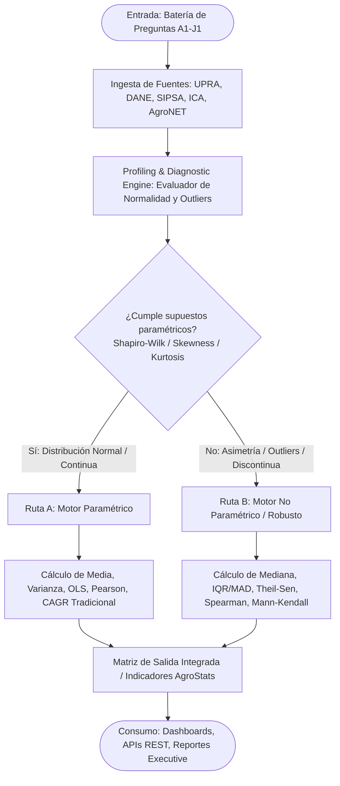

# Matriz y Diagrama Analítico "Qué – Cómo" (Escenarios Paramétrico y No Paramétrico)

**Proyecto**: AgroData Intelligence Platform (`AgroStatsApp`)  
**Versión**: 1.3.0  
**Fecha**: 2026-09-30  
**Fase PDCO**: PLAN → DEVELOPMENT  
**Skill Activa**: `01-requirements` / `02-architecture`  
**Estándar**: SWEBOK (Software Requirements & Design) / DAMA-BOK (Data Management)

---

## 1. Visión General del Marco "Qué – Cómo"

El presente documento define la especificación formal del **Motor Analítico de AgroStatsApp**, mapeando cada una de las 25 preguntas del negocio de la **Batería de Preguntas (`1-Bateria_preguntas.md`)** hacia su correspondiente metodología de cálculo bajo dos escenarios estadísticos:

1. **Escenario Paramétrico**: Asume distribuciones normales o asintóticamente normales, ausencia de sesgos severos, continuidad en las series temporales y baja presencia de valores atípicos (*outliers*). Emplea momentos estadísticos tradicionales ($\mu, \sigma$, OLS, Pearson, ANOVA).
2. **Escenario No Paramétrico (Robusto)**: No asume distribución teórica previa, es resistente a valores extremos, asimetrías acentuadas y discontinuidades en los datos (frecuentes en el sector agropecuario colombiano debido a choques climáticos, estacionales o de orden público). Emplea estadísticos de orden, medoides, rangos y métodos estimadores robustos (Mediana, IQR, MAD, Theil-Sen, Spearman, STL, Gini).

---

## 2. Diagrama Arquitectónico del Motor Analítico (Mermaid)

### 2.1 Flujo de Selección de Escenario Estadístico



### 2.2 Diagrama de Componentes Analíticos (Qué – Cómo)

```mermaid
graph TB
    subgraph Capa_Preguntas ["QUÉ: Preguntas Analíticas (A1 - J1)"]
        Q1["Mercado (A1-A3)"]
        Q2["Producción (B1-B3)"]
        Q3["Concentración (C1-C2)"]
        Q4["Brecha Oferta-Mercado (D1-D2)"]
        Q5["Precios & Volatilidad (E1-E3)"]
        Q6["Estacionalidad (F1-F2)"]
        Q7["Valor Agregado (G1-G3)"]
        Q8["Exportaciones (H1-H4)"]
        Q9["Relaciones / Correlaciones (I1-I2)"]
        Q10["Síntesis Multicriterio (J1)"]
    end

    subgraph Escenario_Parametrico ["CÓMO: Escenario Paramétrico"]
        P1["Media Aritmética / Suma"]
        P2["CAGR OLS Exponential fit"]
        P3["HHI Tradicional (Sum s_i²)"]
        P4["Coeficiente de Variación (σ / μ)"]
        P5["Regresión Lineal OLS (β)"]
        P6["Correlación de Pearson (r)"]
        P7["Descomposición Clásica / ANOVA"]
        P8["Z-Score Composite Index"]
    end

    subgraph Escenario_No_Parametrico ["CÓMO: Escenario No Paramétrico"]
        NP1["Mediana / Trimmed Mean"]
        NP2["Regresión Theil-Sen / Mann-Kendall"]
        NP3["Índice de Gini / HHI Robusto"]
        NP4["RSD Robusto (IQR / Mediana)"]
        NP5["Quantile Regression / Median Slope"]
        NP6["Correlación de Spearman (ρ) / Kendall (τ)"]
        NP7["STL Robusto / Test de Kruskal-Wallis"]
        NP8["TOPSIS / Percentile Rank Index"]
    end

    Q1 --> P1 & NP1
    Q2 --> P2 & NP2
    Q3 --> P3 & NP3
    Q4 --> P4 & NP4
    Q5 --> P5 & NP5
    Q6 --> P7 & NP7
    Q7 --> P1 & NP1
    Q8 --> P2 & NP2
    Q9 --> P6 & NP6
    Q10 --> P8 & NP8
```



---

## 3. Matriz Qué – Cómo General (25 Preguntas: A1 a J1)

| Código | QUÉ (Pregunta Analítica) | Parámetro Principal | Fuente Principal | CÓMO Paramétrico | CÓMO No Paramétrico (Robusto) |
|:---:|---|---|---|---|---|
| **A1** | ¿Cuál es el tamaño de cada mercado agroindustrial? | Valor total | DANE (Cuenta Satélite) | Suma ponderada de producción bruta y VAB ($\sum V_i$) | Mediana agregada e interpolación espacial por medoides |
| **A2** | ¿Qué cadenas concentran mayor valor? | Participación (%) | DANE | Share paramétrico de la media: $S_i = \frac{\bar{X}_i}{\sum \bar{X}_k}$ | Share sobre mediana ajustada o Trimmed Mean ($5\%$) |
| **A3** | ¿Qué cadenas crecen más? | CAGR / Tasa de crecimiento | DANE | $CAGR = \left(\frac{V_t}{V_0}\right)^{\frac{1}{t}} - 1$ u OLS $\ln(V_t) = \alpha + \beta t$ | Regresión de Theil-Sen sobre $\ln(V_t) \implies e^{\hat{\beta}_{TS}} - 1$ |
| **B1** | ¿Qué productos presentan mayor producción? | Producción volumen | UPRA (EVA) | Media aritmética de volumen ($\bar{Y}$) | Mediana de volumen ($Med(Y)$) |
| **B2** | ¿Qué productos crecen más en producción? | $\Delta$ Producción | UPRA (EVA) | Tasa de variación media anual OLS | Pendiente de Theil-Sen sobre series de producción |
| **B3** | ¿Qué productos son más estables? | CV de producción | UPRA (EVA) | $CV = \frac{\sigma}{\mu}$ | $RSD_{IQR} = \frac{IQR}{Mediana}$ o $\frac{MAD}{Mediana}$ |
| **C1** | ¿Qué tan concentrada está la producción? | HHI | UPRA (EVA) | $HHI = \sum_{i=1}^N s_i^2$, con $s_i = \frac{x_i}{\sum x}$ | Coeficiente de Gini ($G$) / Curva de Lorenz no paramétrica |
| **C2** | ¿Qué territorios explican la oferta? | CR5 | UPRA (EVA) | $CR5 = \sum_{i=1}^5 s_{(i)}$ (Top 5 media) | Ratio de dominancia por percentil 90 ($P_{90} / \sum P$) |
| **D1** | ¿Dónde existe brecha oferta–mercado? | Gap Rate | UPRA + SIPSA | $Gap = \frac{\bar{Q}_{oferta} - \bar{Q}_{demanda}}{\bar{Q}_{demanda}}$ | $Gap_{Rob} = \frac{Med(Q_{oferta}) - Med(Q_{demanda})}{Med(Q_{demanda})}$ |
| **D2** | ¿Qué brechas son persistentes? | Gap temporal | UPRA + SIPSA | Autocorrelación AR(1) de la serie de brecha ($\rho_1$) | Test de rachas (Runs Test) / Test de Mann-Kendall |
| **E1** | ¿Qué productos presentan mayor volatilidad? | Volatilidad de precio | SIPSA Precios | Desviación estándar / Modelo GARCH(1,1) | $MAD = Med(|P_t - Med(P)|)$ o $IQR(P)$ |
| **E2** | ¿Qué productos presentan tendencia de precio? | $\beta$ temporal | SIPSA Precios | Pendiente OLS $\hat{\beta} = \frac{Cov(t, P)}{Var(t)}$ | Pendiente de Theil-Sen + Test de Mann-Kendall |
| **E3** | ¿Existe relación oferta–precio? | Correlación ($r$ / $\rho$) | UPRA + SIPSA | Coeficiente de correlación de Pearson ($r$) | Coeficiente de correlación de Spearman ($\rho$) o Kendall ($\tau$) |
| **F1** | ¿Qué productos son estacionales? | Amplitud estacional | UPRA + SIPSA | Descomposición clásica (ANOVA $F$-test) | Descomposición STL Robusta + Test de Kruskal-Wallis |
| **F2** | ¿Cuándo se concentran precios altos? | Meses pico | SIPSA Precios | Meses con máximo índice estacional paramétrico | Meses con máxima mediana móvil y amplitud IQR |
| **G1** | ¿Qué cadenas generan más VAB? | VAB absoluto | DANE | Suma aritmética de VAB | Mediana de VAB sectorial |
| **G2** | ¿Qué cadenas generan mayor VAB relativo? | VAB / Producción | DANE | Ratio de medias $\frac{\bar{VAB}}{\bar{VBP}}$ | Ratio de medianas $\frac{Med(VAB)}{Med(VBP)}$ |
| **G3** | ¿Dónde existe baja transformación? | Ratio transformación | DANE | Ratio de CI sobre VBP: $\frac{\bar{CI}}{\bar{VBP}}$ | Ratio no paramétrico $\frac{Med(CI)}{Med(VBP)}$ |
| **H1** | ¿Qué productos exportan más? | Valor FOB USD | DANE/DIAN | Valor FOB acumulado o medio | Mediana del valor FOB mensual |
| **H2** | ¿Qué productos crecen más en exportación? | CAGR exportaciones | DANE/DIAN | Fit exponencial OLS sobre FOB USD | Regresión Theil-Sen sobre $\ln(FOB)$ |
| **H3** | ¿Qué mercados están creciendo? | CAGR destino | DANE/DIAN | CAGR OLS por país de destino | Pendiente Theil-Sen por país destino |
| **H4** | ¿Qué productos tienen mayor valor exportado/kg? | FOB/kg | DANE/DIAN | Precio unitario medio $\frac{\sum FOB}{\sum kg}$ | Mediana ponderada de $\frac{FOB_i}{kg_i}$ |
| **I1** | ¿Existe relación producción–precio? | Pearson / Spearman | UPRA + SIPSA | Coeficiente de Pearson entre $Q_{prod}$ y $P_{precios}$ | Coeficiente de Spearman $\rho$ o Kendall $\tau$ |
| **I2** | ¿Existe relación abastecimiento–precio? | Pearson / Spearman | SIPSA Abas. + Precios | Coeficiente de Pearson entre $Q_{abas}$ y $P_{precios}$ | Coeficiente de Spearman $\rho$ o Kendall $\tau$ |
| **J1** | ¿Dónde convergen crecimiento, mercado y oferta? | Score Compuesto | Todas | Z-Score Ponderado: $\sum w_k \frac{X_k - \mu_k}{\sigma_k}$ | TOPSIS / Ranking por Percentiles Ponderados |

---

## 4. Fichas Técnicas Detalladas por Pregunta Analítica

---

### Módulo A: Tamaño y Estructura de Mercado

#### Pregunta A1: ¿Cuál es el tamaño de cada mercado agroindustrial?
* **QUÉ**: Estimación de la dimensión económica total del mercado por cadena agroindustrial.
* **CÓMO Paramétrico**:
  $$\text{Tamaño}_c = \sum_{i \in c} \mu_{VBP, i} + \mu_{VAB, i}$$
  Calcula el valor agregado bruto ($VAB$) y valor bruto de producción ($VBP$) sumando directamente los agregados macroeconómicos con ajuste por inflactor del IPP/IPC.
* **CÓMO No Paramétrico**:
  $$\text{Tamaño}_{Rob, c} = N_c \times \text{Mediana}_{i \in c} (VBP_i) + \text{Hodges-Lehmann Aggregate}$$
  Aplica el estimador de Hodges-Lehmann sobre las microseries de valor para eliminar el efecto distorsionante de mega-empresas u operaciones atípicas registradas en la Cuenta Satélite.
* **Fuente & Granularidad**: DANE (Cuenta Satélite de la Agroindustria) — *Cadena $\times$ Fase $\times$ Año*.

---

#### Pregunta A2: ¿Qué cadenas concentran mayor valor?
* **QUÉ**: Proporción relativa de participación de cada cadena en el total agroindustrial.
* **CÓMO Paramétrico**:
  $$S_c = \frac{\sum_{t} VBP_{c,t}}{\sum_{C} \sum_{t} VBP_{C,t}} \times 100\%$$
* **CÓMO No Paramétrico**:
  $$S_{Rob, c} = \frac{\text{Mediana}_t (VBP_{c,t})}{\sum_{C} \text{Mediana}_t (VBP_{C,t})} \times 100\%$$
  Calcula la cuota de mercado basada en la media recortada (*Trimmed Mean* al 10%) o mediana para evitar distorsiones por picos de precios internacionales de commodities (ej. café/palma).
* **Fuente & Granularidad**: DANE — *Cadena $\times$ Año*.

---

#### Pregunta A3: ¿Qué cadenas crecen más?
* **QUÉ**: Tasa de crecimiento interanual del valor agroindustrial.
* **CÓMO Paramétrico**:
  $$\text{CAGR}_c = \left( \frac{V_{c, t_{final}}}{V_{c, t_{inicial}}} \right)^{\frac{1}{t_{final} - t_{inicial}}} - 1$$
  O mediante la pendiente de regresión semi-logarítmica OLS: $\ln(V_{c,t}) = \alpha + \beta t \implies \text{CAGR} = e^{\beta} - 1$.
* **CÓMO No Paramétrico**:
  $$\text{CAGR}_{Rob, c} = e^{\hat{\beta}_{TS}} - 1$$
  Donde $\hat{\beta}_{TS}$ es la pendiente de **Theil-Sen**:
  $$\hat{\beta}_{TS} = \text{Mediana} \left( \frac{\ln(V_j) - \ln(V_i)}{j - i} \right) \quad \forall \, i < j$$
* **Fuente & Granularidad**: DANE — *Cadena $\times$ Año*.

---

### Módulo B: Oferta y Desempeño Productivo

#### Pregunta B1: ¿Qué productos presentan mayor producción?
* **QUÉ**: Identificación de los productos agrícolas/pecuarios con mayor volumen físico (toneladas o cabezas).
* **CÓMO Paramétrico**:
  $$\bar{Q}_p = \frac{1}{N} \sum_{i=1}^N Q_{p,i}$$
  Promedio aritmético interanual/municipal del volumen producido.
* **CÓMO No Paramétrico**:
  $$\tilde{Q}_p = \text{Mediana}(Q_{p,1}, Q_{p,2}, \dots, Q_{p,N})$$
  Mediana muestral robusta frente a reportes atípicos de cosecha en municipios específicos.
* **Fuente & Granularidad**: UPRA (EVA) / ICA — *Producto $\times$ Municipio $\times$ Año*.

---

#### Pregunta B2: ¿Qué productos crecen más en producción?
* **QUÉ**: Tasa de expansión de volumen de producción agrícola y pecuaria.
* **CÓMO Paramétrico**:
  $$\Delta Q_p = \frac{\bar{Q}_{p, t} - \bar{Q}_{p, t-1}}{\bar{Q}_{p, t-1}}$$
* **CÓMO No Paramétrico**:
  $$\Delta Q_{Rob, p} = \text{Mediana} \left( \frac{Q_{p,i,t} - Q_{p,i,t-1}}{Q_{p,i,t-1}} \right)$$
  Calculada municipio a municipio y agregada mediante la mediana del cambio porcentual.
* **Fuente & Granularidad**: UPRA (EVA) — *Producto $\times$ Municipio $\times$ Año*.

---

#### Pregunta B3: ¿Qué productos son más estables?
* **QUÉ**: Grado de variabilidad o estabilidad en los volúmenes de producción a través del tiempo.
* **CÓMO Paramétrico**:
  $$CV_p = \frac{\sigma_p}{\mu_p} = \frac{\sqrt{\frac{1}{N-1}\sum (Q_{p,t} - \bar{Q}_p)^2}}{\bar{Q}_p}$$
* **CÓMO No Paramétrico**:
  $$RSD_{Rob, p} = \frac{IQR_p}{\text{Mediana}_p} = \frac{Q_{0.75} - Q_{0.25}}{Q_{0.50}} \quad \text{o} \quad \frac{MAD_p}{\text{Mediana}_p}$$
  Donde $MAD = \text{Mediana}(|Q_{p,t} - \text{Mediana}(Q_p)|)$.
* **Fuente & Granularidad**: UPRA (EVA) — *Producto $\times$ Tiempo*.

---

### Módulo C: Concentración y Territorio

#### Pregunta C1: ¿Qué tan concentrada está la producción?
* **QUÉ**: Nivel de concentración espacial de la producción de un producto en pocos municipios o departamentos.
* **CÓMO Paramétrico**:
  $$HHI_p = \sum_{m=1}^M \left( \frac{Q_{p,m}}{\sum_{j} Q_{p,j}} \right)^2 \times 10.000$$
  Herfindahl-Hirschman Index sobre participaciones cuadráticas.
* **CÓMO No Paramétrico**:
  $$G_p = \frac{\sum_{i=1}^M (2i - M - 1) Q_{p,(i)}}{M \sum_{i=1}^M Q_{p,i}}$$
  Coeficiente de Gini espacial no paramétrico sobre la curva de Lorenz geográfica.
* **Fuente & Granularidad**: UPRA (EVA) / ICA — *Producto $\times$ Municipio*.

---

#### Pregunta C2: ¿Qué territorios explican la oferta?
* **QUÉ**: Cuota de producción explicada por los principales dominios territoriales.
* **CÓMO Paramétrico**:
  $$CR5_p = \sum_{m=1}^5 s_{p,(m)} \quad \text{donde } s_{p,(m)} = \frac{\bar{Q}_{p,m}}{\sum \bar{Q}_p}$$
* **CÓMO No Paramétrico**:
  $$CR5_{Rob, p} = \sum_{m=1}^5 \frac{\text{Mediana}(Q_{p,m})}{\sum_{k} \text{Mediana}(Q_{p,k})}$$
  Evaluado eliminando los años con heladas, sequías o eventos La Niña/El Niño extreme.
* **Fuente & Granularidad**: UPRA (EVA) — *Producto $\times$ Municipio $\times$ Tiempo*.

---

### Módulo D: Brechas Oferta – Mercado

#### Pregunta D1: ¿Dónde existe brecha oferta–mercado?
* **QUÉ**: Disparidad cuantitativa entre la oferta producida/abastecida y la demanda estimada en centros de consumo.
* **CÓMO Paramétrico**:
  $$\text{Gap Rate}_{p,m} = \frac{\bar{Q}_{oferta, p, m} - \bar{Q}_{demanda, p, m}}{\bar{Q}_{demanda, p, m}}$$
* **CÓMO No Paramétrico**:
  $$\text{Gap Rate}_{Rob, p, m} = \frac{\text{Mediana}(Q_{oferta}) - \text{Mediana}(Q_{demanda})}{\text{Mediana}(Q_{demanda})}$$
* **Fuente & Granularidad**: UPRA (EVA) + DANE (SIPSA Abastecimiento) — *Producto $\times$ Mercado $\times$ Mes*.

---

#### Pregunta D2: ¿Qué brechas son persistentes?
* **QUÉ**: Evaluación de la duración y recurrencia temporal del desbalance oferta-mercado.
* **CÓMO Paramétrico**:
  $$\rho_1 = \frac{\sum_{t=2}^T (Gap_t - \bar{Gap})(Gap_{t-1} - \bar{Gap})}{\sum_{t=1}^T (Gap_t - \bar{Gap})^2}$$
  Autocorrelación de primer orden $AR(1)$ en la serie temporal de la brecha.
* **CÓMO No Paramétrico**:
  $$\text{Persistencia}_{Rob} = \frac{\text{Número de rachas negativas (Negative Runs)}}{\text{Total de periodos T}} \quad + \text{Test de Mann-Kendall sobre } Gap_t$$
* **Fuente & Granularidad**: UPRA + SIPSA — *Producto $\times$ Mercado $\times$ Mes*.

---

### Módulo E: Precios, Volatilidad y Tendencia

#### Pregunta E1: ¿Qué productos presentan mayor volatilidad de precio?
* **QUÉ**: Magnitud de fluctuación en los precios mayoristas diarios/mensuales.
* **CÓMO Paramétrico**:
  $$\sigma_{P, p} = \sqrt{\frac{1}{T-1} \sum_{t=1}^T (P_{p,t} - \bar{P}_p)^2} \quad \text{o varianza condicional } h_t \text{ vía GARCH(1,1)}$$
* **CÓMO No Paramétrico**:
  $$MAD_P = \text{Mediana}(|P_{p,t} - \text{Mediana}(P_p)|) \quad \text{o } IQR(P_p) = P_{p, 75\%} - P_{p, 25\%}$$
* **Fuente & Granularidad**: DANE (SIPSA Precios) — *Producto $\times$ Mercado Mayorista $\times$ Día/Mes*.

---

#### Pregunta E2: ¿Qué productos presentan tendencia de precio?
* **QUÉ**: Inclinación de la trayectoria temporal de los precios mayoristas nominales y reales.
* **CÓMO Paramétrico**:
  $$\hat{\beta}_{OLS} = \frac{\sum_{t=1}^T (t - \bar{t})(P_t - \bar{P})}{\sum_{t=1}^T (t - \bar{t})^2}$$
* **CÓMO No Paramétrico**:
  $$\hat{\beta}_{TS} = \text{Mediana} \left( \frac{P_j - P_i}{j - i} \right) \quad (i < j)$$
  Evaluado junto al estadístico $S$ del **Test de Mann-Kendall**:
  $$S = \sum_{k=1}^{T-1} \sum_{j=k+1}^T \text{sgn}(P_j - P_k)$$
* **Fuente & Granularidad**: DANE (SIPSA Precios) — *Producto $\times$ Mercado $\times$ Mes*.

---

#### Pregunta E3: ¿Existe relación oferta–precio?
* **QUÉ**: Grado de asociación inversa o directa entre el volumen abastecido y el precio del mercado.
* **CÓMO Paramétrico**:
  $$r_{Q,P} = \frac{\sum (Q_t - \bar{Q})(P_t - \bar{P})}{\sqrt{\sum (Q_t - \bar{Q})^2 \sum (P_t - \bar{P})^2}}$$
  Coeficiente de correlación de Pearson.
* **CÓMO No Paramétrico**:
  $$\rho_s = 1 - \frac{6 \sum d_i^2}{T(T^2 - 1)} \quad \text{o Tau de Kendall } \tau = \frac{C - D}{\frac{1}{2} T (T-1)}$$
  Donde $d_i = R(Q_i) - R(P_i)$ representa la diferencia entre rangos.
* **Fuente & Granularidad**: UPRA + DANE (SIPSA Precios y Abastecimiento) — *Producto $\times$ Mes*.

---

### Módulo F: Estacionalidad y Comportamiento Temporal

#### Pregunta F1: ¿Qué productos son estacionales?
* **QUÉ**: Presencia de patrones cíclicos o intra-anuales recurrentes en la producción y precios.
* **CÓMO Paramétrico**:
  $$\text{Descomposición Clásica: } Y_t = T_t + S_t + I_t \quad + \text{ANOVA } F\text{-Test en factores mensuales}$$
* **CÓMO No Paramétrico**:
  $$\text{Descomposición STL (Seasonal-Trend decomposition using Loess con ajuste robusto)}$$
  Acompañado de la prueba no paramétrica de **Kruskal-Wallis** sobre los grupos de meses:
  $$H = \frac{12}{N(N+1)} \sum_{m=1}^{12} \frac{R_m^2}{n_m} - 3(N+1)$$
* **Fuente & Granularidad**: UPRA + SIPSA — *Producto $\times$ Mes*.

---

#### Pregunta F2: ¿Cuándo se concentran precios altos?
* **QUÉ**: Identificación de las ventanas mensuales del año donde se registran los picos de precios mayoristas.
* **CÓMO Paramétrico**:
  $$\text{Meses Pico} = \arg \max_{m \in \{1..12\}} \bar{S}_{m, \text{paramétrico}}$$
  Meses donde el componente estacional medio supera 1.15 (15% por encima de la tendencia).
* **CÓMO No Paramétrico**:
  $$\text{Meses Pico}_{Rob} = \arg \max_{m \in \{1..12\}} \text{Mediana}(S_{m, \text{STL-robust}})$$
  Identificación mediante la mediana estacional STL y percentil 90 mensual.
* **Fuente & Granularidad**: DANE (SIPSA Precios) — *Producto $\times$ Mes*.

---

### Módulo G: Valor Agregado e Industrialización

#### Pregunta G1: ¿Qué cadenas generan más VAB?
* **QUÉ**: Contribución absoluta al Valor Agregado Bruto agroindustrial.
* **CÓMO Paramétrico**:
  $$VAB_c = \sum_{i \in c} (VBP_{i} - CI_{i})$$
  Donde $VBP$ es Valor Bruto de la Producción y $CI$ es Consumo Intermedio.
* **CÓMO No Paramétrico**:
  $$VAB_{Rob, c} = \text{Mediana}_t \left( \sum_{i \in c} (VBP_{i,t} - CI_{i,t}) \right)$$
* **Fuente & Granularidad**: DANE (Cuenta Satélite) — *Cadena $\times$ Año*.

---

#### Pregunta G2: ¿Qué cadenas generan mayor VAB relativo?
* **QUÉ**: Eficiencia en la transformación económica ($VAB / VBP$).
* **CÓMO Paramétrico**:
  $$\text{Ratio } VAB_c = \frac{\bar{VAB}_c}{\bar{VBP}_c}$$
* **CÓMO No Paramétrico**:
  $$\text{Ratio } VAB_{Rob, c} = \frac{\text{Mediana}(VAB_c)}{\text{Mediana}(VBP_c)}$$
* **Fuente & Granularidad**: DANE — *Cadena $\times$ Año*.

---

#### Pregunta G3: ¿Dónde existe baja transformación?
* **QUÉ**: Identificación de cadenas agrícolas que comercializan primariamente en fresco sin procesamiento industrial ($CI / VBP$ bajo).
* **CÓMO Paramétrico**:
  $$\text{Ratio Transf}_c = \frac{\bar{CI}_c}{\bar{VBP}_c}$$
  Valores cercanos a 0 indican baja transformación industrial.
* **CÓMO No Paramétrico**:
  $$\text{Ratio Transf}_{Rob, c} = \text{Mediana} \left( \frac{CI_{c,t}}{VBP_{c,t}} \right)$$
* **Fuente & Granularidad**: DANE (Cuenta Satélite) — *Cadena $\times$ Fase $\times$ Año*.

---

### Módulo H: Comercio Exterior y Competitividad

#### Pregunta H1: ¿Qué productos exportan más?
* **QUÉ**: Volumen monetario total de exportaciones en USD FOB.
* **CÓMO Paramétrico**:
  $$\text{FOB}_p = \sum_{t=1}^T \text{FOB}_{p,t}$$
* **CÓMO No Paramétrico**:
  $$\text{FOB}_{Rob, p} = T \times \text{Mediana}_t (\text{FOB}_{p,t})$$
* **Fuente & Granularidad**: DANE / DIAN (Estadísticas y Microdatos EXPO) — *Producto $\times$ Mes*.

---

#### Pregunta H2: ¿Qué productos crecen más en exportación?
* **QUÉ**: Tasa de expansión de las ventas agropecuarias al exterior.
* **CÓMO Paramétrico**:
  $$\text{CAGR}_{EXPO, p} = e^{\hat{\beta}_{OLS}} - 1 \quad \text{en } \ln(\text{FOB}_{p,t}) = \alpha + \beta t$$
* **CÓMO No Paramétrico**:
  $$\text{CAGR}_{EXPO, Rob, p} = e^{\hat{\beta}_{TS}} - 1 \quad \text{vía Pendiente de Theil-Sen}$$
* **Fuente & Granularidad**: DANE / DIAN EXPO — *Subpartida Arancelaria $\times$ Mes*.

---

#### Pregunta H3: ¿Qué mercados están creciendo?
* **QUÉ**: Identificación de países destino con mayor tasa de penetración y dinamismo.
* **CÓMO Paramétrico**:
  $$\text{CAGR}_{\text{País } d} = \left( \frac{\sum_{p} \text{FOB}_{p,d,t_{final}}}{\sum_{p} \text{FOB}_{p,d,t_{inicial}}} \right)^{\frac{1}{\Delta t}} - 1$$
* **CÓMO No Paramétrico**:
  $$\text{CAGR}_{Rob, d} = e^{\hat{\beta}_{TS, d}} \quad \text{sobre la serie logarítmica de exportación al país } d$$
* **Fuente & Granularidad**: DANE EXPO — *País Destino $\times$ Mes*.

---

#### Pregunta H4: ¿Qué productos tienen mayor valor exportado/kg?
* **QUÉ**: Precio unitario implícito internacional por kilogramo neto ($USD / kg$).
* **CÓMO Paramétrico**:
  $$\text{Precio Unitario}_p = \frac{\sum \text{FOB}_p}{\sum \text{Kg}_p}$$
* **CÓMO No Paramétrico**:
  $$\text{Precio Unitario}_{Rob, p} = \text{Mediana} \left( \frac{\text{FOB}_{p,i}}{\text{Kg}_{p,i}} \right)$$
  Calculado a nivel de declaración individual de exportación para suprimir valores erróneos de digitación aduanera.
* **Fuente & Granularidad**: DANE Microdatos de Exportaciones — *Registro Aduanero $\times$ Subpartida*.

---

### Módulo I: Correlaciones e Interdependencias

#### Pregunta I1: ¿Existe relación producción–precio?
* **QUÉ**: Evaluación de la elasticidad implícita y correlación entre la producción municipal/nacional y los precios.
* **CÓMO Paramétrico**:
  $$r_{\text{Prod, Precio}} = \frac{Cov(Q_{\text{prod}}, P)}{\sigma_{Q} \sigma_{P}}$$
* **CÓMO No Paramétrico**:
  $$\rho_{\text{Prod, Precio}} = 1 - \frac{6 \sum d_i^2}{N(N^2 - 1)}$$
* **Fuente & Granularidad**: UPRA (EVA) + DANE (SIPSA Precios) — *Producto $\times$ Departamento $\times$ Año*.

---

#### Pregunta I2: ¿Existe relación abastecimiento–precio?
* **QUÉ**: Evaluación del acoplamiento entre la oferta efectiva que ingresa a los mercados mayoristas y los precios diarios/semanales.
* **CÓMO Paramétrico**:
  $$r_{\text{Abas, Precio}} = \frac{\sum (Q_{abas, t} - \bar{Q}_{abas})(P_t - \bar{P})}{\sqrt{\sum (Q_{abas, t} - \bar{Q}_{abas})^2 \sum (P_t - \bar{P})^2}}$$
* **CÓMO No Paramétrico**:
  $$\tau_{\text{Abas, Precio}} = \frac{C - D}{\frac{1}{2} N(N-1)} \quad \text{(Tau-b de Kendall)}$$
* **Fuente & Granularidad**: DANE (SIPSA Abastecimiento + Precios) — *Producto $\times$ Mercado Mayorista $\times$ Semana*.

---

### Módulo J: Síntesis Multicriterio y Convergencia

#### Pregunta J1: ¿Dónde convergen crecimiento, mercado y oferta?
* **QUÉ**: Construcción de un Índice Sintético de Potencial Agroindustrial (ISPA) para priorizar inversiones territoriales y cadenas.
* **CÓMO Paramétrico**:
  $$\text{Score}_k = \sum_{j=1}^m w_j Z_{k,j} = \sum_{j=1}^m w_j \left( \frac{X_{k,j} - \mu_j}{\sigma_j} \right)$$
  Donde $Z_{k,j}$ es la estandarización Z-Score de la variable $j$ (Crecimiento, HHI, Volatilidad, VAB, Exportaciones) y $w_j$ el peso derivado de Análisis de Componentes Principales (PCA).
* **CÓMO No Paramétrico**:
  $$\text{Score}_{Rob, k} = \text{TOPSIS No Paramétrico} \quad \text{o} \quad \text{Score}_{Percentil, k} = \sum_{j=1}^m w_j \cdot P(X_{k,j})$$
  Donde $P(X_{k,j}) \in [0, 100]$ representa la posición percentilar no paramétrica de la cadena/territorio $k$ en el indicador $j$, calculado mediante distancias Manhattan ($L_1$) a la alternativa ideal.
* **Fuente & Granularidad**: Integración Multifuente (UPRA + DANE + SIPSA + DIAN + ICA) — *Cadena / Territorio*.

---

## 5. Recomendaciones de Implementación para el Motor de Software (Python)

```python
# Módulo de Abstracción Analítica en Python (Motor Qué-Cómo AgroStatsApp)
from typing import Dict, Literal
import numpy as np
import pandas as pd
from scipy import stats
import statsmodels.api as sm

def compute_indicator(
    data: pd.Series, 
    method: Literal["parametric", "non_parametric"] = "non_parametric"
) -> Dict[str, float]:
    """
    Calcula métricas clave del motor Qué-Cómo adaptándose automáticamente
    al escenario paramétrico o no paramétrico seleccionados.
    """
    clean_data = data.dropna()
    
    if method == "parametric":
        return {
            "center": float(np.mean(clean_data)),
            "dispersion": float(np.std(clean_data, ddof=1)),
            "relative_variability": float(np.std(clean_data, ddof=1) / np.mean(clean_data)) if np.mean(clean_data) != 0 else np.nan,
            "trend_slope": float(np.polyfit(np.arange(len(clean_data)), clean_data, 1)[0]) if len(clean_data) > 1 else np.nan
        }
    else: # non_parametric / robust
        median_val = float(np.median(clean_data))
        iqr_val = float(stats.iqr(clean_data))
        
        # Pendiente de Theil-Sen no paramétrica
        if len(clean_data) > 1:
            res_ts = stats.theilslopes(clean_data, np.arange(len(clean_data)))
            ts_slope = float(res_ts.slope)
        else:
            ts_slope = np.nan
            
        return {
            "center": median_val,
            "dispersion": iqr_val,
            "relative_variability": float(iqr_val / median_val) if median_val != 0 else np.nan,
            "trend_slope": ts_slope
        }
```

---

## 6. Control de Cambios y Trazabilidad

- **2026-09-30 (v1.3.0)**: Creación e integración completa de la Matriz y Diagrama Qué-Cómo para las 25 preguntas (A1-J1) bajo los enfoques Paramétrico y No Paramétrico. Alineado con estándares SWEBOK/DAMA-BOK.
