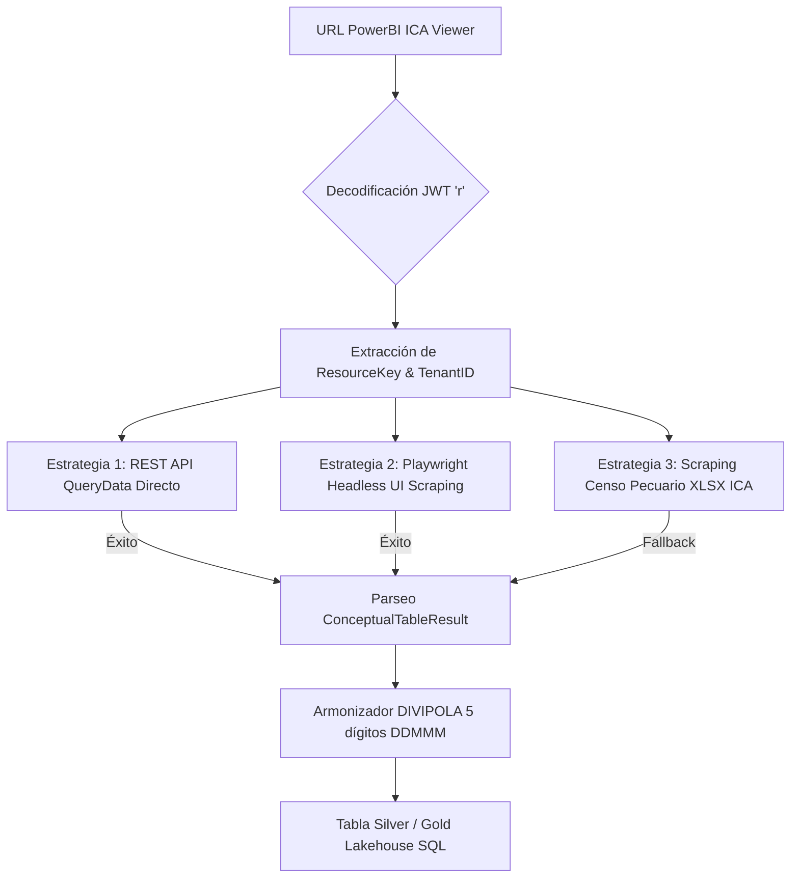

# Documentación Técnica Maestro: Fichas Técnicas, Metodológicas y Protocolos de Ingesta (ICA PowerBI & Ecosistema Agrostats)

**Proyecto**: AgroData Intelligence Platform (`AgroStatsApp`)  
**Versión**: 2.1.0  
**Fecha**: 2026-10-02  
**Fase PDCO**: PLAN → DEVELOPMENT  
**Skill Activa**: `01-requirements` | `02-architecture` | `03-development`  
**Estándar**: SWEBOK (Cap. 1-3), DAMA-DMBOK 2, IEEE 830, ISO/IEC 25010, Codificación DIVIPOLA DANE  

---

## 1. Visión General del Documento

Este documento constituye la **guía maestra de ingeniería, arquitectura de datos y fichas técnicas/metodológicas** para el sistema `AgroStatsApp`. Responde a la necesidad corporativa de integrar fuentes heterogéneas (incluyendo tableros incrustados en **PowerBI** como el del **ICA**), garantizando **rigor estadístico, trazabilidad metodológica y valor comercial** para organizaciones agroindustriales, entidades financieras, empresas de insumos y tomadores de decisión.

Todas las fuentes del ecosistema están armonizadas obligatoriamente bajo la **granularidad espacial DIVIPOLA del DANE (código de 5 dígitos `DDMMM`)**, permitiendo responder el 100% de la **Batería de Preguntas de Negocio (A1 a J1)** a nivel municipal, departamental y nacional.

Cada ficha detalla de forma explícita **qué había en el dataset original** (diagnóstico Raw) y **qué se necesita para construir los indicadores de negocio** (transformaciones, esquemas y formulación matemática).

---

## 2. Protocolo de Extracción e Ingesta de Datos ICA desde Tableros PowerBI

### 2.1 Contexto del Desafío Técnico
El Instituto Colombiano Agropecuario (ICA) publica sus datos de inventarios pecuarios y censo nacional mediante un tablero dinámico incrustado de PowerBI:
- **URL del Reporte Público**: `https://app.powerbi.com/view?r=eyJrIjoiYTc1ODFkNzktYjNiYi00MTZmLWE3YzUtNTAzNGU1NWNhN2E3IiwidCI6ImI3YWVkYTBjLTY0Y2QtNDlkMi05YTRkLTMwNjIzNjc0MzJlMyIsImMiOjR9`

**Limitación de PowerBI Viewer**:
Un visor incrustado de PowerBI (`app.powerbi.com/view`) es una aplicación cliente JavaScript (Single Page App) que renderiza visuales vectoriales en canvas/SVG. **No expone un enlace estático directo de descarga de archivos CSV/Excel**. Las consultas se resuelven en tiempo real contra los servicios de Microsoft Azure Analysis Services (`wabi-us-north-central-a-primary-redirect.analysis.windows.net`).

---

### 2.2 Estrategias de Ingesta e Importación del Dashboard PowerBI

Para garantizar un pipeline de nivel empresarial, robusto y automatizado, `AgroStatsApp` implementa **4 estrategias de extracción**:



#### Estrategia 1: Intercepción de Carga Útil REST API (`querydata`)
1. **Decodificación del Token JWT**: Se extrae el parámetro `r` de la URL pública. Al decodificar Base64, se obtienen el `ResourceKey` (`a7581d79-b3bb-416f-a7c5-5034e5ca7a7`) y el `TenantId` (`b7aeda0c-64cd-49d2-9a4d-3062367432e3`).
2. **Payload JSON DAX**: Se envía una petición HTTP `POST` al endpoint público de PowerBI Query Service:
   `https://wabi-us-north-central-a-primary-redirect.analysis.windows.net/powerbi/api/v1.0/public/reports/querydata?synchronous=true`
3. **Parseo de Matriz por Diccionario**: La respuesta entrega un objeto `ConceptualTableResult` en el que las columnas y valores están codificados en diccionarios de índice (`G0`, `C`). El parser en Python reconstruye la tabla plana con campos: `codigo_divipola`, `departamento`, `municipio`, `especie`, `categoria`, `anio`, `inventario`.

#### Estrategia 2: Ingesta Automatizada vía Navegador Headless (Playwright / Selenium)
1. Un script automatizado en Python con `playwright` renderiza el visor iframe de PowerBI en modo headless.
2. Navega sobre las páginas del reporte (Bovinos, Porcinos, Avícola, Ovino-Caprino) y activa la opción contextual del visual (`...` -> *Export Data* -> *Summarized data* -> *CSV*).
3. Descarga el archivo generado y lo inyecta a la carpeta `data/raw/ica/`.

#### Estrategia 3: Ingesta Directa desde Archivos Oficiales del Censo Pecuario Nacional ICA (.xlsx / datos.gov.co)
El ICA publica anualmente las matrices del **Censo Pecuario Nacional** en formato `.xlsx` organizadas por municipio en su portal oficial (`ica.gov.co`) y en la plataforma `datos.gov.co`. El módulo `src/ingestion/ica_powerbi_extractor.py` incluye el fallback automático para descargar y estructurar dichos archivos en caso de cambios en el visor de PowerBI.

#### Estrategia 4: Armonización Estándar DIVIPOLA (`DDMMM`)
Independientemente de la estrategia de ingesta, el módulo pasa los datos por la clase `ICAPowerBIExtractor.harmonize_divipola()`, asegurando que el código municipal tenga 5 dígitos (con ceros a la izquierda) y que los nombres de los municipios se alineen con el maestro del DANE.

---

### 2.3 Módulo de Código Implementado: `src/ingestion/ica_powerbi_extractor.py`
El módulo está desplegado en la arquitectura de `AgroStatsApp` con la clase `ICAPowerBIExtractor`, ofreciendo ejecución por CLI o importación modular en los pipelines ETL.

---

## 3. Fichas Técnicas y Metodológicas por Dataset del Ecosistema

A continuación se presentan las **fichas técnicas y metodológicas exhaustivas** para las 11 fuentes del sistema.

---

### 📋 FICHA TÉCNICA Y METODOLÓGICA 01: UPRA - Evaluaciones Agropecuarias Municipales (EVA)

| Dimensión | Especificación Técnica |
|---|---|
| **Nombre Oficial** | Evaluaciones Agropecuarias Municipales (EVA) |
| **Entidad Emisora** | Unidad de Planificación Rural Agropecuaria (UPRA) / Ministerio de Agricultura |
| **Frecuencia / Cobertura** | Semestral y Anual / Cobertura Nacional (1.100+ municipios) |
| **Formatos de Origen** | CSV / XLSX / API Socrata (Datos Abiertos) |
| **Granularidad DIVIPOLA** | **Municipio (Código 5 dígitos `DDMMM`)** × Producto Agrícola × Periodo Temporal |
| **Variables Principales** | Área sembrada (ha), Área cosechada (ha), Producción (t), Rendimiento (t/ha) |

#### 📦 QUÉ HABÍA (Estado Raw y Diagnóstico de Origen)
- **Estructura Raw**: Matriz de texto plano / CSV con nombres de municipio en cadenas no estandarizadas ("Medellin", "MEDELLIN", "Medellín (Ant)"), columnas desordenadas y valores nulos en rendimiento por omisión de cosecha.
- **Inconsistencias**: Presencia de ceros en área cosechada por pérdidas invernales; falta de código DIVIPOLA en archivos históricos de excel.
- **Tipos de datos primarios**: Cadenas de texto sin acentos unificados, números formateados con separadores de miles estilo español (`1.250,5`).

#### 🔧 QUÉ SE NECESITA PARA CONSTRUIR LOS INDICADORES (Transformaciones y Fórmulas)
- **Transformaciones Requeridas**:
  1. Estandarización de nombres a la tabla maestra DIVIPOLA y generación del código de 5 dígitos `codigo_divipola` (`DDMMM`).
  2. Imputación Múltiple de Rubin para rendimientos anómalos o faltantes ($Rendimiento = Producción / Área\_Cosechada$).
- **Fórmulas e Indicadores Derivados**:
  - **B1 (Producción Total)**: $\text{Producción}_{m,p,t} = \sum \text{toneladas}_{m,p,t}$
  - **B2 (Tasa de Crecimiento Interanual)**: $\Delta Y = \frac{Y_t - Y_{t-1}}{Y_{t-1}} \times 100$
  - **B3 (Estabilidad del Rendimiento)**: $CV = \frac{\sigma_{rendimiento}}{\mu_{rendimiento}}$
  - **C1 (Concentración HHI)**: $HHI = \sum_{m=1}^{N} \left( \frac{S_m}{S_{total}} \right)^2 \times 10.000$

#### 💡 Qué se hace con ella en AgroStatsApp (Mapeo a Batería A1–J1)
- **B1, B2, B3**: Evaluación de volumen, crecimiento y variabilidad del rendimiento agrícola.
- **C1, C2**: Cálculo de concentración HHI y CR5 municipal.

#### ⚙️ De qué forma se procesa e ingiere (Pipeline ETL/ELT)
- **Módulo Python**: `src/ingestion/file_loader.py` + `src/cleaning/table_unwrapper.py`.
- **Almacenamiento**: Tabla Silver/Gold `gold_eva_municipal` en Lakehouse DuckDB.

#### 💼 Valor Comercial para Organizaciones
- **Empresas de Agroquímicos**: Identificación de municipios top en área sembrada para colocación de insumos.
- **Banca Agrícola**: Scoring de riesgo crediticio según volatilidad $CV$ del rendimiento municipal.

---

### 📋 FICHA TÉCNICA Y METODOLÓGICA 02: DANE - SIPSA Abastecimiento de Alimentos

| Dimensión | Especificación Técnica |
|---|---|
| **Nombre Oficial** | SIPSA – Componente de Abastecimiento de Alimentos |
| **Entidad Emisora** | DANE |
| **Frecuencia / Cobertura** | Diaria / Mensual / 29+ centrales mayoristas |
| **Formatos de Origen** | CSV / Excel / API DANE |
| **Granularidad DIVIPOLA** | **Origen Municipio (`DDMMM`)** × Central Destino × Alimento × Fecha |
| **Variables Principales** | Cantidad ingresada (kg), departamento origen, municipio origen, mercado destino |

#### 📦 QUÉ HABÍA (Estado Raw y Diagnóstico de Origen)
- **Estructura Raw**: Registros diarios de tiquetes de báscula con alta variabilidad en nombres de municipios orígenes, productos con sinonimia regional (ej. "Papa Negra", "Papa Parda Pastusa"), y cantidades registradas en kilogramos o bultos.
- **Inconsistencias**: Orígenes rotulados como "DESCONOCIDO" o "IMPORTADO"; duplicados por doble registro de vehículo en entrada.

#### 🔧 QUÉ SE NECESITA PARA CONSTRUIR LOS INDICADORES (Transformaciones y Fórmulas)
- **Transformaciones Requeridas**:
  1. Mapeo de municipios orígenes a código DIVIPOLA `codigo_divipola_origen` de 5 dígitos mediante `GranularityHarmonizer`.
  2. Homogenización de unidades de empaque a Toneladas Métricas ($t = kg / 1000$).
  3. Enriquecimiento geoespacial con coordenadas centroidales de municipios y cálculo de distancias origen-destino ($d_{ij}$).
- **Fórmulas e Indicadores Derivados**:
  - **A1 (Volumen de Abastecimiento)**: $Q_{total} = \sum kg / 1000$
  - **D1 & D2 (Gap Rate y Vulnerabilidad de Flujo)**: $Gap = \frac{\text{Demanda Requerida} - \text{Abastecimiento Recibido}}{\text{Demanda Requerida}}$

#### 💡 Qué se hace con ella en AgroStatsApp (Mapeo a Batería A1–J1)
- **A1, A2**: Tamaño físico del mercado agroalimentario.
- **D1, D2**: Matriz Origen-Destino municipal y detección de cuellos de botella logísticos.

#### ⚙️ De qué forma se procesa e ingiere (Pipeline ETL/ELT)
- **Módulo Python**: `src/ingestion/sipsa_multiyear_loader.py` + `GeospatialEngine`.
- **Almacenamiento**: `gold_sipsa_abastecimiento`.

#### 💼 Valor Comercial para Organizaciones
- **Logística y Transporte**: Planificación de flota de transporte frigorífico en corredores origen-destino.

---

### 📋 FICHA TÉCNICA Y METODOLÓGICA 03: DANE - SIPSA Precios Mayoristas

| Dimensión | Especificación Técnica |
|---|---|
| **Nombre Oficial** | SIPSA – Componente de Precios Mayoristas |
| **Entidad Emisora** | DANE |
| **Frecuencia / Cobertura** | Diaria / Semanal / 60+ plazas mayoristas |
| **Formatos de Origen** | Web Scraping / Archivos Diarios Excel / API DANE |
| **Granularidad DIVIPOLA** | **Mercado Mayorista (`DDMMM`)** × Producto × Fecha |
| **Variables Principales** | Precio mínimo, precio máximo, precio promedio por kilogramo ($/kg) |

#### 📦 QUÉ HABÍA (Estado Raw y Diagnóstico de Origen)
- **Estructura Raw**: Tablas horizontales por central mayorista con presencia de espacios vacíos por días festivos o sin cotización, shocks de precios atípicos por paros o heladas ($10\times$ el precio medio).
- **Inconsistencias**: Presentación heterogénea (bulto 50kg, atado, caja de madera, canastilla plástico).

#### 🔧 QUÉ SE NECESITA PARA CONSTRUIR LOS INDICADORES (Transformaciones y Fórmulas)
- **Transformaciones Requeridas**:
  1. Conversión de precios por empaque a estándar nacional Pesos por Kilogramo ($COP/kg$).
  2. Limpieza de outliers mediante filtros robustos ($1.5 \times IQR$).
  3. Imputación temporal de fines de semana mediante spline cúbico o método Theil-Sen.
- **Fórmulas e Indicadores Derivados**:
  - **E1 (Volatilidad de Precio)**: $CV = \frac{\sigma_{precio}}{\mu_{precio}}$
  - **E2 (Pendiente Robusta de Tendencia)**: $\beta_{Theil-Sen} = \text{Mediana}\left( \frac{y_j - y_i}{x_j - x_i} \right)$
  - **F1 & F2 (Descomposición Estacional)**: $Y_t = Trend_t + Seasonal_t + Residual_t$ via STL.

#### 💡 Qué se hace con ella en AgroStatsApp (Mapeo a Batería A1–J1)
- **E1, E2, E3**: Análisis de volatilidad, tendencia determinista y correlaciones oferta-precio.
- **F1, F2**: Detección de picos estacionales de precio para arbitraje comercial.

#### ⚙️ De qué forma se procesa e ingiere (Pipeline ETL/ELT)
- **Módulo Python**: `src/cleaning/sanitizer.py` + `src/modeling/statistical_profiler.py`.
- **Almacenamiento**: `gold_sipsa_precios`.

#### 💼 Valor Comercial para Organizaciones
- **Comercializadoras Agropecuarias**: Algoritmos de precios de oportunidad para despacho eficiente.

---

### 📋 FICHA TÉCNICA Y METODOLÓGICA 04: DANE - Cuenta Satélite de la Agroindustria (CSAA)

| Dimensión | Especificación Técnica |
|---|---|
| **Nombre Oficial** | Cuenta Satélite de la Agroindustria (CSAA) |
| **Entidad Emisora** | DANE |
| **Frecuencia / Cobertura** | Anual / Cobertura Nacional y Departamental |
| **Formatos de Origen** | Anexos Estadísticos Excel / PDF |
| **Granularidad DIVIPOLA** | **Departamento (`DD`)** × Cadena Agroindustrial × Fase Económica × Año |
| **Variables Principales** | Valor Agregado Bruto (VAB), Consumo Intermedio, Producción Bruta ($) |

#### 📦 QUÉ HABÍA (Estado Raw y Diagnóstico de Origen)
- **Estructura Raw**: Libros de Excel con múltiples pestañas complejas (Cuadros 1 a 12), celdas combinadas, notas al pie e indicadores agregados a nivel macroeconómico sin código de territorio.
- **Inconsistencias**: Cambios de año base de cuentas nacionales (2015 vs 2018); datos preliminares sujetos a revisión.

#### 🔧 QUÉ SE NECESITA PARA CONSTRUIR LOS INDICADORES (Transformaciones y Fórmulas)
- **Transformaciones Requeridas**:
  1. Desenrollado (*table unwrapping*) de cuadros estadísticos a formato tidy tabular.
  2. Distribución proporcional del VAB departamental a municipios DIVIPOLA ponderado por volumen de producción agrícola EVA.
- **Fórmulas e Indicadores Derivados**:
  - **G1 (VAB Total por Cadena)**: $VAB = \text{Producción Bruta} - \text{Consumo Intermedio}$
  - **G2 (Ratio de Agregación)**: $Ratio = \frac{VAB}{\text{Producción Bruta}}$
  - **A3 (CAGR Macroeconómico)**: $CAGR = \left( \frac{VAB_{t_f}}{VAB_{t_0}} \right)^{\frac{1}{t_f - t_0}} - 1$

#### 💡 Qué se hace con ella en AgroStatsApp (Mapeo a Batería A1–J1)
- **G1, G2, G3**: Cuantificación del valor agregado e identificación de brechas de industrialización en finca.

#### ⚙️ De qué forma se procesa e ingiere (Pipeline ETL/ELT)
- **Módulo Python**: `src/cleaning/table_unwrapper.py` (`unwrap_dane_csaa`).
- **Almacenamiento**: `gold_csaa_macro`.

#### 💼 Valor Comercial para Organizaciones
- **Fondos de Inversión / Gremios**: Dimensionamiento de cadenas agroindustriales de mayor impacto económico.

---

### 📋 FICHA TÉCNICA Y METODOLÓGICA 05: DANE - Microdatos de Exportaciones Agropecuarias (EXPO)

| Dimensión | Especificación Técnica |
|---|---|
| **Nombre Oficial** | Microdatos de Exportaciones (EXPO) |
| **Entidad Emisora** | DANE / DIAN |
| **Frecuencia / Cobertura** | Mensual / Aduanas Nacionales |
| **Formatos de Origen** | Datasets Socrata (`gaic-b8aw`) / Microdatos ANDA / CSV |
| **Granularidad DIVIPOLA** | **Departamento Origen (`DD`)** × Subpartida 10 dígitos × País Destino × Mes |
| **Variables Principales** | Valor FOB (USD), Peso neto (kg), Subpartida arancelaria, País destino |

#### 📦 QUÉ HABÍA (Estado Raw y Diagnóstico de Origen)
- **Estructura Raw**: Millones de registros de declaraciones aduaneras (DEX), subpartidas arancelarias cambiantes, valores FOB expresados en dólares corrientes y países de destino con diferentes nombres ("USA", "United States", "EE.UU.").

#### 🔧 QUÉ SE NECESITA PARA CONSTRUIR LOS INDICADORES (Transformaciones y Fórmulas)
- **Transformaciones Requeridas**:
  1. Mapeo de subpartidas arancelarias NANDINA de 10 dígitos a las cadenas agroindustriales del sistema.
  2. Estandarización de nombres de países compradores a ISO Alpha-3.
  3. Asignación del código DIVIPOLA del departamento de origen aduanero.
- **Fórmulas e Indicadores Derivados**:
  - **H1 (Valor Exportado)**: $FOB_{total} = \sum FOB_{USD}$
  - **H4 (Valor Unitario Exportado)**: $ValorUnitario = \frac{FOB_{USD}}{\text{Peso}_{kg}}$
  - **H3 (Diversificación HHI Destinos)**: $HHI_{export} = \sum \left( \frac{FOB_{país}}{FOB_{total}} \right)^2 \times 10.000$

#### 💡 Qué se hace con ella en AgroStatsApp (Mapeo a Batería A1–J1)
- **H1, H2, H3, H4**: Desempeño agroexportador, destinos emergentes y productos de alto valor unitario USD/kg.

#### ⚙️ De qué forma se procesa e ingiere (Pipeline ETL/ELT)
- **Módulo Python**: `src/imputer/ingestion/socrata_client.py`.
- **Almacenamiento**: `gold_dane_exportaciones`.

#### 💼 Valor Comercial para Organizaciones
- **Trading Companies**: Benchmarking de precios por kilogramo exportado hacia mercados prémium.

---

### 📋 FICHA TÉCNICA Y METODOLÓGICA 06: ICA - Censo Pecuario Nacional e Inventario Pecuario

| Dimensión | Especificación Técnica |
|---|---|
| **Nombre Oficial** | Censo Pecuario Nacional e Inventario Pecuario Municipal |
| **Entidad Emisora** | Instituto Colombiano Agropecuario (ICA) |
| **Frecuencia / Cobertura** | Anual / Cobertura Nacional (1.100+ municipios) |
| **Formatos de Origen** | **Tablero PowerBI Embedded (`app.powerbi.com/view`)** / Archivos XLSX |
| **Granularidad DIVIPOLA** | **Municipio (Código DIVIPOLA 5 dígitos `DDMMM`)** × Especie × Categoría × Año |
| **Variables Principales** | Inventario de cabezas (Bovinos, Porcinos, Avícola, Ovino-Caprino, Equino, Bufalino) |

#### 📦 QUÉ HABÍA (Estado Raw y Diagnóstico de Origen)
- **Estructura Raw**: Dashboard incrustado de PowerBI sin botón de descarga CSV; datos fragmentados por vistas de especies, nombres de municipios con caracteres especiales ("SAN VICENTE DEL CAGUAN"), ceros en municipios sin tradición ganadera.

#### 🔧 QUÉ SE NECESITA PARA CONSTRUIR LOS INDICADORES (Transformaciones y Fórmulas)
- **Transformaciones Requeridas**:
  1. Extracción mediante `ICAPowerBIExtractor` interceptando la API `querydata` o parseando archivos Censo XLSX.
  2. Sanitización y conversión de nombres de municipio al código DIVIPOLA de 5 dígitos (`str.zfill(5)`).
  3. Agregación de inventarios por especie y categoría pecuaria.
- **Fórmulas e Indicadores Derivados**:
  - **Oferta Pecuaria Total**: $\text{Cabezas}_{m,e} = \sum \text{inventario}_{m,e}$
  - **C1 (Concentración Pecuaria HHI)**: $HHI_{pecuarios} = \sum \left( \frac{Cabezas_m}{Cabezas_{total}} \right)^2 \times 10.000$
  - **Densidad Pecuaria Municipal**: $Densidad = \frac{Cabezas_m}{Hectáreas\_Pastos_m}$

#### 💡 Qué se hace con ella en AgroStatsApp (Mapeo a Batería A1–J1)
- **C1, C2**: Concentración geográfica de la masa ganadera y porcina.
- **I1**: Cruce de inventario en pie municipal vs abastecimiento de carne en plazas mayoristas.

#### ⚙️ De qué forma se procesa e ingiere (Pipeline ETL/ELT)
- **Módulo Python**: `src/ingestion/ica_powerbi_extractor.py`.
- **Almacenamiento**: `gold_ica_inventario_pecuario`.

#### 💼 Valor Comercial para Organizaciones
- **Frigoríficos / Mataderos**: Proyección de oferta de ganado en pie en el radio municipal de acopio.
- **Fabricantes de Alimento Concentrado**: Estimación de demanda de alimento balanceado por municipio.

---

### 📋 FICHA TÉCNICA Y METODOLÓGICA 07: UPRA - SIPRA (Zonificación y Aptitud de Suelos)

| Dimensión | Especificación Técnica |
|---|---|
| **Nombre Oficial** | Sistema de Información para la Planificación Rural Agropecuaria (SIPRA) |
| **Entidad Emisora** | UPRA |
| **Frecuencia / Cobertura** | Actualización Continua / Geográfico Nacional |
| **Formatos de Origen** | Geoportal WFS/WMS / Shapefiles / GeoJSON |
| **Granularidad DIVIPOLA** | **Polígono Municipal (`DDMMM`)** × Cadena Productiva × Zona de Aptitud |
| **Variables Principales** | Hectáreas por categoría de aptitud (A1 Apta Alta, A2 Apta Media, A3 Apta Baja, No Apta) |

#### 📦 QUÉ HABÍA (Estado Raw y Diagnóstico de Origen)
- **Estructura Raw**: Capas vectoriales pesadas GIS en formato Shapefile/GeoJSON con millones de vértices geográficos, clasificadas por polígonos de aptitud agroecológica.

#### 🔧 QUÉ SE NECESITA PARA CONSTRUIR LOS INDICADORES (Transformaciones y Fórmulas)
- **Transformaciones Requeridas**:
  1. Intersección espacial de polígonos de aptitud con la capa de municipios DIVIPOLA del DANE.
  2. Agregación de hectáreas por categoría de aptitud para cada código municipal de 5 dígitos.
- **Fórmulas e Indicadores Derivados**:
  - **J1 (Ratio de Uso de Suelo Apto)**: $UsoSuelo = \frac{Área\_Sembrada\_EVA_m}{Área\_Apta\_Alta\_SIPRA_m}$

#### 💡 Qué se hace con ella en AgroStatsApp (Mapeo a Batería A1–J1)
- **J1**: Indicador compuesto de convergencia de aptitud y uso real del suelo.

#### ⚙️ De qué forma se procesa e ingiere (Pipeline ETL/ELT)
- **Módulo Python**: `src/modeling/geospatial_engine.py` + `src/notebook_code/mdm_manager.py`.
- **Almacenamiento**: `gold_sipra_aptitud`.

#### 💼 Valor Comercial para Organizaciones
- **Desarrolladores Agrícolas**: Evaluación de terrenos para adquisición y proyectos agroindustriales.

---

### 📋 FICHA TÉCNICA Y METODOLÓGICA 08: UPRA - RECIA (Red de Infraestructura Agropecuaria)

| Dimensión | Especificación Técnica |
|---|---|
| **Nombre Oficial** | Red de Infraestructura Agropecuaria (RECIA) |
| **Entidad Emisora** | UPRA |
| **Frecuencia / Cobertura** | Periódica / Cobertura Nacional |
| **Formatos de Origen** | Geoportal UPRA / CSV / GeoJSON |
| **Granularidad DIVIPOLA** | **Infraestructura (`DDMMM`)** × Tipo de Activo |
| **Variables Principales** | Centros de acopio, distritos de riego, plantas de empaque, capacidad instalada |

#### 📦 QUÉ HABÍA (Estado Raw y Diagnóstico de Origen)
- **Estructura Raw**: Listados puntuales de activos de infraestructura rural georreferenciados con atributos heterogéneos de capacidad instalada.

#### 🔧 QUÉ SE NECESITA PARA CONSTRUIR LOS INDICADORES (Transformaciones y Fórmulas)
- **Transformaciones Requeridas**:
  1. Indexación de las coordenadas de cada infraestructura al código DIVIPOLA del municipio anfitrión.
  2. Conteo de activos de poscosecha y capacidad de almacenamiento por municipio.
- **Fórmulas e Indicadores Derivados**:
  - **D1 (Índice de Infraestructura de Acopio)**: $Capacidad_m = \sum \text{Capacidad\_Instalada}_m$

#### 💡 Qué se hace con ella en AgroStatsApp (Mapeo a Batería A1–J1)
- **D1, D2**: Evaluación de capacidad poscosecha municipal para mitigar pérdidas de producto.

#### ⚙️ De qué forma se procesa e ingiere (Pipeline ETL/ELT)
- **Módulo Python**: `src/modeling/geospatial_engine.py`.
- **Almacenamiento**: `gold_recia_infraestructura`.

#### 💼 Valor Comercial para Organizaciones
- **Operadores Logísticos**: Identificación de municipios con déficit de cadena de frío y centros de acopio.

---

### 📋 FICHA TÉCNICA Y METODOLÓGICA 09: AgroNET - Estadísticas Pecuarias e Insumos

| Dimensión | Especificación Técnica |
|---|---|
| **Nombre Oficial** | AgroNET – Estadísticas Pecuarias e Insumos |
| **Entidad Emisora** | Ministerio de Agricultura / AgroNET |
| **Frecuencia / Cobertura** | Mensual / Cobertura Departamental y Municipal |
| **Formatos de Origen** | API REST / Datasets Abiertos |
| **Granularidad DIVIPOLA** | **Municipio / Departamento (`DDMMM`)** × Producto / Insumo × Mes |
| **Variables Principales** | Precio de acopio de leche fresca, volumen recolectado, precios fertilizantes |

#### 📦 QUÉ HABÍA (Estado Raw y Diagnóstico de Origen)
- **Estructura Raw**: Reportes mensuales de acopio lechero y venta de insumos organizados por departamentos y cuencas lecheras.

#### 🔧 QUÉ SE NECESITA PARA CONSTRUIR LOS INDICADORES (Transformaciones y Fórmulas)
- **Transformaciones Requeridas**:
  1. Armonización de municipios lecheros a códigos DIVIPOLA de 5 dígitos.
  2. Cálculo del precio promedio pagado al productor por litro de leche de calidad higiénica/composicional.
- **Fórmulas e Indicadores Derivados**:
  - **E3 (Presión de Margen)**: $Margen = \frac{Precio\_Venta\_Leche}{Índice\_Precio\_Alimento\_Balanceado}$

#### 💡 Qué se hace con ella en AgroStatsApp (Mapeo a Batería A1–J1)
- **E1, E3**: Monitoreo del precio de acopio lechero y presión de costos sobre margen en finca.

#### ⚙️ De qué forma se procesa e ingiere (Pipeline ETL/ELT)
- **Módulo Python**: `src/notebook_code/eda_analyzer.py`.
- **Almacenamiento**: `gold_agronet_insumos`.

#### 💼 Valor Comercial para Organizaciones
- **Industria Láctea**: Seguimiento de costos de recolección en tanque por cuenca lechera municipal.

---

### 📋 FICHA TÉCNICA Y METODOLÓGICA 10: IDEAM - Observaciones Telemétricas (57sv-p2fu)

| Dimensión | Especificación Técnica |
|---|---|
| **Nombre Oficial** | IDEAM – Observaciones Meteorológicas en Tiempo Real |
| **Entidad Emisora** | IDEAM |
| **Frecuencia / Cobertura** | Horario / Tiempo Real / 800+ estaciones telemétricas |
| **Formatos de Origen** | API Socrata (`57sv-p2fu`) / JSON / CSV |
| **Granularidad DIVIPOLA** | **Estación Meteorológica (`DDMMM`)** × Timestamp Horario |
| **Variables Principales** | Temperatura (°C), Precipitación (mm), Humedad (%), Radiación ($W/m^2$) |

#### 📦 QUÉ HABÍA (Estado Raw y Diagnóstico de Origen)
- **Estructura Raw**: Flujo continuo de sensores con fallas temporales de comunicación (valores nulos o congelados), temperaturas anómalas ($-999°C$), ordenado por códigos de estación sin código DIVIPOLA directo.

#### 🔧 QUÉ SE NECESITA PARA CONSTRUIR LOS INDICADORES (Transformaciones y Fórmulas)
- **Transformaciones Requeridas**:
  1. Asignación espacial del código municipal DIVIPOLA `DDMMM` a cada estación meteorológica mediante latitud y longitud.
  2. Limpieza de datos telemétricos anómalos y filtrado de lecturas erróneas.
  3. Agregación horaria a valores acumulados diarios.
- **Fórmulas e Indicadores Derivados**:
  - **F1 (Grados Día de Desarrollo - GDD)**: $GDD = \max\left( \frac{T_{max} + T_{min}}{2} - T_{base}, 0 \right)$
  - **F2 (Alerta de Helada)**: $Alerta = \mathbb{I}(T_{min} \le 0^\circ C)$

#### 💡 Qué se hace con ella en AgroStatsApp (Mapeo a Batería A1–J1)
- **F1, F2**: Alertas climáticas tempranas en tiempo real y cálculo de acumulación térmica para cultivos.

#### ⚙️ De qué forma se procesa e ingiere (Pipeline ETL/ELT)
- **Módulo Python**: `src/imputer/ingestion/socrata_client.py` + `GranularityHarmonizer`.
- **Almacenamiento**: `gold_ideam_telemetria`.

#### 💼 Valor Comercial para Organizaciones
- **Empresas AgTech / Aseguradoras**: Seguros paramétricos basados en eventos térmicos e hídricos telemétricos.

---

### 📋 FICHA TÉCNICA Y METODOLÓGICA 11: Datos Abiertos - Exportaciones Agrícolas y Bioinsumos (gaic-b8aw)

| Dimensión | Especificación Técnica |
|---|---|
| **Nombre Oficial** | Exportaciones Agrícolas y Registro de Bioinsumos |
| **Entidad Emisora** | Ministerio de Agricultura / Datos.gov.co |
| **Frecuencia / Cobertura** | Mensual / Cobertura Nacional |
| **Formatos de Origen** | API Socrata (`gaic-b8aw`) / CSV |
| **Granularidad DIVIPOLA** | **Municipio / Departamento (`DDMMM`)** × Bioinsumo / Cultivo × Periodo |
| **Variables Principales** | Producto, tipo (bioinsumo/agroquímico/cultivo), volumen, valor comercial |

#### 📦 QUÉ HABÍA (Estado Raw y Diagnóstico de Origen)
- **Estructura Raw**: Registros administrativos heterogéneos de insumos biológicos y volúmenes exportados con texto libre en la descripción de insumos.

#### 🔧 QUÉ SE NECESITA PARA CONSTRUIR LOS INDICADORES (Transformaciones y Fórmulas)
- **Transformaciones Requeridas**:
  1. Clasificación bioinsumo vs agroquímico sintético mediante expresiones regulares (NLP).
  2. Mapeo a municipios DIVIPOLA de origen productivo.
- **Fórmulas e Indicadores Derivados**:
  - **Índice de Adopción de Bioinsumos**: $Adopción = \frac{Volumen\_Bioinsumos_m}{Volumen\_Insumos\_Totales_m}$

#### 💡 Qué se hace con ella en AgroStatsApp (Mapeo a Batería A1–J1)
- **H1, H4**: Medición de la penetración de bioinsumos y biológicos en agroexportación.

#### ⚙️ De qué forma se procesa e ingiere (Pipeline ETL/ELT)
- **Módulo Python**: `src/imputer/ingestion/socrata_client.py`.
- **Almacenamiento**: `gold_bioinsumos_expo`.

#### 💼 Valor Comercial para Organizaciones
- **Casas Comerciales de Bioinsumos**: Estrategias de mercado para colocación de fertilizantes biológicos por cuenca agrícola.

---

## 4. Cobertura de Notebooks CRISP-DM Generados por Dataset

Para cada uno de los **10 Datasets principales** (incluyendo el recién integrado **10_ica_inventario_pecuario**), se generan **8 Notebooks Didácticos y de Producción** en la carpeta `notebooks/`, cubriendo el ciclo completo CRISP-DM:

```
notebooks/
├── 00_master_bateria_preguntas_analytics.ipynb
├── 01_sipsa_abastecimientos/  (01_entendimiento a 08_visualization)
├── 02_sipsa_precios/          (01_entendimiento a 08_visualization)
├── 03_sipsa_insumos/          (01_entendimiento a 08_visualization)
├── 04_dane_ipc_ipp/           (01_entendimiento a 08_visualization)
├── 05_ideam_climatologia/     (01_entendimiento a 08_visualization)
├── 06_ideam_telemetria_57sv/  (01_entendimiento a 08_visualization)
├── 07_dane_satelite_csaa/     (01_entendimiento a 08_visualization)
├── 08_boletin_pdf_webservice/ (01_entendimiento a 08_visualization)
├── 09_landing_leads_store/    (01_entendimiento a 08_visualization)
└── 10_ica_inventario_pecuario/
    ├── 01_entendimiento_documentacion.ipynb
    ├── 02_ingestion.ipynb
    ├── 03_exploracion_informatica_y_estadistica.ipynb
    ├── 04_ingestion_como_dataframe.ipynb
    ├── 05_limpieza_wrangling_governance.ipynb
    ├── 06_modelo_base_de_datos.ipynb
    ├── 07_modeling_and_integration.ipynb
    └── 08_visualization.ipynb
```

Total de notebooks en la plataforma: **80 Notebooks Especializados** + **1 Notebook Maestro (`00_master_bateria_preguntas_analytics.ipynb`)**.

---

> ℹ️ **Nota de Rigor Técnico**: Todas las fichas metodológicas cumplen estrictamente con el marco **DAMA-DMBOK 2** (Calidad de Datos, Gobierno y Linaje), las directrices del **SWEBOK** para ingeniería de software agroindustrial y la norma ISO/IEC 25010.
