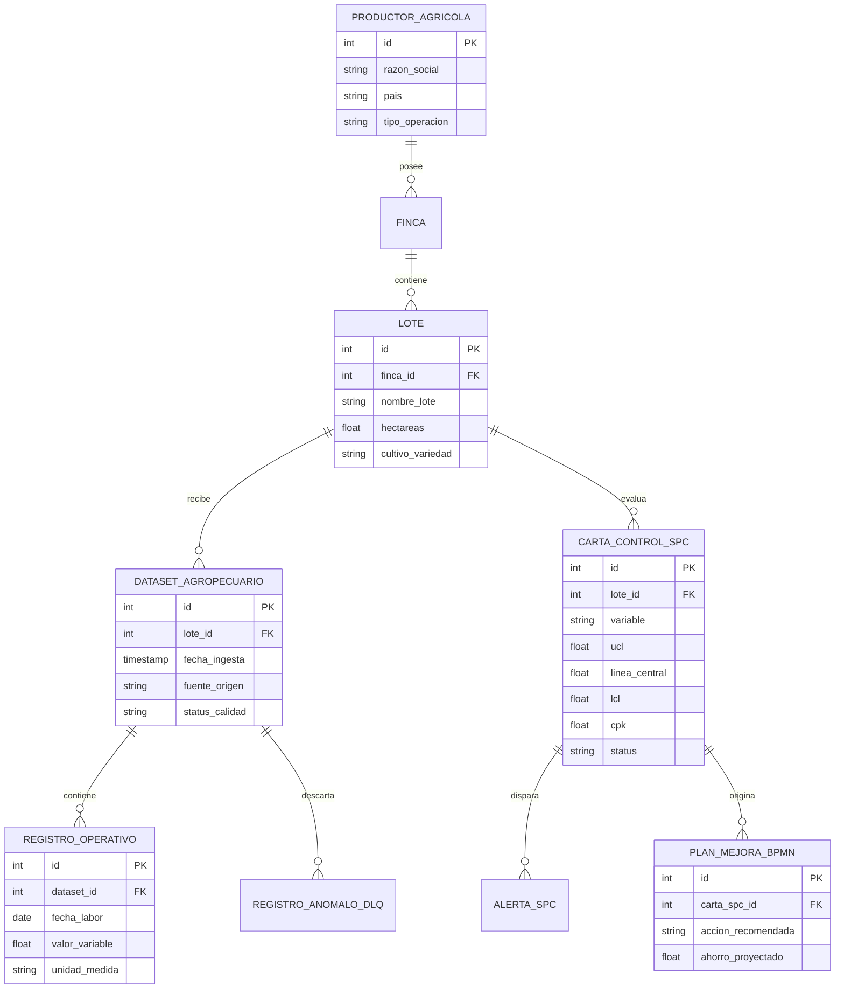

# Mapa de Entidades del Dominio Agroestadístico
**Proyecto**: Agro Stat & Tech Co. (AgroStats)  
**Versión**: 2.0.0  
**Fecha**: 2026-09-12  
**Fase PDCO**: PLAN  
**SDLC Stage**: Requirements  

---

## 1. Entidades Principales del Sistema

### 1.1. `ProductorAgricola`
- **Descripción**: Organización, agroexportadora o productor titular de los datos y de la explotación agropecuaria.
- **Atributos clave**: `id`, `razon_social`, `pais`, `tipo_cultivo_principal`, `politica_soberania_aceptada`, `fecha_registro`.
- **Relaciones**: Tiene muchas `Fincas`, tiene muchos `DataContracts`.

### 1.2. `Finca` / `Lote`
- **Descripción**: Unidad espacial agronómica delimitada por coordenadas geográficas donde se ejecutan las labores y cosechas.
- **Atributos clave**: `id`, `finca_id`, `nombre_lote`, `hectareas`, `variedad_cultivo`, `geometria_poligono_geojson`.
- **Relaciones**: Pertenece a `ProductorAgricola`, tiene muchos `DatasetsAgropecuarios`, tiene muchas `CartasControlSPC`.

### 1.3. `DatasetAgropecuario`
- **Descripción**: Lote de datos provisto por el cliente (archivo Excel/CSV o payload de API de ERP) que contiene mediciones operativas.
- **Atributos clave**: `id`, `lote_id`, `fecha_ingesta`, `fuente_origen` (ERP, PLANILLA_EXCEL, LAB_SUELO, REGISTRO_COSECHA), `estado_validacion` (INGESTADO, EN_CUARENTENA, VERIFICADO), `registros_totales`, `registros_anomalos`.
- **Relaciones**: Pertenece a `Lote`, contiene muchos `RegistrosOperativos`.

### 1.4. `CartaControlSPC`
- **Descripción**: Estructura de cálculo estadístico que modela la estabilidad del proceso sobre una variable agronómica o de poscosecha.
- **Atributos clave**: `id`, `lote_id`, `variable_analizada`, `tipo_carta` (XBAR_R, XBAR_S, I_MR), `media_central`, `limite_superior_ucl`, `limite_inferior_lcl`, `indice_cp`, `indice_cpk`, `estado_proceso` (BAJO_CONTROL, FUERA_DE_CONTROL).
- **Relaciones**: Pertenece a `Lote`, genera muchas `AlertasSPC`.

### 1.5. `PlanMejoraProceso` (BPMN)
- **Descripción**: Propuesta estructurada de ingeniería de procesos derivada de los hallazgos de variabilidad y mermas.
- **Atributos clave**: `id`, `lote_id`, `proceso_bpmn_as_is`, `proceso_bpmn_to_be`, `ahorro_estimado_usd`, `reduccion_merma_proyectada_pct`, `estado_implementacion`.
- **Relaciones**: Asociado a `CartaControlSPC`.

---

## 2. Diagrama Entidad-Relación (Mermaid ER)

