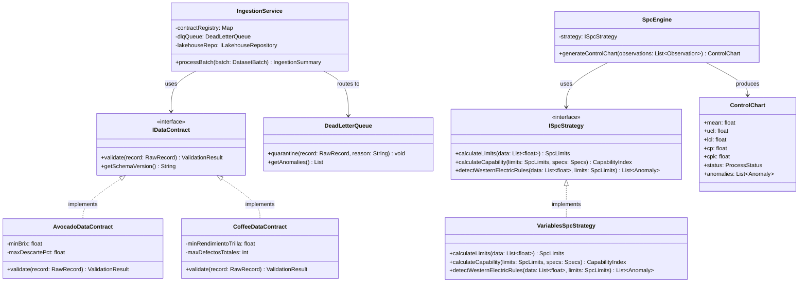

# Diagrama de Clases del Motor Bioestadístico y de Ingesta (Mermaid)
**Proyecto**: Agro Stat & Tech Co. (AgroStats)  
**Versión**: 2.0.0  
**Fecha**: 2026-09-12  

```mermaid
classDiagram
    class IDataContract {
        <<interface>>
        +validate(record: RawRecord) ValidationResult
        +getSchemaVersion() String
    }

    class AvocadoDataContract {
        -minBrix: float
        -maxDescartePct: float
        +validate(record: RawRecord) ValidationResult
    }

    class CoffeeDataContract {
        -minRendimientoTrilla: float
        -maxDefectosTotales: int
        +validate(record: RawRecord) ValidationResult
    }

    class IngestionService {
        -contractRegistry: Map
        -dlqQueue: DeadLetterQueue
        -lakehouseRepo: ILakehouseRepository
        +processBatch(batch: DatasetBatch) IngestionSummary
    }

    class DeadLetterQueue {
        +quarantine(record: RawRecord, reason: String) void
        +getAnomalies() List
    }

    class ISpcStrategy {
        <<interface>>
        +calculateLimits(data: List~float~) SpcLimits
        +calculateCapability(limits: SpcLimits, specs: Specs) CapabilityIndex
        +detectWesternElectricRules(data: List~float~, limits: SpcLimits) List~Anomaly~
    }

    class VariablesSpcStrategy {
        +calculateLimits(data: List~float~) SpcLimits
        +calculateCapability(limits: SpcLimits, specs: Specs) CapabilityIndex
        +detectWesternElectricRules(data: List~float~, limits: SpcLimits) List~Anomaly~
    }

    class SpcEngine {
        -strategy: ISpcStrategy
        +generateControlChart(observations: List~Observation~) ControlChart
    }

    class ControlChart {
        +mean: float
        +ucl: float
        +lcl: float
        +cp: float
        +cpk: float
        +status: ProcessStatus
        +anomalies: List~Anomaly~
    }

    IDataContract <|.. AvocadoDataContract : implements
    IDataContract <|.. CoffeeDataContract : implements
    IngestionService --> IDataContract : uses
    IngestionService --> DeadLetterQueue : routes to
    ISpcStrategy <|.. VariablesSpcStrategy : implements
    SpcEngine --> ISpcStrategy : uses
    SpcEngine --> ControlChart : produces
```
