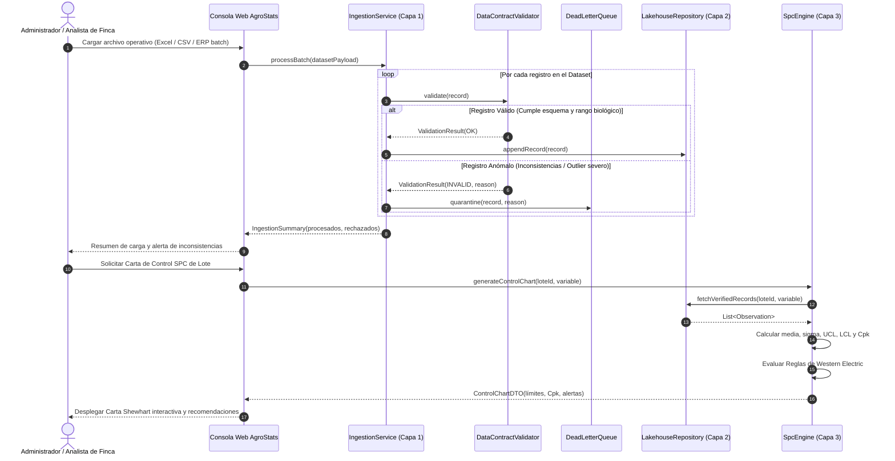

# Diagrama de Secuencia: Ingesta, Validación y Control SPC (Mermaid)
**Proyecto**: Agro Stat & Tech Co. (AgroStats)  
**Versión**: 2.0.0  
**Fecha**: 2026-09-12  

```mermaid
sequenceDiagram
    autonumber
    actor Cliente as Administrador / Analista de Finca
    participant Portal as Consola Web AgroStats
    participant Ingesta as IngestionService (Capa 1)
    participant Contract as DataContractValidator
    participant DLQ as DeadLetterQueue
    participant Lakehouse as LakehouseRepository (Capa 2)
    participant SpcEngine as SpcEngine (Capa 3)

    Cliente->>Portal: Cargar archivo operativo (Excel / CSV / ERP batch)
    Portal->>Ingesta: processBatch(datasetPayload)
    
    loop Por cada registro en el Dataset
        Ingesta->>Contract: validate(record)
        alt Registro Válido (Cumple esquema y rango biológico)
            Contract-->>Ingesta: ValidationResult(OK)
            Ingesta->>Lakehouse: appendRecord(record)
        else Registro Anómalo (Inconsistencias / Outlier severo)
            Contract-->>Ingesta: ValidationResult(INVALID, reason)
            Ingesta->>DLQ: quarantine(record, reason)
        end
    end

    Ingesta-->>Portal: IngestionSummary(procesados, rechazados)
    Portal-->>Cliente: Resumen de carga y alerta de inconsistencias

    Cliente->>Portal: Solicitar Carta de Control SPC de Lote
    Portal->>SpcEngine: generateControlChart(loteId, variable)
    SpcEngine->>Lakehouse: fetchVerifiedRecords(loteId, variable)
    Lakehouse-->>SpcEngine: List<Observation>
    SpcEngine->>SpcEngine: Calcular media, sigma, UCL, LCL y Cpk
    SpcEngine->>SpcEngine: Evaluar Reglas de Western Electric
    SpcEngine-->>Portal: ControlChartDTO(límites, Cpk, alertas)
    Portal-->>Cliente: Desplegar Carta Shewhart interactiva y recomendaciones
```
