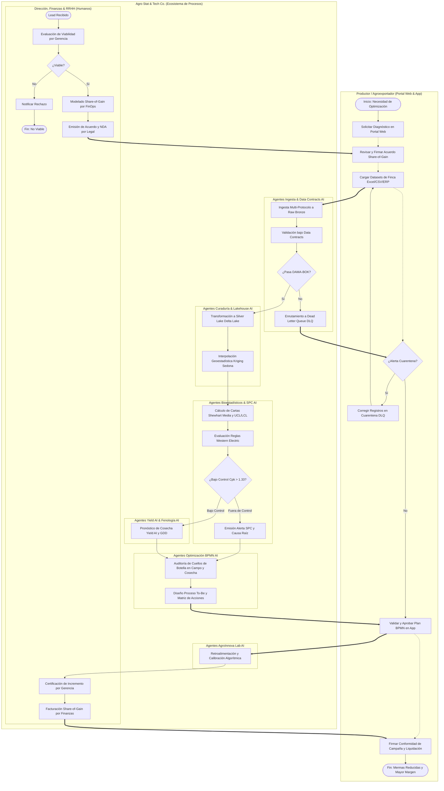

# Especificación Técnica de Ingeniería de Procesos BPMN 2.0
**Compañía**: Agro Stat & Tech Co. (AgroStats)  
**Versión**: 2.0.0  
**Fecha**: 2026-09-12  
**Referencia de Proceso**: `bpmn/agrostats_procesos_analiticos.bpmn`  
**Estándar**: BPMN 2.0 (OMG) / SWEBOK / DAMA-BOK / Clean Architecture  
**Fase PDCO**: DEVELOPMENT | **SDLC Stage**: Implementation  

---

## 1. Visión General del Proceso Agroindustrial Canónico

El modelo de procesos de **Agro Stat & Tech Co.** implementa un flujo de extremo a extremo (*End-to-End*) para la **ingesta de datasets de clientes, validación bajo contratos de datos (Data Contracts), curaduría en Lakehouse, control estadístico de procesos (SPC), predicción de cosecha (Yield AI) y optimización de procesos (BPMN)**, sin requerir sensores ni hardware en campo.

El proceso se encuentra implementado bajo el estándar internacional **BPMN 2.0 (OMG)** en el archivo ejecutable [agrostats_procesos_analiticos.bpmn](file:///c:/Users/ADAN/OneDrive/Documentos/Statsfirm/AgroStats%20AndTech/bpmn/agrostats_procesos_analiticos.bpmn), compatible con Camunda Modeler y motores de orquestación de microservicios.

---

## 2. Topología Híbrida: Roles Humanos vs. Agentes Autónomos de IA

En estricto alineamiento con el modelo corporativo:
- **Roles Humanos (Supervisión, Capital y Dirección Estratégica)**:
  1. **Gerencia & Dirección Agroempresarial**: Calificación estratégica de cuentas, aprobación de contratos de gran escala y certificación de ahorros hídricos / mermas alcanzadas.
  2. **FinOps & Finanzas Agropecuarias**: Modelado financiero de ahorro compartido (*Share-of-Gain*), emisión de liquidaciones y facturación por resultados.
  3. **Legal Counsel**: Redacción de acuerdos de custodia y confidencialidad (*Zero Data Lock-In* / NDA).
  4. **Recursos Humanos / Talento**: Asignación de consultores agrónomos sénior y gestión de capacidades humanas.

- **Agentes Autónomos de Inteligencia Artificial (Ejecución Analítica)**:
  1. **Agente de Ingesta & Data Contracts AI**: Validador sintáctico, biológico y dimensional (DAMA-BOK); gestiona el aislamiento automático hacia la *Dead Letter Queue (DLQ)*.
  2. **Agente de Curaduría & Lakehouse AI**: Motor ETL/ELT con dbt, Apache Spark, Delta Lake y procesamiento espacial con Apache Sedona (Interpolación Kriging).
  3. **Agente Bioestadístico & SPC AI**: Motor matemático de cálculo de cartas de control Shewhart ($\bar{X}-R, \bar{X}-S, I-MR$), límites de control ($\pm 3\sigma$), evaluación de las 8 Reglas de Western Electric, cálculo de índices $C_p, C_{pk} > 1.33$ y análisis de varianza (ANOVA).
  4. **Agente Yield AI & Fenología AI**: Modelo predictivo de acumulación de grados-día (GDD), curvas de maduración y pronóstico de volumen cosechable por hectárea.
  5. **Agente de Optimización BPMN AI**: Diagnóstico de cuellos de botella en labores de cultivo y cosecha en campo; formulación del proceso optimizado (*To-Be*).
  6. **Agente de AgroInnova Lab AI**: Calibración biofísica continua, benchmarking agronómico y retroalimentación de algoritmos.

---

## 3. Diagrama de Procesos (Mermaid Flowchart)

---

## 4. Matriz Detallada de Tareas del Proceso

| ID de Tarea | Nombre en BPMN | Tipo de Tarea | Rol / Agente Responsable | Entradas | Salidas |
|---|---|---|---|---|---|
| `Task_EvaluarLeadAgro` | Evaluación Inicial de Viabilidad Agrícola y Datos | `userTask` | `Humano: Gerencia / Ejecutivo Agronómico` | Solicitud web, hectáreas, cultivo | Dictamen de factibilidad |
| `Task_ModeladoShareOfGain` | Modelado Financiero Share-of-Gain y Proyección | `userTask` | `Humano: Finanzas / Especialista FinOps` | Costos de insumos, historial mermas | Modelo de reparto de valor |
| `Task_EmitirAcuerdoDigital` | Formalización de Contrato y Soberanía del Dato | `userTask` | `Humano: Legal & Finanzas / Legal Counsel` | Modelo de negocio, datos fiscales | Contrato digital, NDA |
| `Task_ActivarCuentaLakehouse` | Aprovisionamiento de Tenant Seguro en Lakehouse | `serviceTask` | Motor Automatizado Camunda | Contrato firmado | Credenciales de ingesta |
| `Task_IngestaMulticanal` | Ingesta Multi-Protocolo a Raw Bronze | `serviceTask` | Motor Automatizado Camunda | Archivos Excel/CSV, endpoints ERP | Datasets crudos en Bronze |
| `Task_ValidarDataContracts` | Validación Sintáctica y Biofísica bajo Data Contracts | `userTask` | `Agente: Ingesta & Data Contracts AI` | Datasets crudos, esquemas JSON | Registros validados / anomalías |
| `Task_EnrutarDLQ` | Enrutamiento a Dead Letter Queue (DLQ) y Alerta | `serviceTask` | Motor Automatizado Camunda | Registros inconsistentes | Payload en cuarentena y notificación |
| `Task_CuraduriaDelta` | Transformación a Silver Lake (Delta Lake / Parquet) | `serviceTask` | Motor Automatizado Camunda | Datos validados | Tablas Delta optimizadas |
| `Task_InterpolacionKriging` | Interpolación Geoestadística Kriging con Sedona | `serviceTask` | Motor Automatizado Camunda | Muestreos georreferenciados | Superficie continua estimada |
| `Task_CalculoLimitesSPC` | Cálculo de Cartas Shewhart (Media, Desviación, UCL/LCL)| `userTask` | `Agente: Bioestadístico & SPC AI` | Series temporales Silver | Límites de control, $C_p, C_{pk}$ |
| `Task_EvaluarWesternElectric`| Evaluación Automatizada de Reglas Western Electric | `serviceTask` | Motor Automatizado Camunda | Puntos vs. zonas $1\sigma, 2\sigma, 3\sigma$ | Banderas de causas especiales |
| `Task_EmitirAlertaSPC` | Emisión de Alerta Temprana de Fuera de Control | `serviceTask` | Motor Automatizado Camunda | Causa especial detectada | Notificación push / email |
| `Task_AnalisisCausaRaiz` | Diagnóstico de Causas Especiales de Variación | `userTask` | `Agente: Bioestadístico & SPC AI` | Datos fuera de control | Diagnóstico agronómico |
| `Task_EntrenamientoYieldAI` | Modelado Predictivo de Cosecha (Yield AI) y GDD | `userTask` | `Agente: Yield AI & Fenología AI` | Históricos, fenología, clima | Proyección Ton/Ha y fecha óptima |
| `Task_AuditoriaCuellosBotella`| Auditoría de Procesos de Cosecha y Gestión de Campo | `userTask` | `Agente: Optimización BPMN AI` | Datos de descarte, tiempos de ciclo | Mapa de desperdicios Lean |
| `Task_GenerarPlanMejoraBPMN`| Diseño de Proceso To-Be y Matriz de Acciones | `userTask` | `Agente: Optimización BPMN AI` | Cuellos de botella diagnosticados | Diagrama To-Be y plan de acción |
| `Task_RetrospectivaAgroInnova`| Retroalimentación Algorítmica y Calibración | `userTask` | `Agente: AgroInnova Lab AI` | Métricas reales de campaña | Pesos de modelo actualizados |
| `Task_CertificarIncrementoValor`| Certificación de Incremento de Margen y Ahorro | `userTask` | `Humano: Gerencia / Director Agroempresarial` | Ahorros consolidados | Acta de entrega formal |
| `Task_FacturacionShareOfGain`| Emisión de Liquidación y Facturación Share-of-Gain | `serviceTask` | `Humano: Finanzas` | Acta de entrega certificada | Factura electrónica de servicios |

---

## 5. Garantía de Calidad y Cumplimiento

1. **Sin Dispositivos Físicos**: Ninguna tarea, lane o flujo interactúa con sensores, balizas, antenas LoRaWAN o microcontroladores embebidos.
2. **Soberanía y Seguridad del Dato**: La información del cliente reside en un tenant aislado con cifrado AES-256 en reposo y TLS 1.3 en tránsito.
3. **Auditabilidad Camunda**: Todas las tareas implementan el tracking de auditoría nativo de BPMN 2.0 con captura de timestamps e identificación de agentes ejecutores.
