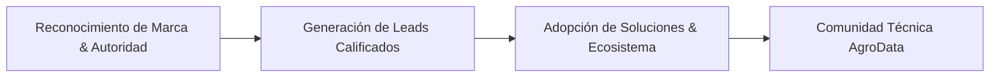

# Módulo 01: Estrategia y Posicionamiento de Marca
**Código de Referencia**: `AST-MKT-SMP-002`  
**Entidad**: Agro Stat & Tech Co. (Spin-off de Statsfirm Co.)  
**Fase PDCO**: PLAN $\rightarrow$ DEVELOPMENT  

---

## 1. Contexto Corporativo y Propuesta de Posicionamiento

**Agro Stat & Tech Co.** nace como una spin-off especializada de **Statsfirm Co.** dedicada a cerrar la brecha entre la ciencia de datos de nivel industrial y la realidad del campo agropecuario y agroindustrial de América Latina.

### 1.1. Declaración de Posicionamiento Único (USP)
> *"Para los productores agropecuarios, agroexportadores y directores de planta que enfrentan alta variabilidad en sus cosechas y márgenes ajustados, **Agro Stat & Tech Co.** es la firma de transformación bioestadística y software que estabiliza la calidad y multiplica la rentabilidad operativa utilizando los datos que la finca ya genera, sin obligar a la compra de sensores propietarios ni hardware costoso."*

### 1.2. El Paradigma de Diferenciación

```
AgTech Tradicional (Competencia)              Agro Stat & Tech Co. (Nuestra Firma)
───────────────────────────────────           ────────────────────────────────────
❌ Venta obligada de sensores/drones           ✅ Análisis de datasets existentes (DANE, SIPSA, fincas)
❌ Plataformas cerradas y costosas             ✅ Arquitectura abierta, Data Contracts y Lakehouses
❌ Promesas vagas de "Machine Learning"        ✅ Control Estadístico de Procesos (SPC) y Shewhart
❌ Desconexión con la rentabilidad real        ✅ Modelado BPMN 2.0 y Farm FinOps con ROI medible
❌ Dependencia de internet 24/7 en lote        ✅ Aplicaciones móviles con arquitectura Offline-First
```

---

## 2. Objetivos Estratégicos SMART (Horizonte 12 Meses)



1. **Autoridad y Posicionamiento (Brand Equity)**:
   - Posicionar a *Agro Stat & Tech Co.* como el referente de contenido técnico en bioestadística y analítica agropecuaria en LinkedIn e Instagram de habla hispana en los primeros 6 meses.
   - Alcanzar 15,000 seguidores orgánicos en LinkedIn y 10,000 en Instagram con un engagement rate superior al 4.2% (benchmark del sector B2B Agro: 1.8%).

2. **Generación de Demanda (Lead Gen & Pipeline)**:
   - Capturar 250 MQLs (Marketing Qualified Leads) mensuales mediante descargables técnicos (Plantillas SPC en Excel/Python, Guía de Data Contracts, Calculadoras de Merma).
   - Generar 30 reuniones de diagnóstico bioestadístico (SQLs) mensuales con directores de operaciones y agroexportadores.

3. **Adopción de Producto & Tráfico Web**:
   - Incrementar en un 300% el tráfico orgánico al portal web institucional (`docs_landing_page/index.html`).
   - Lograr más de 1,200 registros en la lista de espera / beta testing de la **App Móvil de Gestión Operativa Offline-First**.

4. **Construcción de Comunidad Activa**:
   - Crear y consolidar un canal en WhatsApp/Telegram con más de 1,000 agrónomos, ingenieros agrícolas y agroempresarios que consuman los boletines matutinos de precios SIPSA y modelos climáticos.

---

## 3. Arquetipo de Marca y Personalidad

### 3.1. Arquetipo Principal: "El Sabio Visionario" (The Sage + The Creator)
- **Atributos Clave**: Riguroso, pragmático, innovador, empático con el productor, respaldado por la ciencia.
- **Voz de Marca**: La de un ingeniero agrónomo senior y bioestadístico que camina el lote con botas de campo y a la vez domina modelos de dispersión gaussiana, dbt y Camunda BPMN.

### 3.2. Directrices de Tono y Estilo

| Dimensión | Enfoque de Agro Stat & Tech Co. | Ejemplo Práctico |
|---|---|---|
| **Científico vs. Accesible** | Riguroso pero traducido al impacto en el bolsillo del agricultor. | *"Un Cpk de 0.85 significa que 15 de cada 100 cajas de aguacate no cumplen el calibre exportable y van a pérdida nacional."* |
| **Pragmático vs. Teórico** | Cero abstracciones sin caso de uso ni fórmula clara. | *"Menos dashboards cosméticos; más cartas de control que detengan la cuadrilla a tiempo."* |
| **Respetuoso con el Campo** | Entiende que el agricultor tiene décadas de experiencia empírica. | *"No reemplazamos la intuición del agrónomo; le damos un escudo estadístico contra la variabilidad climática."* |
| **Transparente con la Tecnología** | Sin cajas negras ni promesas mágicas de IA. | *"Te mostramos el código, la fórmula y el linaje del dato en cada paso."* |

### 3.3. Vocabulario de Marca (Lexicografía)

- **Términos Obligatorios**: Control Estadístico de Procesos (SPC), Cartas Shewhart, Índice de Capacidad ($C_{pk}$), Reducción de Varianza, Arquitectura Offline-First, Lakehouse Agropecuario, Data Contracts (DAMA-BOK), BPMN 2.0, Retorno de Inversión (ROI), Farm FinOps.
- **Términos Prohibidos / A Evitar**: "Magia de la IA", "Solución milagrosa", "Revolución 4.0 sin esfuerzo", "Nube obligatoria en medio del monte", "Hardware costoso indispensable".

---

## 4. Matriz de Buyer Personas

```
┌─────────────────────────────────────────────────────────────────────────┐
│                      MATRIZ DE BUYER PERSONAS                           │
├────────────────────┬────────────────────┬───────────────────────────────┤
│ PERSONA 1:         │ PERSONA 2:         │ PERSONA 3:                    │
│ Don Hernán         │ Ing. Marcela       │ Santiago                      │
│ Productor & Dueño  │ Directora Calidad  │ Gerente Operaciones / FinOps  │
│ (Rentabilidad/Merma)│ (Cpk / Normas EUDR)│ (BPMN / Cuellos de Botella)   │
└────────────────────┴────────────────────┴───────────────────────────────┘
```

### 4.1. Persona 1: Don Hernán (El Productor Agroempresario)
- **Perfil**: 48 a 65 años. Dueño o socio de finca mediana/grande (50 a 500 hectáreas) de café, aguacate, palma o cítricos.
- **Dolores**: Pérdida de dinero por variabilidad climática, compras excesivas de fertilizantes basadas en recomendaciones genéricas, falta de señal celular en los lotes.
- **Objeción Típica**: *"Ya compré sensores caros una vez y se dañaron con el sol y la lluvia; no quiero más cacharros."*
- **Gancho de Alto Impacto**: *"¿Sabías que estás botando el 22% de tu fertilizante nitrogenado porque aplicas en días con déficit hídrico acumulado? Aquí está la carta de control para evitarlo con tus registros actuales."*
- **Canales Clave**: Instagram, WhatsApp, YouTube.

### 4.2. Persona 2: Ing. Marcela (La Directora de Calidad y Poscosecha)
- **Perfil**: 32 a 45 años. Ingeniera agroindustrial o química a cargo de la planta de empaque de una agroexportadora.
- **Dolores**: Rechazos de contenedores en destino (Rotterdam, Philadelphia) por calibre disparejo o deshidratación; auditorías de certificación (GlobalGAP, Rainforest, EUDR).
- **Objeción Típica**: *"Mis operarios llenan planillas en Excel que nadie revisa a tiempo; cuando veo el error, el contenedor ya zarpó."*
- **Gancho de Alto Impacto**: *"Un $C_{pk} < 1.00$ en la báscula de empaque es un contenedor rechazado esperando a ocurrir. Te enseñamos a implementar las 4 Reglas de Nelson en tiempo real."*
- **Canales Clave**: LinkedIn, Webinars Técnicos, Artículos descargables.

### 4.3. Persona 3: Santiago (El Gerente de Operaciones y FinOps Agrícola)
- **Perfil**: 35 a 50 años. Ingeniero industrial o MBA a cargo de la rentabilidad operativa de un grupo agroindustrial.
- **Dolores**: Tiempos muertos de cuadrillas y maquinaria pesada, costos invisibles en la cadena de frío, falta de trazabilidad en jornales.
- **Objeción Típica**: *"Los agrónomos me piden más presupuesto pero no me muestran el costo por kilo producido desagregado por lote."*
- **Gancho de Alto Impacto**: *"Diagramamos el flujo de tu cuadrilla de cosecha en BPMN 2.0 y encontramos 3.5 horas de tiempos muertos por día en transporte de canastillas."*
- **Canales Clave**: LinkedIn, X (Twitter), Reportes Técnicos.

### 4.4. Persona 4: Carlos (El Agrónomo e Investigador Tecnológico)
- **Perfil**: 24 a 35 años. Agrónomo de campo, consultor independiente, docente o estudiante de posgrado.
- **Dolores**: Falta de herramientas analíticas modernas; cansado de hacer regresiones lineales simples en Excel.
- **Motivación**: Convertirse en un referente del "Agro 2.0" dominando bioestadística y Python/SQL aplicado al campo.
- **Gancho de Alto Impacto**: *"Deja de predecir cosechas con promedios móviles simples. Aprende a construir Data Contracts para tus registros de floración con validación Pydantic."*
- **Canales Clave**: LinkedIn, Instagram, Repositorios de Código / GitHub, X.
