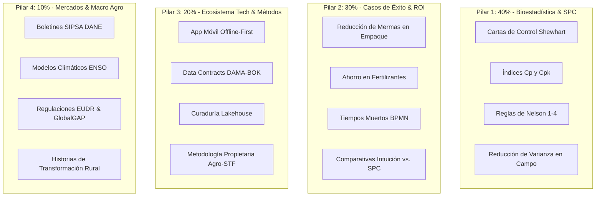

# Módulo 03: Pilares de Contenido y Calendario Editorial
**Código de Referencia**: `AST-MKT-SMP-004`  
**Entidad**: Agro Stat & Tech Co. (Spin-off de Statsfirm Co.)  
**Fase PDCO**: PLAN $\rightarrow$ DEVELOPMENT  

---

## 1. Definición Detallada de los 4 Pilares de Contenido

La estrategia de contenidos se organiza bajo la **Regla 40-30-20-10**, diseñada para construir autoridad científica, validar el retorno financiero de la metodología y conducir a la conversión.



---

### 1.1. Pilar 1: Bioestadística Avanzada & Control Estadístico de Procesos (40%)
- **Objetivo**: Posicionarse como los únicos expertos en el mercado que aplican ingeniería de calidad industrial al cultivo biológico.
- **Temas Clave**:
  - ¿Cómo calcular si tu lote tiene un proceso bajo control ($C_{pk} \ge 1.33$)?
  - El peligro de tomar decisiones con el promedio simple: la trampa de la variabilidad oculta.
  - Las 4 Reglas de Nelson aplicadas a grados Brix, calibre de exportación y peso de fruto.
  - Modelado de distribución de lluvias vs. curvas de absorción de fósforo y potasio.

### 1.2. Pilar 2: Casos de Éxito, Demostración de ROI & Prueba Social (30%)
- **Objetivo**: Demostrar que la ciencia de datos se traduce en dinero real para el bolsillo del agricultor y la agroexportadora.
- **Temas Clave**:
  - *"Cómo Finca Santa Elena redujo un 19% de rechazo en puerto sin comprar un solo sensor nuevo."*
  - Desglose financiero: ¿Cuánto cuesta un lote con un $C_{pk} = 0.70$ frente a uno de $1.40$?
  - El antes y después del empaque de aguacate Hass: de la planilla en papel al control en tiempo real.
  - Testimonios de jefes de planta y directores de agronomía.

### 1.3. Pilar 3: Ecosistema Tecnológico & Metodología Propietaria (20%)
- **Objetivo**: Mostrar los productos, la arquitectura y el enfoque único de no vender hardware cautivo.
- **Temas Clave**:
  - ¿Por qué una arquitectura Offline-First con SQLite y CRDTs es obligatoria para el campo sin señal?
  - Qué es un *Data Contract* y por qué protege la calidad del dato antes de entrar al Lakehouse.
  - La metodología *Agro-STF*: Diagnóstico $\rightarrow$ Curaduría $\rightarrow$ Modelado $\rightarrow$ Control Continuo.
  - Demos en video de la Consola Agro y la App del Productor.

### 1.4. Pilar 4: Mercados Mayoristas, Macro Agro & Clima (10%)
- **Objetivo**: Ganar tracción masiva, viralidad en el sector y mantener al día al ecosistema con fuentes oficiales.
- **Temas Clave**:
  - Análisis semanal de precios mayoristas del DANE (SIPSA) en Corabastos, Cavasa y Central Mayorista de Antioquia.
  - Impacto de anomalías climáticas (El Niño / La Niña) con datos satelitales NASA POWER e IDEAM.
  - Nuevas exigencias de no deforestación de la Unión Europea (EUDR) y cómo cumplirlas con datos.

---

## 2. Calendario Editorial Maestro Semanal (Parrilla Tipo)

```
┌──────────────┬──────────────────┬───────────────────────────────────────────┬─────────────┐
│ DÍA          │ PILAR            │ FORMATO & CANAL                           │ HORARIO     │
├──────────────┼──────────────────┼───────────────────────────────────────────┼─────────────┤
│ LUNES        │ Pilar 4: Mercado │ Infografía de Precios SIPSA (LinkedIn/X)  │ 06:30 AM    │
│ MARTES       │ Pilar 1: SPC     │ Carrusel "Swipe & Learn" (LinkedIn/IG)    │ 12:15 PM    │
│ MIÉRCOLES    │ Pilar 2: ROI     │ Caso de Éxito / Video Reel (IG/LinkedIn)  │ 06:45 PM    │
│ JUEVES       │ Pilar 3: Tech    │ Infografía Arquitectura / Demo App (Li/X) │ 12:30 PM    │
│ VIERNES      │ Pilar 1: BioStat │ Píldora Bioestadística / Plantilla (Li/IG)│ 07:00 AM    │
│ SÁBADO       │ Pilar 4: Cultura │ Historia de Campo / Storytelling (IG/Li)  │ 10:00 AM    │
│ DOMINGO      │ -                │ Resumen Dominical & Boletín (WhatsApp/TG) │ 06:00 PM    │
└──────────────┴──────────────────┴───────────────────────────────────────────┴─────────────┘
```

---

## 3. Parrilla de Contenidos a 4 Semanas (Plan Mensual de Lanzamiento)

### Semana 1: El Despertar del Dato Agropecuario (Fundamentos & Dolor)
- **Lun**: *Pilar 4* — "Boletín SIPSA: Variación del precio del limón Tahití en las 3 principales centrales de abasto del país".
- **Mar**: *Pilar 1* — "Por qué el promedio te está mintiendo: Caso real de dispersión en peso de racimo de banano".
- **Mié**: *Pilar 2* — "La finca que botaba $4,200 USD al mes en fletes por no correlacionar humedad y báscula".
- **Jue**: *Pilar 3* — "¿Por qué no vendemos hardware? La verdad sobre la 'trampa del sensor' en el campo".
- **Vie**: *Pilar 1* — "Píldora: Cómo leer una Carta Shewhart $\bar{X}-R$ en 3 minutos (+ Plantilla Excel gratis)".

### Semana 2: Control Estadístico en Acción (SPC & Capacidad de Proceso)
- **Lun**: *Pilar 4* — "Climatología IDEAM: Correlación entre días con déficit de vapor y caída de floración".
- **Mar**: *Pilar 1* — "Índice $C_{pk}$ en empaque de frutas: ¿Tu línea es capaz de exportar a Europa?".
- **Mié**: *Pilar 2* — "Cómo un agroexportador de aguacate redujo el rechazo en Rotterdam del 14% al 2.1%".
- **Jue**: *Pilar 3* — "Offline-First en acción: Cómo nuestra App de campo sincroniza 5,000 registros sin un solo mega de internet".
- **Vie**: *Pilar 1* — "Las 4 Reglas de Nelson explicadas con peras y manzanas (literalmente)".

### Semana 3: Eficiencia Operativa y FinOps Agrícola (BPMN & Costeo)
- **Lun**: *Pilar 4* — "Boletín SIPSA: Alerta de sobreoferta en hortalizas y cómo anticipar cosechas".
- **Mar**: *Pilar 1* — "Grados Brix bajo control: Por qué la varianza entre tablones te castiga el precio agroindustrial".
- **Mié**: *Pilar 2* — "BPMN 2.0 en cuadrillas de café: 28 horas/hombre recuperadas por semana".
- **Jue**: *Pilar 3* — "Data Contracts: El firewall que evita que datos sucios arruinen tus pronósticos".
- **Vie**: *Pilar 1* — "Píldora: ¿Qué es la Capabilidad a Corto Plazo ($C_p$) vs. Largo Plazo ($P_{pk}$)?".

### Semana 4: Gobernanza del Dato & Conversión Directa
- **Lun**: *Pilar 4* — "Normativa EUDR: El checklist de datos geoespaciales que te exigirán tus compradores".
- **Mar**: *Pilar 1* — "Análisis de regresión multivariada: Clima + Suelo + Manejo = Rendimiento real".
- **Mié**: *Pilar 2* — "Comparativa real: Costo de gestionar por intuición vs. gestionar bajo el estándar Agro-STF".
- **Jue**: *Pilar 3* — "Tour visual por la Consola Web de Agro Stat & Tech Co.".
- **Vie**: *Pilar 2* — "Auditoría de Lote Abierta: Envíanos tus datos de empaque y diagnosticamos tu $C_{pk}$ gratis en vivo".
