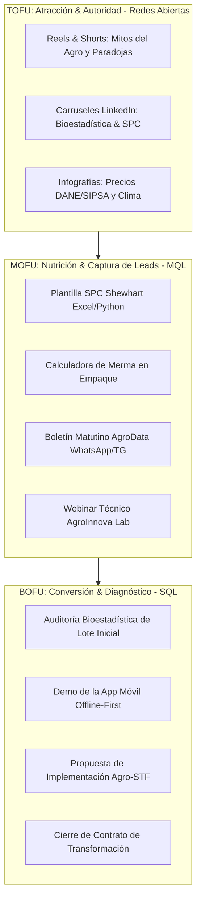

# Módulo 06: KPIs, Embudo de Conversión y Gobernanza Digital
**Código de Referencia**: `AST-MKT-SMP-007`  
**Entidad**: Agro Stat & Tech Co. (Spin-off de Statsfirm Co.)  
**Fase PDCO**: PLAN $\rightarrow$ DEVELOPMENT  

---

## 1. Arquitectura del Embudo de Conversión Agroempresarial

A diferencia de los embudos B2C tradicionales, la venta de servicios y soluciones de ingeniería de datos en el sector agropecuario requiere **construcción sistemática de confianza técnica y demostración tangible de retorno de inversión (ROI)**.



---

## 2. Tablero de Control de KPIs y Métricas de Rendimiento

### 2.1. Métricas TOFU (Alcance y Engagement de Marca)

| KPI | Definición | Meta Mensual (Meses 1-3) | Meta Mensual (Meses 4-6) | Canal Principal |
|---|---|---|---|---|
| **Impresiones Totales** | Número de veces que el contenido se muestra en pantalla | 80,000 | 250,000 | LinkedIn / Instagram |
| **Tasa de Engagement (ER)** | (Interacciones / Impresiones) $\times$ 100 | $\ge 4.0\%$ | $\ge 4.8\%$ | LinkedIn / Instagram |
| **Tasa de Guardados (Save Rate)** | Publicaciones guardadas para consulta técnica posterior | $\ge 6.5\%$ | $\ge 8.0\%$ | Instagram / LinkedIn |
| **Tasa de Compartidos** | Publicaciones compartidas entre colegas agrónomos | $\ge 3.0\%$ | $\ge 4.5\%$ | WhatsApp / LinkedIn |
| **Crecimiento de Comunidad** | Nuevos seguidores orgánicos calificados | +800 / mes | +2,000 / mes | Todos los canales |

### 2.2. Métricas MOFU (Conversión a Leads Calificados - MQL)

| KPI | Definición | Meta Mensual | Fuente de Captura |
|---|---|---|---|
| **Descargas de Plantilla SPC** | Registros con nombre, cultivo, hectáreas y correo | 120 descargas | Landing Page / Formulario |
| **Suscriptores Canal AgroData** | Productores activos en canal WhatsApp/Telegram | +200 miembros | Enlace en bio / Stories |
| **Asistentes a Masterclasses** | Participantes en vivo en sesiones de AgroInnova Lab | 45 asistentes | YouTube Live / LinkedIn Event |
| **Costo por Lead (CPL Orgánico)** | Costo de producción de contenido / MQLs generados | < $8 USD eq. | Contenido Orgánico |

### 2.3. Métricas BOFU (Oportunidades de Venta y Cierre - SQL)

| KPI | Definición | Meta Mensual | Responsable |
|---|---|---|---|
| **Diagnósticos Agendados (SQL)** | Reuniones de auditoría técnica con tomadores de decisión | 15 a 25 / mes | Squad Comercial Agro |
| **Tasa de Cierre (Win Rate)** | Diagnósticos que pasan a contrato de servicio | $\ge 22\%$ | Dirección de Soluciones |
| **Valor de Contrato (ACV)** | Ticket promedio anual de consultoría o suscripción | $6,000 - $24,000 USD | Dirección Comercial |
| **Velocidad del Pipeline** | Días transcurridos desde el MQL hasta el cierre | < 35 días | CRM / Pipeline |

---

## 3. Secuencia de Lead Nurturing Automatizada

Cuando un usuario descarga una plantilla o comenta un post pidiendo el material, se activa el siguiente flujo de nutrición:

```
[Día 0: Inmediato]
Envío del recurso solicitado (Plantilla SPC en Excel + Script en Python) vía WhatsApp/Email
+ Mensaje de bienvenida: "Hola [Nombre], aquí tienes la herramienta. ¿Qué cultivo estás monitoreando actualmente?"

[Día 2: Valor Agregado]
Video corto (2 min): "Cómo evitar los 3 errores más comunes al graficar los límites de Shewhart en Excel".

[Día 5: Caso de Estudio Relacionado]
PDF descargable: "Caso Finca La Ceiba: Cómo redujeron 22% el costo de fertilización con este mismo método".

[Día 8: Invitación al Diagnóstico]
Llamada a la acción consultiva: "¿Te gustaría que nuestro equipo corra una auditoría bioestadística con un lote de tus datos históricos sin costo de diagnóstico inicial?"
```

---

## 4. Gobernanza Editorial y Flujo de Aprobaciones

Para garantizar que ningún contenido viole el rigor científico, la identidad de marca o la confidencialidad de clientes, se establece el siguiente flujo bajo el marco **PDCO**:

```
[ 1. PLAN ] 
Elaboración del tema y selección del pilar en la parrilla mensual (Social Media Lead).
    │
    ▼
[ 2. DEVELOPMENT ]
Redacción del copy técnico, aplicación de fórmulas y diseño gráfico (Diseñador + Copywriter).
    │
    ▼
[ 3. CONTROL ]
Revisión técnica bioestadística y validación de cifras (Chief Agro Data Scientist / CTO).
    │
    ▼
[ 4. OPERATIONS ]
Programación, publicación, monitoreo de comentarios y entrega de leads al CRM.
```

---

## 5. Protocolo de Gestión de Crisis y Respuestas Técnicas

### Escenario A: Usuario escéptico que afirma que "el software no sirve en el campo real"
- **Respuesta Oficial**: *"Totalmente de acuerdo en que el software de escritorio no sirve en el lote. Por eso nuestra arquitectura es 100% Offline-First en SQLite: tomas los datos sin señal bajo la lluvia y se sincronizan al volver al campamento. Además, no te vendemos sensores; usamos los datos que tus cuadrillas ya recolectan. ¿Qué cultivo manejas para mostrarte un ejemplo de tu zona?"*

### Escenario B: Debate sobre discrepancias en los pronósticos climáticos
- **Respuesta Oficial**: *"Los modelos numéricos climáticos entregan probabilidades, no certezas absolutas. En Agro Stat & Tech Co. no hacemos magia; cruzamos los datos abiertos del IDEAM con el reanálisis satelital de la NASA POWER y tus pluviómetros de finca para construir intervalos de confianza del 95% bajo Control Estadístico de Procesos."*
