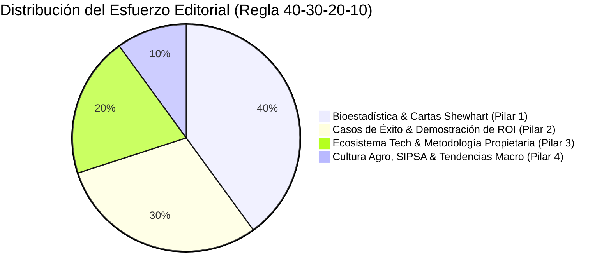

# Plan Maestro de Redes Sociales y Estrategia Digital — Agro Stat & Tech Co.
**Código de Referencia**: `AST-MKT-SMP-001`  
**Entidad**: Agro Stat & Tech Co. (División Agroindustrial de Statsfirm Co.)  
**Versión**: 1.0.0  
**Fecha**: 2026-09-18  
**Fase PDCO**: **PLAN $\rightarrow$ DEVELOPMENT** | **Active Skill**: `01-requirements` / `02-architecture`  
**Responsable**: Brand Strategy, Creative Direction & Social Media Practice  

---

## 1. Visión Ejecutiva y Propósito

El presente plan estratégico y operativo de redes sociales define la presencia digital, el posicionamiento de marca B2B/B2C Agro y el motor de generación de demanda para **Agro Stat & Tech Co.** (AgroStats).

A diferencia del software agropecuario tradicional centrado en la venta de sensores o drones, **Agro Stat & Tech Co.** se posiciona como la **firma líder en ingeniería de transformación agroempresarial basada en datos, bioestadística avanzada, Control Estadístico de Procesos (SPC) y modelado BPMN**, enfocada en extraer el máximo valor de los datasets ya existentes en fincas, centrales de abasto y agroexportadoras.

```
       [ NATURALEZA Y BOSQUE ]                 [ CIENCIA Y DATOS ]
       Suelos, Cultivos, Clima       x         Bioestadística, SPC Shewhart,
   Variabilidad Biológica, Cosecha               Data Contracts, BPMN FinOps
                  \                                   /
                   \                                 /
                    ▼                               ▼
     ┌─────────────────────────────────────────────────────────────┐
     │  AGRO STAT & TECH CO. (PRESENCIA DIGITAL EN REDES)          │
     │  "El Contraste: Bosque Profundo & Precisión Bio-Digital"   │
     └─────────────────────────────────────────────────────────────┘
```

---

## 2. Estructura y Navegación del Plan

Este repositorio contiene la arquitectura integral de la estrategia de contenidos, distribuida en 6 módulos especializados:

| # | Archivo | Contenido Clave |
|---|---|---|
| **01** | [`01_estrategia_posicionamiento.md`](file:///c:/Users/ADAN/OneDrive/Documentos/Statsfirm/AgroStats%20AndTech/network/01_estrategia_posicionamiento.md) | Objetivos SMART, Propuesta de Valor, Arquetipo de Marca, Buyer Personas (Productor, Directora de Calidad, Gerente de Operaciones, Agrónomo). |
| **02** | [`02_canales_audiencias_formatos.md`](file:///c:/Users/ADAN/OneDrive/Documentos/Statsfirm/AgroStats%20AndTech/network/02_canales_audiencias_formatos.md) | Matriz de canales (LinkedIn B2B, Instagram Visual/Storytelling, YouTube AgroInnova Lab, X Data/Alertas, Comunidad WhatsApp/Telegram). |
| **03** | [`03_pilares_y_calendario_editorial.md`](file:///c:/Users/ADAN/OneDrive/Documentos/Statsfirm/AgroStats%20AndTech/network/03_pilares_y_calendario_editorial.md) | Los 4 Pilares de Contenido (40/30/20/10), Parrilla Mensual Tipo (4 semanas), Horarios y Frecuencias Óptimas. |
| **04** | [`04_copywriting_hooks_y_diseno.md`](file:///c:/Users/ADAN/OneDrive/Documentos/Statsfirm/AgroStats%20AndTech/network/04_copywriting_hooks_y_diseno.md) | Catálogo de Ganchos (Hooks) de Alto Impacto, Fórmulas de Copywriting (PAS, AIDA, BAB), Ficha Técnica Estética y Guía Visual. |
| **05** | [`05_banco_contenido_y_scripts.md`](file:///c:/Users/ADAN/OneDrive/Documentos/Statsfirm/AgroStats%20AndTech/network/05_banco_contenido_y_scripts.md) | Guiones y copys completos listos para producción (Carruseles LinkedIn, Reels/Shorts, Posts Técnicos, Boletín SIPSA/Clima). |
| **06** | [`06_kpis_embudo_conversion.md`](file:///c:/Users/ADAN/OneDrive/Documentos/Statsfirm/AgroStats%20AndTech/network/06_kpis_embudo_conversion.md) | Embudo de Conversión (TOFU-MOFU-BOFU), KPIs de Rendimiento, Atribución, Flujos de Lead Nurturing y Gobernanza de Contenido. |

---

## 3. Síntesis de los Pilares de Marca



1. **Autoridad Científica**: Educar al sector en que la intuición agronómica debe complementarse con el Control Estadístico de Procesos (SPC) y la reducción de varianza.
2. **Cero Venta de Hardware Cautivo**: Romper la objeción tradicional de que la digitalización requiere costosos sensores importados.
3. **Estética de Vanguardia**: Aplicar la regla visual del **35% Bosque / 65% Superficie Técnica**, con tipografía `Space Grotesk` y acentos `Bio Neon Green` (`#10B981`).
4. **Conversión Basada en Utilidad**: Cada publicación ofrece una plantilla, un código descargable, una fórmula matemática o un diagnóstico ejecutable.
